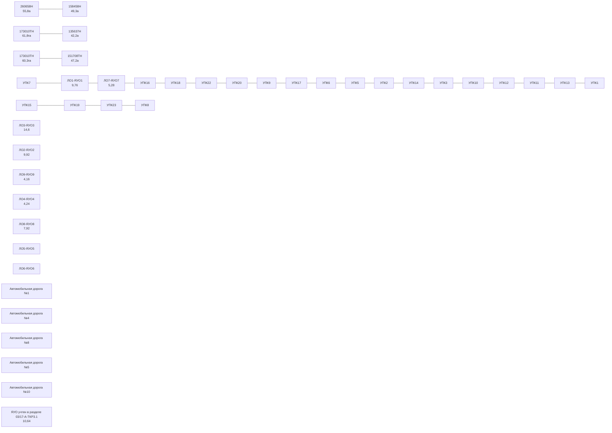
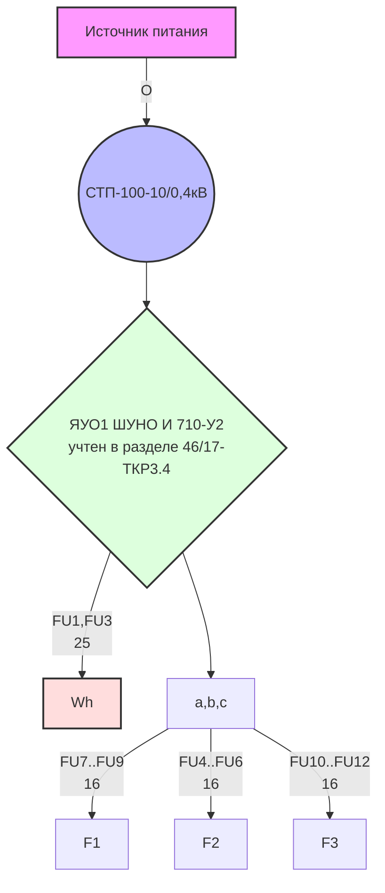
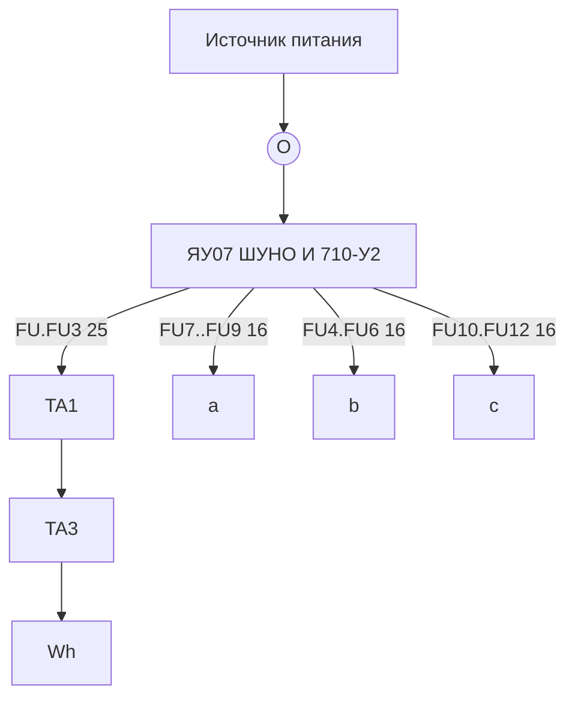
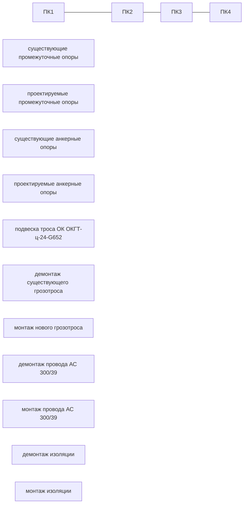
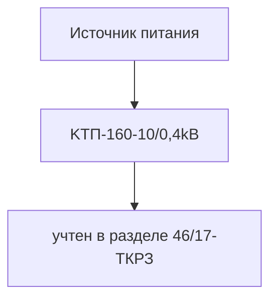
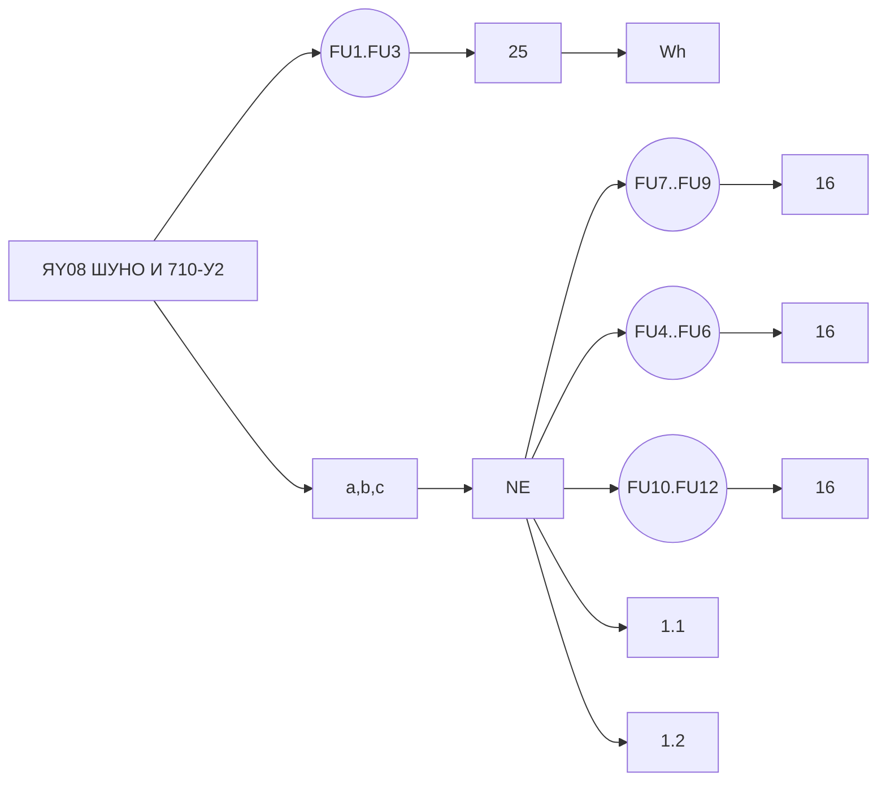
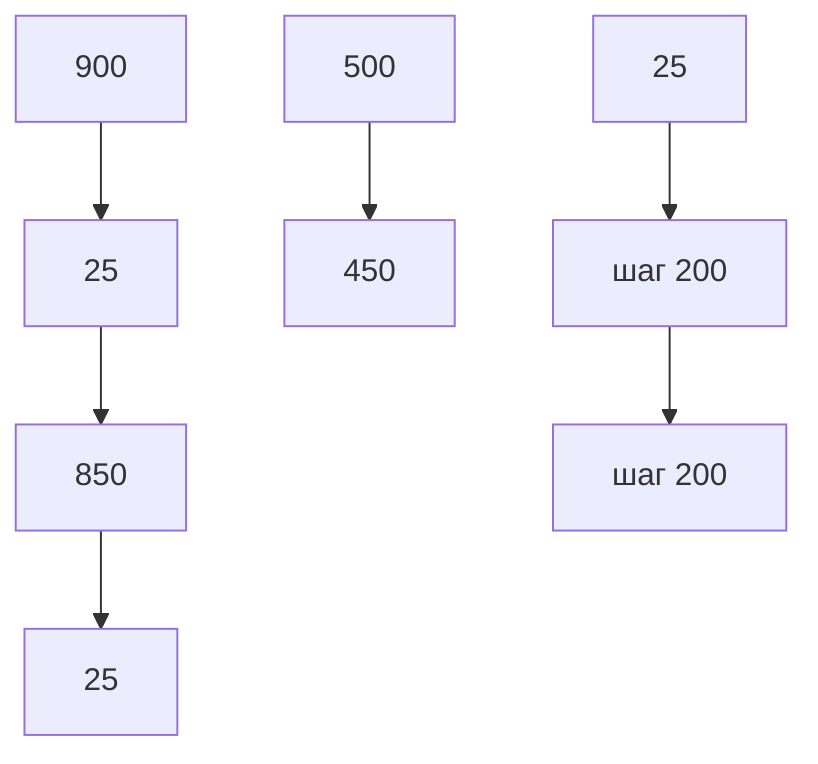
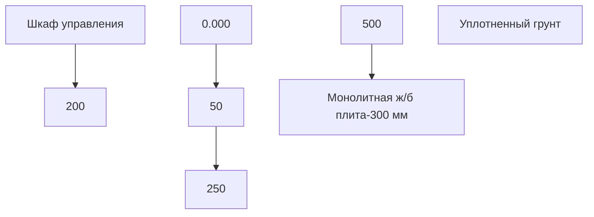
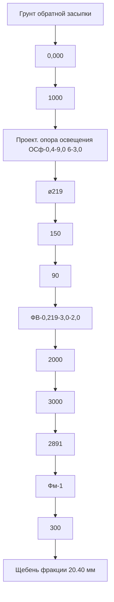
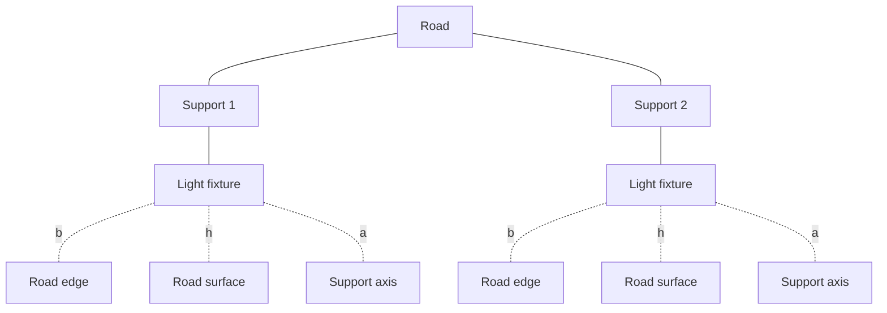

[Logo of a globe with "ГЕОэкспресс" written on a banner across it]
ООО "ГЕОэкспресс" Проектно-строительная фирма

Свидетельство № П-094-003015057950-0019 от 11.01.2010 г.

Технический заказчик: АО «ОЭЗ «Лотос»

Объекты капитального строительства на территории «Особая
экономическая зона промышленно-производственного типа, созданная
на территории муниципального образования «Наримановский район»
Астраханской области. Инженерная инфраструктура: кабельная
канализация сетей связи, сети и сооружения электроснабжения.
Объекты транспортной инфраструктуры».
Корректировка. 5 этап. Автомобильная дорога от УПК 15 до УПК7.
6 этап Автомобильная дорога от УПК15 до УПК16»

ПРОЕКТНАЯ ДОКУМЕНТАЦИЯ

Раздел 3.3.4. Технологические и конструктивные решения
линейного объекта. Искусственные сооружения.
Часть 3.4. Объекты транспортной инфраструктуры.
Строительство сетей наружного освещения дорог

24/5-ТКР3.4

Том 3.3.4

2024


Logo of GEOexpress with a globe

Проектно-строительная фирма "ГЕОэкспресс"

Свидетельство № П-094-003015057950-0019 от 11.01.2010 г.

Технический заказчик: АО «ОЭЗ «Лотос»

Объекты капитального строительства на территории «Особая экономическая зона промышленно-производственного типа, созданная на территории муниципального образования «Наримановский район» Астраханской области. Инженерная инфраструктура: кабельная канализация сетей связи, сети и сооружения электроснабжения. Объекты транспортной инфраструктуры».
Корректировка. 5 этап. Автомобильная дорога от УПК 15 до УПК7.
6 этап Автомобильная дорога от УПК15 до УПК16»

ПРОЕКТНАЯ ДОКУМЕНТАЦИЯ

Раздел 3.3.4. Технологические и конструктивные решения линейного объекта. Искусственные сооружения.
Часть 3.4. Объекты транспортной инфраструктуры.
Строительство сетей наружного освещения дорог

24/5-ТКР3.4

Том 3.3.4

Директор: В. Н. Никульшин

Главный инженер проекта: Е.М. Шелухина

[Official stamp]

2024


<table>
<tr>
<th>Разрешение</th>
<th>Обозначение</th>
<th>24/5-ТКР 3.4</th>
</tr>
<tr>
<td>15-24<br>от 03.10.2024</td>
<td>Наименование<br>объекта<br>строительства</td>
<td>Объекты капитального строительства на территории «Особая экономическая зона промышленно-производственного типа, созданная на территории муниципального образования «Наримановский район» Астраханской области. Инженерная инфраструктура: кабельная канализация сетей связи, сети и сооружения электроснабжения. Объекты транспортной инфраструктуры».<br>Корректировка. 5 этап. Автомобильная дорога от УПК 15 до УПК7. 6 этап Автомобильная дорога от УПК15 до УПК16»</td>
</tr>
</table>

<table>
<tr>
<th>Изм.</th>
<th>Лист</th>
<th>Содержание изменения</th>
<th>Код</th>
<th>Примечание</th>
</tr>
<tr>
<td rowspan="2">4</td>
<td>16, 17, 18, 19</td>
<td>Текстовая часть часть<br>Из текстовой части вычеркнута информация в связи с корректировкой проекта в части вынесения участка автомобильной дороги от УПК2 до УПК14 и автомобильного путепровода от УПК14 м ПК0+00,00 по ПК3 +73,80.<br>Добавлено введение</td>
<td>4</td>
<td></td>
</tr>
<tr>
<td>27, 28, 29, 30, 31, 32, 33, 34, 36</td>
<td>Графическая часть<br>Листы аннулированы в связи с корректировкой проекта в части вынесения участка автомобильной дороги от УПК2 до УПК14 и автомобильного путепровода от УПК14 м ПК0+00,00 по ПК3+73,80.</td>
<td>4</td>
<td></td>
</tr>
</table>

<table>
<tr>
<td>Изм.внес</td>
<td>Кашина</td>
<td>10.24</td>
<td rowspan="4">ООО ПСФ «ГЕОэкспресс»</td>
<td>Лист</td>
<td>Листов</td>
</tr>
<tr>
<td>Составил</td>
<td>Кашина</td>
<td>10.24</td>
<td rowspan="3">1</td>
<td rowspan="3">1</td>
</tr>
<tr>
<td>ГИП</td>
<td>Шелухина</td>
<td>10.24</td>
</tr>
<tr>
<td>Утв.</td>
<td></td>
<td></td>
</tr>
</table>


Logo of Darvodgeo Joint Stock Company

Свидетельство № 0023.08-2009-5012014825-П-30 от 21 июля 2016 г.

Заказчик: ПАО «ОЭЗ «Лотос»

«Объекты капитального строительства на территории «Особая экономическая зона промышленно-производственного типа, созданная на территории муниципального образования «Наримановский район» Астраханской области. Инженерная инфраструктура: кабельная канализация сетей связи, сети и сооружения электроснабжения. Объекты транспортной инфраструктуры»

ПРОЕКТНАЯ ДОКУМЕНТАЦИЯ

Раздел 3.3.4. Технологические и конструктивные решения линейного объекта. Искусственные сооружения.
Часть 3.4 Объекты транспортной инфраструктуры. Строительство сетей наружного освещения дорог
18/18-ТКР3.4
Том 3.3.4

<table>
<thead>
  <tr>
    <th>Изм.</th>
    <th>№ док.</th>
    <th>Подпись</th>
    <th>Дата</th>
  </tr>
</thead>
<tbody>
  <tr>
    <td>1</td>
    <td>12-18</td>
    <td></td>
    <td>10.18</td>
  </tr>
  <tr>
    <td>2</td>
    <td>16-18</td>
    <td></td>
    <td>11.18</td>
  </tr>
  <tr>
    <td>3</td>
    <td>11-21</td>
    <td></td>
    <td>03.21</td>
  </tr>
  <tr>
    <td>4</td>
    <td>15-24</td>
    <td></td>
    <td>10.24</td>
  </tr>
</tbody>
</table>

2018 г.


акционерное общество

# дар/водгео

Свидетельство № 0023.08-2009-5012014825-П-30 от 21 июля 2016 г.

Заказчик: ПАО «ОЭЗ «Лотос»

«Объекты капитального строительства на территории «Особая экономическая зона промышленно-производственного типа, созданная на территории муниципального образования «Наримановский район» Астраханской области. Инженерная инфраструктура: кабельная канализация сетей связи, сети и сооружения электроснабжения. Объекты транспортной инфраструктуры»

## ПРОЕКТНАЯ ДОКУМЕНТАЦИЯ

Раздел 3.3.4. Технологические и конструктивные решения линейного объекта. Искусственные сооружения.

Часть 3.4 Объекты транспортной инфраструктуры. Строительство сетей наружного освещения дорог

18/18-ТКР3.4

Том 3.3.4

Директор Астраханского филиала    О. В. Максимова

Главный инженер проекта           С. В. Медведева

<table>
  <thead>
    <tr>
      <th>Изм.</th>
      <th>№ док.</th>
      <th>Подпись</th>
      <th>Дата</th>
    </tr>
  </thead>
  <tbody>
    <tr>
      <td>1</td>
      <td>12-18</td>
      <td></td>
      <td>10.18</td>
    </tr>
    <tr>
      <td>2</td>
      <td>16-18</td>
      <td></td>
      <td>11.18</td>
    </tr>
    <tr>
      <td>3</td>
      <td>11-21</td>
      <td></td>
      <td>03.21</td>
    </tr>
    <tr>
      <td>4</td>
      <td>15-24</td>
      <td></td>
      <td>10.24</td>
    </tr>
  </tbody>
</table>

2018 г.


<table>
<tr>
<th>Разрешение</th>
<th>Обозначение</th>
<th>18/18- ТКР 3.4</th>
</tr>
<tr>
<td>11-21</td>
<td>Наименование объекта строительства</td>
<td>Объекты капитального строительства на территории «Особая экономическая зона промышленно-производственного типа, созданная на территории муниципального образования «Наримановский район» Астраханской области. Инженерная инфраструктура: кабельная канализация сетей связи, сети и сооружения электроснабжения
Объекты транспортной инфраструктуры</td>
</tr>
</table>

<table>
<tr>
<th>Изм.</th>
<th>Лист</th>
<th>Содержание изменения</th>
<th>Код</th>
<th>Примечание</th>
</tr>
<tr>
<td colspan="5"><strong>Текстовая часть</strong></td>
</tr>
<tr>
<td>3</td>
<td>3</td>
<td>В содержании тома добавлены примечания к листам которые в данном комплекте аннулированы в связи с корректировкой проекта</td>
<td>3</td>
<td></td>
</tr>
<tr>
<td colspan="5"><strong>Графическая часть</strong></td>
</tr>
<tr>
<td>3</td>
<td>12,13,14</td>
<td>Листы аннулированы в связи с корректировкой проекта в части разделения объекта "автомобильные дороги от УПК 10 до УПК 11, от УПК 12 до УПК 13" на объекты "автомобильные дороги от УПК 10 до УПК 3" "автомобильные дороги от УПК 3 до УПК 12" автомобильные дороги от УПК 12 до УПК 11". Данные листы перенесены в комплект 20/113- А - ТКР 3.4.2.</td>
<td>3</td>
<td></td>
</tr>
</table>

<table>
<tr>
<td>Изм. внес</td>
<td>Акимова</td>
<td>03.2021</td>
<td rowspan="3">АО "ДАР/ВОДГЕО"</td>
<td>Лист</td>
<td>Листов</td>
</tr>
<tr>
<td>Составил</td>
<td>Акимова</td>
<td>03.2021</td>
<td rowspan="2">1</td>
<td></td>
</tr>
<tr>
<td>ГИП</td>
<td>Медведева</td>
<td>03.2021</td>
<td></td>
</tr>
</table>


Содержание тома

<table>
<thead>
<tr>
<th>Обозначение</th>
<th>Наименование</th>
<th>Стр.</th>
<th>Прим ечани е</th>
</tr>
</thead>
<tbody>
<tr>
<td>18/18-ТКР3.4.С</td>
<td>Содержание тома</td>
<td>2</td>
<td></td>
</tr>
<tr>
<td>18/18-ТКР3.4.СП</td>
<td>Состав проектной документации</td>
<td>4</td>
<td></td>
</tr>
<tr>
<td>1</td>
<td>Общие сведения</td>
<td>9</td>
<td></td>
</tr>
<tr>
<td>2</td>
<td>Сведения о топографических, инженерно-геологических, климатических условиях участка строительства</td>
<td>9</td>
<td></td>
</tr>
<tr>
<td>3</td>
<td>Сведения об особых природно-климатических условиях земельного участка</td>
<td>12</td>
<td></td>
</tr>
<tr>
<td>4</td>
<td>Сведения о прочностных и деформационных характеристиках грунта в основании линейного объекта</td>
<td>13</td>
<td></td>
</tr>
<tr>
<td>5</td>
<td>Сведения об уровне грунтовых вод, их химическом составе, агрессивности.</td>
<td>14</td>
<td></td>
</tr>
<tr>
<td>6</td>
<td>Сведения о категории и классе линейного объекта</td>
<td>16</td>
<td>Изм.</td>
</tr>
<tr>
<td>7</td>
<td>Сведения о проектной мощности</td>
<td>16</td>
<td>Изм.</td>
</tr>
<tr>
<td>8</td>
<td>Показатели и характеристика технологического оборудования и устройств линейного объекта</td>
<td>17</td>
<td>Изм.</td>
</tr>
<tr>
<td>9</td>
<td>Перечень мероприятий по энергосбережению</td>
<td>23</td>
<td></td>
</tr>
<tr>
<td>10</td>
<td>Обоснование количества и типов оборудования, используемого в процессе строительства линейного объекта</td>
<td>23</td>
<td></td>
</tr>
<tr>
<td>11</td>
<td>Сведения о численности и профессионально-квалификационном составе персонала с распределением по группам производственных процессов, число и оснащенность рабочих мест</td>
<td>24</td>
<td></td>
</tr>
<tr>
<td>12</td>
<td>Мероприятия, обеспечивающие соблюдение требований по охране труда в процессе эксплуатации линейного объекта</td>
<td>24</td>
<td></td>
</tr>
<tr>
<td>13</td>
<td>Обоснование принятых автоматизированных систем управления технологическими процессами, автоматических систем по предотвращению нарушения устойчивости и качества работы линейного объекта</td>
<td>24</td>
<td></td>
</tr>
<tr>
<td>14</td>
<td>Организация ремонтного хозяйства, его оснащенность</td>
<td>25</td>
<td></td>
</tr>
<tr>
<td colspan="4">Графическая часть</td>
</tr>
<tr>
<td>18/18-ТКР3.4 л1</td>
<td>Структурная схема сети наружного освещения</td>
<td>26</td>
<td></td>
</tr>
<tr>
<td>18/18-ТКР3.4. л2</td>
<td>Схема питающей сети ЯУО1</td>
<td>27</td>
<td>Анулирован</td>
</tr>
<tr>
<td>18/18-ТКР3.4. л3</td>
<td>Принципиальная электрическая схема питания наружного освещения автодороги от УПК 15 до УПК7</td>
<td>28</td>
<td>Анулирован</td>
</tr>
<tr>
<td>18/18-ТКР3.4. л4</td>
<td>План наружного освещения автодороги от УПК15 до УПК7. М 1:1000</td>
<td>29</td>
<td>Анулирован</td>
</tr>
<tr>
<td>18/18-ТКР3.4. л5</td>
<td>План наружного освещения автодороги от УПК15 до УПК7. М 1:1000</td>
<td>30</td>
<td>Анулирован</td>
</tr>
<tr>
<td>18/18-ТКР3.4. л6</td>
<td>Схема питающей сети ЯУО7</td>
<td>31</td>
<td>Анулирован</td>
</tr>
</tbody>
</table>

<table>
<thead>
<tr>
<th>Изм.</th>
<th>Кол.уч.</th>
<th>Лист</th>
<th>№док</th>
<th>Подпись</th>
<th>Дата</th>
</tr>
</thead>
<tbody>
<tr>
<td>4</td>
<td>9</td>
<td>Изм. 15-24</td>
<td></td>
<td></td>
<td>10.24</td>
</tr>
<tr>
<td>3</td>
<td>3</td>
<td>Изм. 11-21</td>
<td></td>
<td></td>
<td>03.21</td>
</tr>
</tbody>
</table>

<table>
<thead>
<tr>
<th>ГИП</th>
<th>Медведева</th>
<th rowspan="3">Стадия</th>
<th rowspan="3">Лист</th>
<th rowspan="3">Листов</th>
</tr>
<tr>
<th>Разраб.</th>
<th>Егорова</th>
</tr>
<tr>
<th>Пров.</th>
<th></th>
</tr>
<tr>
<th>Н. контр.</th>
<th>Куксина</th>
<th>П</th>
<th>1</th>
<th>5</th>
</tr>
</table>

18/18-ТКР3.4-С

Содержание тома

O3JDO8/CED Формат А4


3

<table>
<thead>
<tr>
<th>Обозначение</th>
<th>Наименование</th>
<th>Лист</th>
<th>Примечание</th>
</tr>
</thead>
<tbody>
<tr>
<td>18/18-ТКР3.4. л7</td>
<td>Принципиальная электрическая схема питания наружного освещения автодороги от УПК 15 до УПК16</td>
<td>32</td>
<td>Лист анулирован</td>
</tr>
<tr>
<td>18/18-ТКР3.4. л8</td>
<td>План наружного освещения автодороги от УПК15 до УПК16. М 1:1000</td>
<td>33</td>
<td>Лист анулирован</td>
</tr>
<tr>
<td>18/18-ТКР3.4. л9</td>
<td>План наружного освещения автодороги от УПК15 до УПК16. М 1:1000</td>
<td>34</td>
<td>Лист анулирован</td>
</tr>
<tr>
<td>18/18-ТКР3.4. л10</td>
<td>Схема питающей сети ЯУО8</td>
<td>35</td>
<td>Анулирован</td>
</tr>
<tr>
<td>18/18-ТКР3.4.л11</td>
<td>Принципиальная электрическая схема питания наружного освещения автодороги от УПК 10 до УПК11 и от УПК12 до УПК13</td>
<td>36</td>
<td>Лист анулирован</td>
</tr>
<tr>
<td>18/18-ТКР3.4. л12</td>
<td>План наружного освещения автодороги от УПК11 до УПК11. М 1:1000</td>
<td>37</td>
<td>Лист анулирован</td>
</tr>
<tr>
<td>18/18-ТКР3.4. л13</td>
<td>План наружного освещения автодороги от УПК11 до УПК11. М 1:1000</td>
<td>38</td>
<td>Лист анулирован</td>
</tr>
<tr>
<td>18/18-ТКР3.4. л14</td>
<td>План наружного освещения автодороги от УПК12 до УПК13. М 1:1000</td>
<td>39</td>
<td>Лист анулирован</td>
</tr>
<tr>
<td>18/18-ТКР3.4.л15</td>
<td>Схема питающей сети ЯУО9</td>
<td>40</td>
<td></td>
</tr>
<tr>
<td>18/18-ТКР3.4.л16</td>
<td>Принципиальная электрическая схема питания наружного освещения автодороги от УПК 2 до УПК14 и автомобильного путепровода.</td>
<td>41</td>
<td></td>
</tr>
<tr>
<td>18/18-ТКР3.4.л17</td>
<td>План наружного освещения автомобильного путепровода. М 1:1000</td>
<td>42</td>
<td></td>
</tr>
<tr>
<td>18/18-ТКР3.4. л18</td>
<td>План наружного освещения автодороги от УПК2 до УПК14. М 1:1000</td>
<td>43</td>
<td></td>
</tr>
<tr>
<td>18/18-ТКР3.4. л18.1</td>
<td>План наружного освещения автодороги от УПК2 до УПК14 (продолжение). М 1:1000</td>
<td>43.1</td>
<td></td>
</tr>
<tr>
<td>18/18-ТКР3.4. л19</td>
<td>Внешний вид опоры. Внешний вид кронштейна. Внешний вид светильника.</td>
<td>44</td>
<td></td>
</tr>
<tr>
<td>18/18-ТКР3.4. л20</td>
<td>Плита ПМ-1 под шкаф управления.</td>
<td>45</td>
<td></td>
</tr>
<tr>
<td>18/18-ТКР3.4. л21</td>
<td>Фундамент под опору освещения</td>
<td>46</td>
<td></td>
</tr>
<tr>
<td>18/18-ТКР3.4. л22</td>
<td>Фундамент ФМ-1под опору освещения</td>
<td>47</td>
<td></td>
</tr>
<tr>
<td>18/18-ТКР3.4.С</td>
<td>Спецификация оборудования, изделий и материалов.</td>
<td>48</td>
<td></td>
</tr>
</tbody>
</table>

Прилагаемые документы

№04/1157-СА от 02.08.2018 Технические условия ПАО «ОЭЗ Лотос»

18/18-ТКР3.4-С Лист
Изм Кол.уч. Лист №док. Подпись Дата 2


# Состав проектной документации

<table>
<thead>
  <tr>
    <th>№ то-ма</th>
    <th>Обозначение</th>
    <th>Наименование</th>
    <th>Приме-чание</th>
  </tr>
</thead>
<tbody>
  <tr>
    <td>1</td>
    <td>20/113-А-ПЗ</td>
    <td>Раздел 1. Пояснительная записка</td>
    <td></td>
  </tr>
  <tr>
    <td>2.1</td>
    <td>18/18-ППО изм. 3</td>
    <td>Раздел 2. Проект полосы отвода.</td>
    <td></td>
  </tr>
  <tr>
    <td>2.2</td>
    <td>20/113-А-ППО</td>
    <td>Раздел 2. Проект полосы отвода. Восточный участок</td>
    <td></td>
  </tr>
  <tr>
    <td>3.1</td>
    <td>18/18-ТКР1 изм. 3</td>
    <td>Раздел 3. Технологические и конструктивные решения линейного объекта. Искусственные сооружения. Часть 1. Сети электроснабжения</td>
    <td>Без изменений</td>
  </tr>
  <tr>
    <td>3.2</td>
    <td>18/18-ТКР2 изм. 3</td>
    <td>Раздел 3. Технологические и конструктивные решения линейного объекта. Искусственные сооружения. Часть 2. Сети связи</td>
    <td>Без изменений</td>
  </tr>
  <tr>
    <td>3.3.1</td>
    <td>18/18-ТКР3.1 изм. 3</td>
    <td>Раздел 3. Технологические и конструктивные решения линейного объекта. Искусственные сооружения. Часть 3.1. Объекты транспортной инфраструктуры. Строительство автомобильных дорог.</td>
    <td></td>
  </tr>
  <tr>
    <td>3.3.1.1</td>
    <td>20/113-А-ТКР3.1</td>
    <td>Раздел 3. Технологические и конструктивные решения линейного объекта. Искусственные сооружения. Часть 3.1. Объекты транспортной инфраструктуры. Строительство автомобильных дорог восточного участка</td>
    <td></td>
  </tr>
  <tr>
    <td>3.3.2</td>
    <td>18/18-ТКР3.2 изм. 3</td>
    <td>Раздел 3. Технологические и конструктивные решения линейного объекта. Искусственные сооружения. Часть 3.2 Объекты транспортной инфраструктуры. Строительство автомобильного путепровода</td>
    <td>Без изменений</td>
  </tr>
  <tr>
    <td>3.3.3.</td>
    <td>18/18-ТКР3.3 изм 2</td>
    <td>Раздел 3. Технологические и конструктивные решения линейного объекта. Искусственные сооружения. Часть 3.3. Объекты транспортной инфраструктуры. Организация дорожного движения.</td>
    <td></td>
  </tr>
  <tr>
    <td>3.3.3.1</td>
    <td>20/113-А-ТКР3.3</td>
    <td>Раздел 3. Технологические и конструктивные решения линейного объекта. Искусственные сооружения. Часть 3.3. Объекты транспортной инфраструктуры. Организация дорожного движения дорог восточного участка</td>
    <td></td>
  </tr>
  <tr>
    <td>3.3.4</td>
    <td>18/18-ТКР3.4 изм 3</td>
    <td>Раздел 3.3.4 Технологические и конструктивные решения линейного объекта. Искусственные сооружения. Часть 3.4. Объекты транспортной инфраструктуры. Строительство сетей наружного освещения дорог.</td>
    <td></td>
  </tr>
  <tr>
    <td>3.3.4.1</td>
    <td>20/113-А-ТКР3.4</td>
    <td>Раздел 3. Технологические и конструктивные решения линейного объекта. Искусственные сооружения. Часть 3.4. Объекты транспортной инфраструктуры. Строительство сетей наружного освещения дорог восточного участка</td>
    <td></td>
  </tr>
  <tr>
    <td>4</td>
    <td></td>
    <td>Раздел 4. Здания и сооружения входящие в инфраструктуру линейного объекта</td>
    <td>Не разрабатывается</td>
  </tr>
</tbody>
</table>

<table>
<tbody>
  <tr>
    <td>2</td>
    <td>-</td>
    <td>16-18</td>
    <td></td>
    <td>11.18</td>
    <td rowspan="2">18/18-СП</td>
  </tr>
  <tr>
    <td>1</td>
    <td>-</td>
    <td>15-18</td>
    <td></td>
    <td>10.18</td>
  </tr>
  <tr>
    <td>Изм.</td>
    <td>Кол.у</td>
    <td>Лист</td>
    <td>№до</td>
    <td>Подп.</td>
    <td>Дата</td>
  </tr>
</tbody>
</table>

<table>
<tbody>
  <tr>
    <td>ГИП</td>
    <td>Медведева</td>
    <td rowspan="4">Состав проектной документации</td>
    <td>Стадия</td>
    <td>Лист</td>
    <td>Листов</td>
  </tr>
  <tr>
    <td>Разраб.</td>
    <td>Медведева</td>
    <td>П</td>
    <td>1</td>
    <td>2</td>
  </tr>
  <tr>
    <td>Пров.</td>
    <td></td>
    <td rowspan="2" colspan="3">акционерное общество дар/водгео</td>
  </tr>
  <tr>
    <td>Н.контр.</td>
    <td>Куксина</td>
  </tr>
</tbody>
</table>


<table>
<thead>
<tr>
<th>№ то-ма</th>
<th>Обозначение</th>
<th>Наименование</th>
<th>Приме-чание</th>
</tr>
</thead>
<tbody>
<tr>
<td>5</td>
<td>20/113-А-ПОС</td>
<td>Раздел 5. Проект организации строительства.</td>
<td></td>
</tr>
<tr>
<td>6</td>
<td></td>
<td>Раздел 6. Проект организации работ по сносу (демон-тажу) линейного объекта</td>
<td>Не разрабаты-вается</td>
</tr>
<tr>
<td>7</td>
<td>20/113-А-ООС</td>
<td>Раздел 7. Мероприятия по охране окружающей сре-ды.</td>
<td></td>
</tr>
<tr>
<td>8</td>
<td>20/113-А-ПБ</td>
<td>Раздел 8. Мероприятия по обеспечению пожарной безопасности</td>
<td></td>
</tr>
<tr>
<td>9.1</td>
<td>18/18-СМ</td>
<td>Раздел 9. Смета на строительство. Часть 1</td>
<td></td>
</tr>
<tr>
<td>9.2</td>
<td>20/113-А-СМ</td>
<td>Раздел 9. Смета на строительство. Часть 2</td>
<td></td>
</tr>
</tbody>
</table>

18/18-СП    Лист
             2
Изм. Кол.уч Лист №док Подп.  Дата


# Введение

Цель корректировки данного раздела проектной документации – выделение этапов строительства, для возможности независимого финансирования, последовательности строительства и ввода в эксплуатацию каждого этапа.

Основанием для корректировки является техническое задание на выполнение проектной документации по объекту: «Объекты капитального строительства на территории «Особая экономическая зона промышленно-производственного типа, созданная на территории муниципального образования «Наримановский район» Астраханской области». Инженерная инфраструктура: кабельная канализация сетей связи, сети и сооружения электроснабжения. Объекты транспортной инфраструктуры». Корректировка. 5 этап. Автомобильная дорога от УПК15 до УПК7. 6 этап. Автомобильная дорога от УПК15 до УПК16», утвержденное АО «ОЭЗ «Лотос» 02 февраля 2024г.

В соответствии с техническим заданием предусмотрено следующее выделение этапов:

Этап 1 - Строительство основных автомобильных дорог по территории восточного участка (от УПК3 до УПК12).

Этап 2 - Строительство основных автомобильных дорог по территории восточного участка (от УПК12 до УПК11).

Этап 3 - Строительство основных автомобильных дорог по территории восточного участка (от УПК10 до УПК3).

Этап 4 - Строительство основных автомобильных дорог по территории восточного участка (от УПК12 до УПК13).

Этап 5 - Строительство основных автомобильных дорог по территории западного участка (от УПК15 до УПК7).

Этап 6 - Строительство основных автомобильных дорог по территории западного участка (от УПК15 до УПК16).

Этап 7 - Строительство основных автомобильных дорог по территории западного участка (от УПК2 до УПК14). Строительство автомобильного путепровода. Кабельная канализация для сетей связи (от УПК6 до УПК7, от УПК1 до УПК9, от УПК8 до УПК10, от УПК3 до УПК17, от УПК18 до УПК19). Кабельный лоток от РП №4 по территории западного участка (У8). Кабельная линия в кабельном лотке от РП №4 по территории западного участка (У9).

Выделение этапов с 1 по 4 выполнено ранее – см. проектную документацию по объекту: «Объекты капитального строительства на территории «Особая экономическая зона промышленно-производственного типа, созданная на территории муниципального образования «Наримановский район» Астраханской области». Инженерная инфраструктура: кабельная канализация сетей связи, сети и сооружения электроснабжения. Объекты транспортной инфраструктуры. Корректировка (разделение объекта «автомобильные дороги от УПК10 до УПК11, от УПК12 до УПК13» на объекты: «автомобильные дороги от УПК10 до УПК3», «автомобильные дороги от УПК3 до УПК12», «автомобильные дороги от УПК12 до УПК11»)».

<table>
<tr>
<td>Нов.</td>
<td>4</td>
<td>15-24</td>
<td></td>
<td>10.24</td>
<td>18/18-ТКР3.4. ТЧ</td>
</tr>
<tr>
<td>Лист</td>
<td>Изм.</td>
<td>№ докум.</td>
<td>Подп.</td>
<td>Дата</td>
<td></td>
</tr>
</table>


# ТЕКСТОВАЯ ЧАСТЬ

## 1. Общие сведения

Проектная документация объектов капитального строительства на территории ««Объекты капитального строительства на территории «Объекты капитального строительства на территории «Особая экономическая зона промышленно-производственного типа, созданная на территории муниципального образования «Наримановский район» Астраханской области. Инженерная инфраструктура: кабельная канализация сетей связи, сети и сооружения электроснабжения. Объекты транспортной инфраструктуры " разработана на основании договора №18 от 07.05.2018г., а также технического задания, утверждённого Заказчиком – Публичным акционерным обществом «Особая экономическая зона «Лотос», в лице генерального директора С.Ю. Милушкина.

Исходными данными для разработки проектной документации приняты:

1. Проект планировки и межевания территории особой экономической зоны промышленно-производственного типа, созданной на территории муниципального образования «Наримановский район» Астраханской области (далее по тексту - ОЭЗ ППТ), утвержденный распоряжением правительства Астраханской области №266-Пр от 13.07.2016г.

2. План обустройства и соответствующего материально-технического оснащения особой экономической зоны промышленно-производственного типа, созданной на территории муниципального образования «Наримановский район» Астраханской области, и прилегающей к ней территории.

3. Материалы инженерных и археологических изысканий территории ОЭЗ ППТ, выполненные на стадии проекта планировки территории.

4. Материалы комплексных инженерных изысканий территории ОЭЗ ППТ, выполненные на стадии проектной документации.

5. Письмо 04/937-СА от 18.06.2018 ТУ ПАО «ОЭЗ Лостос» о присоединении ТП на площадке ЛОС №3 к электрическим сетям ПАЛ «ОЭЗ «Лотос»

6. Письмо 04/1155-СА от 02.08.2018 ТУ ПАО «ОЭЗ Лостос» присоединении сети наружного освещения автомобильных дорог к электрическим сетям ПАО «Лотос».

7. Письмо 04/1373-СА от 18.09.2018 ТУ ПАО «ОЭЗ Лостос» на распределение нагрузок в электрических сетях ПАО «ОЭЗ Лостос» между РП-2, РП 10 кв №3, РП 10 кВ №4

<table>
  <tr>
    <td>4</td>
    <td>-</td>
    <td>15-24</td>
    <td>10.24</td>
    <td rowspan="2">18/18-ТКР3.4-ТЧ</td>
  </tr>
  <tr>
    <td>Изм.</td>
    <td>Кол.уч</td>
    <td>Лист</td>
    <td>№док</td>
  </tr>
  <tr>
    <td>ГИП</td>
    <td colspan="3">Медведева</td>
    <td rowspan="4">Технологические и конструктивные решения линейного объекта. Искусственные сооружения</td>
  </tr>
  <tr>
    <td>Разраб.</td>
    <td colspan="3">Егорова</td>
  </tr>
  <tr>
    <td>Пров.</td>
    <td colspan="3"></td>
  </tr>
  <tr>
    <td>Н.контр.</td>
    <td colspan="3">Куксина</td>
  </tr>
</table>

<table>
  <tr>
    <td>Стадия</td>
    <td>Лист</td>
    <td>Листов</td>
  </tr>
  <tr>
    <td>П</td>
    <td>1</td>
    <td>40</td>
  </tr>
</table>


## 2. Сведения о топографических, инженерно-геологических, климатических условиях участка строительства

В административном отношении площадка проектируемых капитальных объектов ОЭЗ ППТ расположена в Наримановском районе Астраханской области, в 300м севернее жилой застройки с. Волжское и в 2 км южнее от г. Нариманов.

Территория ОЭЗ ППТ ограничена на севере – границей МО «Город Нариманов», на востоке – береговой линией р. Волга, на юге – границей МО «Волжский сельсовет», на западе – границей МО «Барановский сельсовет».

Общую территорию ОЭЗ ППТ разделяет на два участка (восточный и западный) автомобильная дорога общего пользования федерального значения М 6 участок Р-22 «Каспий» (далее по тексту - автомобильная дорога Р-22 «Каспий»).

С юго-запада от земельного участка проходит железнодорожный путь, принадлежащий АО «ССЗ «Лотос». У северной границы западного участка территории ОЭЗ ППТ расположено прудовое хозяйство филиала осетрового рыболовного завода «Лебяжий».

В соответствии с ГОСТ 17.8.1.02-88 «Ландшафты. Классификация» обследованная территория относится к сельскохозяйственному ландшафту пастбищного направления в сочетании с промышленным ландшафтом и ландшафтом поселений с длительным постоянным сильным техногенным воздействиям в результате строительства объектов различного типа и обустройства территории, сопряженной с низменным приречным ландшафтом.

Рельеф представлен бугристо-грядовыми закреплёнными и полузакреплёнными песками, барханами и котловинами выдувания. Среди закреплённых и полузакреплённых песков отмечаются участки активного развеивания барханного типа, лишённые растительности.

Барханные гряды формируются из отдельных песчаных бугров, соединённых седловинами и чередуются с понижениями, имеющими единую западную и северо-западную ориентацию. Эта ориентация объясняется влиянием восточных и юго-восточных ветров, господствующих в наиболее засушливое время.

На территории отвода располагаются несколько пересохших озер - ильме-ней. Они вытянуты цепочкой с востока на запад и, очень возможно, в древности представляли собой единый водный бассейн. Площадь озер исходя из современ-


ного их состояния различная – от 0,4 до 1,5 км в поперечнике. Глубина озер со-
ставляла 3 – 4 м, а иногда и более метров. На момент обследования практически
все озера были пересохшими. Заполнение их, как правило, наступает в весенне-
осенний период за счет поднятия грунтовых вод во время паводка, а также за счет
образования талых вод во время весеннего снеготаяния.

В геоморфологическом отношении район работ приурочен к двум
морфогенетическим категориям рельефа:

1. Плоская современная аккумулятивная пойменно-русловая равнина
дельты реки Волги.

2. Волнисто-увалистая современная эоловая дефляционно-
аккумулятивная равнина с очагами активного развеивания и массивами
полузакреплённых и перевиваемых песков.

Большая часть пойменно-русловой равнины в пределах границ
исследования затронута техногенной деятельностью – промышленная зона,
планировка территории. Абсолютные отметки поверхности исследуемой площади
равнины составляют минус 21,50-23,70 м. БС. Покровные отложения
представлены песками, реже супесями и суглинками.

Характерной чертой волнисто-увалистой равнины является чередование
бугристых полузакреплённых и закрепленных песков и понижений (озёр -
ильменей), в которых на поверхности отмечаются выцветы солей. В весеннее
время, после снеготаяния, озера заполняются водой. Поверхность описываемой
равнины осложнена наложенными техногенными формами рельефа —
автодороги, каналы, насыпи, выемки.

Из природных инженерно-геологических процессов и явлений,
отрицательно влияющих на природную обстановку, в пределах волнисто-
увалистой равнины, являются эоловые процессы.

Абсолютные отметки поверхности составляют минус 11,58-18,17 м БС в
повышенных участках и минус 18,17-24,17 м БС - в понижениях.

Покровные отложения представлены песками и супесями

Климат района работ резко-континентальный, пустынный, засушливый с
частыми ветрами широтного направления. Согласно материалам инженерно-
гидрометеорологических изысканий [12]:

- средняя годовая скорость ветра 2,8 м/с, максимальная 30 м/с в апреле
1978 года. В течение года преобладают восточные ветры со скоростью 2,6 м/с.


- средняя температура воздуха самого жаркого месяца (июль) 25,6°С, абсолютный максимум 41°С (июль 1991г.), самого холодного (январь - февраль) – минус 4,1°С, абсолютный зимний минимум составляет -33,8°С (февраль 2012 г.);
- среднегодовая температура воздуха составляет + 10,4°С;
- среднегодовое количество осадков составляет 231,7 мм;
- средняя высота снежного покрова равна 1 - 4 см;
- число дней в году с туманом – 21.

Продолжительность периода с положительными температурами воздуха (>0º) 253 дня, начало 16.03, конец 23.11.

Ливневые дожди наблюдаются преимущественно летом, когда количество осадков за сутки может составить месячную норму и более. Наиболее продолжительные осадки (сутки и более) с интенсивностью 0,1 – 0,25 мм/мин наблюдаются весной (апрель-май) и осенью (сентябрь-октябрь). Средняя интенсивность осадков в холодный период незначительная (0,2-0,4мм/час). Летом интенсивность ливневых дождей увеличивается и в июле – августе может достигать 1,2 мм/мин.

Характерной особенностью зимнего периода является неустойчивость залегания снежного покрова, 50% зим имеют неустойчивое снегозалегание. Максимальное число снежных дней зимой составляет 37 дней. Нормативная глубина промерзания грунтов 100 см.

## 3.Сведения об особых природно-климатических условиях земельного участка

Согласно материалам ранее выполненных инженерных изысканий, материалам «Государственного доклада об экологической ситуации в Астраханской области в 2015 году», Государственному кадастру особо охраняемых природных территорий Астраханской области, материалам сайта Службы природопользования и охраны окружающей среды, материалам официальных сайтом МО «Город Нариманов» и МО «Волжский сельсовет» на прилегающей территории отсутствуют особоохраняемые природные территории.

Согласно ранее выполненным археологическим изысканиям, выполненным ООО Научно-производственным предприятием «АРХЕОТЕРРА» на объекте «Проект планировки и инженерные изыскания территории особой экономической зоны «Лотос» промышленно-производственного типа и территории объектов внешней инфраструктуры в Наримановском районе Астраханской области» на территории отвода был обнаружен археологический объект обладающий


признаками объекта культурного наследия – архитектурное сооружение 14 – 15 веков (мавзолей).

Сейсмичность исследуемой территории в соответствии со СП 14.13330.2014 «Строительство в сейсмических районах» по карте А ОСР-2015 – 5 баллов, по карте В - 6 баллов, по карте С – 7 баллов.

Исходя из вышеописанного и в соответствии с приложением Б СП 11-105-97 категория сложности инженерно-геологических условий принимается - вторая.

## 4.Сведения о прочностных и деформационных характеристиках грунта в основании линейного объекта

Физические свойства грунтов в их природном состоянии исследованы в лабораторных условиях на монолитах ненарушенной структуры и образцах нарушенного сложения.

Выделение инженерно-геологических элементов производилось на основании анализа пространственной изменчивости свойств грунтов, их возраста, происхождения, текстурно-структурных особенностей и номенклатурного вида.

В соответствии с ГОСТ 25100-2011 «Грунты. Классификация» на участке исследования выделены класс дисперсных грунтов:

- подкласс – связные; тип – осадочные; вид – минеральные; подвид – глинистые грунты; разновидность – суглинок, супесь, глина;
- подкласс – несвязные; тип – осадочные; вид – минеральные; подвид – пески; разновидность – песок пылеватый, песок мелкий.

В результате проведенного анализа на территории изысканий выделено девять инженерно-геологических элементов:

- ИГЭ-1 (m III hv) – супесь твердая просадочная.
- ИГЭ-2 (m III hv) – песок мелкий, средней плотности, маловлажный в зоне аэрации, водонасыщенный ниже уровня грунтовых вод.
- ИГЭ-3 (m III hv) – песок мелкий, плотный, маловлажный в зоне аэрации, водонасыщенный ниже уровня грунтовых вод.
- ИГЭ-4 (m III hv) – суглинок легкий тугопластичный.
- ИГЭ-5 (m III hv) – песок пылеватый, средней плотности, маловлажный.
- ИГЭ-6 (m III hv) – песок пылеватый, средней плотности, водонасыщенный.
- ИГЭ-7 (m III hv) – песок пылеватый, плотный, водонасыщенный.
- ИГЭ-8 (m III hv) – глина легкая тугопластичная.
- ИГЭ-9 (m III hv) – суглинок мягкопластичный.


Специфические грунты на площадке изысканий – просадочные супеси ИГЭ-1, залегают с поверхности до глубины 0,5-4,4 м.

Исследуемая территория по просадочности относится к I типу грунтовых условий.

## 5.Сведения об уровне грунтовых вод, их химическом составе, агрессивности

В процессе инженерно-геологических изысканий на площадке исследования вскрыты и изучены грунтовые воды современных аллювиальных отложений, верхнечетвертичных морских хвалынских отложений и среднечетвертичных морских хазарских отложений.

Водовмещающими породами являются пески, супеси и их прослои в глинах и суглинках.

Фильтрационные свойства грунтов по архивным и справочным материалам составляют: для песка пылеватого коэффициент фильтрации (Кф) = 3,4 м/сут; коэффициент водоотдачи (μ) = 0,10; для песка мелкого коэффициент фильтрации (Кф) = 6,8 м/сут; для суглинка тяжелого Кф = 0,080-0,125 м /сут, μ =0,02; для суглинка легкого Кф = 0,125-0,350 м /сут, μ =0,03; для глины Кф = 0,015 м /сут, μ ≤0,01; для супеси Кф = 1,1 м/сут.

Кровля хазарского водоупора вскрыта скважинами №№ 1, 6, 22, 42, 46, 51, 52 на абсолютных отметках минус 37,4-47,5 м БС мощностью 1,2-8,4 м.

Грунтовые воды современных аллювиальных отложений вскрыты в пойменно-русловой части исследуемой территории – безнапорные, по состоянию на сентябрь – октябрь 2015 года глубина их залегания составила 3,4-4,9 м, что соответствует абсолютным отметкам минус 23,7-24,2 м БС.

Режим грунтовых вод тесно взаимосвязан с гидрологическим режимом р. Волги. Уровень воды в реке на период изысканий минус 25,21 м БС.

По условиям, характеру и срокам питания, выделяется тип сезонного, преимущественно весеннего режима питания грунтовых вод.

В паводковый период происходит питание водоносного горизонта, а в межень река служит дреной для грунтовых вод.

За прогнозируемый уровень подземных вод принята отметка минус 20,69 м БС, что соответствует 10% обеспеченности максимальных уровней р. Волга в створе изысканий за период с 1956 по 2014 г.


Грунтовые воды современных аллювиальных отложений – пресные и со-
лоноватые, величина сухого остатка 1,6-3,8 г/дм3, по химическому составу гид-
рокарбонатно-хлоридные кальциево-натриевые, хлоридные кальциевые.

Грунтовые воды единого горизонта верхнечетверитичных морских хва-
лынских и среднечетвертичных морских хазарских отложений - безнапорные, по
состоянию на сентябрь – октябрь 2015 года глубина их залегания составила 0,6-
10,5 м, что соответствует абсолютным отметкам минус 23,0-24,1 м БС.

Режим грунтовых вод на данной площади ненарушенный, питание грунто-
вых вод осуществляется, в основном, за счёт атмосферных осадков, разгрузка за
счет испарения. Количественный прогноз уровня подземных вод по исследуемой
территории возможен только при наличии годичного цикла наблюдений по ре-
жимным скважинам.

Грунтовые воды единого горизонта верхнечетверитичных морских
хвалынских и среднечетвертичных морских хазарских отложений – сильно
соленые и рассолы, величина сухого остатка 9,9-72,9 г/дм3, по химическому
составу хлоридные натриевые, хлоридные кальциево-магниево-натриевые,
хлоридные магниево-натриевые, хлоридные магниево-кальциевые, хлоридные
натриево-кальциевые.

По степени засоленности грунты зоны аэрации на большей части
территории незасоленные Dsal=0,108-0,430 %, в пониженном участке рельефа
скважиной № 23 вскрыты среднезасоленные грунты Dsal = 2,372-2,432 %.

В нижеследующей таблице приведены показатели агрессивности воды в
зависимости от условий эксплуатации и расположения сооружений.

Таблица 1 - Степень агрессивного воздействия воды на бетон

<table>
    <thead>
    <tr>
        <th>Показатели

агрессивности воды</th>
        <th colspan="5">в грунтах с Kf свыше 0,1 м/сут</th>
    </tr>
    <tr>
        <th>Марка бетона по
водопроницаемости</th>
        <th>W₄</th>
        <th>W₆</th>
        <th>W₈</th>
        <th>W₁₀₋₁₄</th>
        <th>W₁₆₋₂₀</th>
    </tr>
    </thead>
    <tr>
        <td>Содержаний солей
магния

2-</td>
        <td>Среднеагр.</td>
        <td>Слабоагр.</td>
        <td>Неагресс.</td>
        <td>Неагресс.</td>
        <td>-</td>
    </tr>
    <tr>
        <td>SO₄ для бетонов на
-портландцементе</td>
        <td>Сильно-
агрессивная</td>
        <td>Сильно-
агрессивная</td>
        <td>Слабо-
агрессивная</td>
        <td>Средне-
агрессивная</td>
        <td>Слабо-
агрессивная</td>
    </tr>
    <tr>
        <td>-C3S<65%,C3A<7%

C3A+S4AF<22% и

шлакопортландцементе</td>
        <td>Слабо-
агрессивная</td>
        <td>Неагрессив.</td>
        <td>Неагрессив.</td>
        <td>Неагрессив.</td>
        <td>Неагрессив.</td>
    </tr>
    <tr>
        <td>Сульфатостойкие

цементы по ГОСТ 22266</td>
        <td>Неагрессив.</td>
        <td>Неагрессив.</td>
        <td>Неагрессив.</td>
        <td>Неагрессив.</td>
        <td>Неагрессив.</td>
    </tr>
    <tr>
        <td>Показатели

агрессивности воды</td>
        <td colspan="5">в слабофильтрующих грунтах с Kf менее 0,1 м/сут</td>
    </tr>
    <tr>
        <td>Марка бетона по

водопроницаемости</td>
        <td>W₄</td>
        <td>W₆</td>
        <td>W₈</td>
        <td>W₁₀₋₁₄</td>
        <td>W₁₆₋₂₀</td>
    </tr></table>


<table>
<thead>
<tr>
<th>Содержаний солей магния</th>
<th>Слабоагр.</th>
<th>Неагресс.</th>
<th>Неагресс.</th>
<th>Неагресс.</th>
<th>-</th>
</tr>
</thead>
<tbody>
<tr>
<td>SO<sub>4</sub><sup>2-</sup> для бетонов на -портландцементе -C3S&lt;65%,C3A&lt;7% C3A+S4AF&lt;22% и шлакопортландцементе</td>
<td>Сильно-агрессивная</td>
<td>Сильно-агрессивная</td>
<td>Сильно-агрессивная</td>
<td>Сильно-агрессивная</td>
<td>Средне-агрессивная</td>
</tr>
<tr>
<td>C3A+S4AF&lt;22% и шлакопортландцементе</td>
<td>Неагресс.</td>
<td>Неагресс.</td>
<td>Неагресс.</td>
<td>Неагресс.</td>
<td>Неагресс.</td>
</tr>
<tr>
<td>Сульфатостойкие цементы по ГОСТ 22266</td>
<td>Неагресс.</td>
<td>Неагресс.</td>
<td>Неагресс.</td>
<td>Неагресс.</td>
<td>Неагресс.</td>
</tr>
</tbody>
</table>

Степень агрессивного воздействия воды на арматуру железобетонных конструкций приведена в нижеследующей таблице.

Таблица 2 - Степень агрессивного воздействия воды на арматуру железобетонных конструкций

<table>
<thead>
<tr>
<th colspan="2">Степень агрессивного воздействия воды на арматуру железобетонных конструкций</th>
<th>Степень агрессивного воздействия грунтов с Кф&gt; 0,1 м/сут ниже УГВ на конструкции из углеродистой стали</th>
</tr>
<tr>
<th>при постоянном погружении</th>
<th>при периодическом смачивании</th>
<th></th>
</tr>
</thead>
<tbody>
<tr>
<td>Слабоагрессивная</td>
<td>Сильноагрессивная</td>
<td>Сильноагрессивная</td>
</tr>
</tbody>
</table>

## 6. Сведения о категории и классе линейного объекта.

Схема подключения к электрическим сетям принята в соответствии с техническими условиями за №04/1155-СА от 02.08.2018, выданными ПАО «ОЭЗ «Лотос» и предусматривает подключение ящиков управления наружным освещением ШУНО И-710У3 (ЯОУ) от ранее запроектированных ТП, а именно:

~~- ЯУО1 - от СТП100-10/0,4-У3, расположенной на площадке КНСд №3, с установкой в ней дополнительного автоматического выключателя на ток 32А;~~

~~- ЯУО7 - от СТП100-10/0,4-У3, расположенной на площадке КНСд №3, с установкой в ней дополнительного автоматического выключателя на ток 32А;~~

~~- ЯУО8 - от КТП №1 -160кВА, расположенной на площадке КНСд№1.~~

- ЯУО9 - от СТП25-10/0,4-У3, учтена в разделе 03/17-А-ТКР3.1, с установкой в ней дополнительного автоматического выключателя на ток 32А;

Категория электроснабжения-III.

## 7. Сведения о проектной мощности .

<table>
<thead>
<tr>
<th rowspan="2">Наименование групп токоприемников</th>
<th colspan="3">Расчетный максимум нагрузки</th>
<th rowspan="2">Коэффициент мощности, cosφ</th>
<th rowspan="2">Коэффициент спроса Кс</th>
</tr>
<tr>
<th>Установленная мощность (Руст), кВт</th>
<th>Акт. Мощность (Рр), кВт</th>
<th>Реактивная мощность, (Qр), ква</th>
</tr>
</thead>
<tbody>
<tr>
<td><s>ЯУО1</s></td>
<td><s>5,36</s></td>
<td><s>5,36</s></td>
<td></td>
<td><s>0,99</s></td>
<td><s>1</s></td>
</tr>
</tbody>
</table>


<table>
<tr>
<th>ЯУО7</th>
<td>5,28</td>
<td>5,28</td>
<td>0,99</td>
<td>1</td>
</tr>
<tr>
<th>ЯУО8</th>
<td>7,92</td>
<td>7,92</td>
<td>0,99</td>
<td>1</td>
</tr>
<tr>
<th>ЯУО9</th>
<td>4,16</td>
<td>4,16</td>
<td>0,99</td>
<td>1</td>
</tr>
</table>

## 8. Показатели и характеристика технологического оборудования и устройств линейного объекта .

### 8.1 Сведения о системе электроснабжения

Подраздел 3.4 «Объекты капитального строительства на территории «Особая экономическая зона промышленно-производственного типа, созданная на территории муниципального образования «Наримановский район» Астраханской области. Инженерная инфраструктура: кабельная канализация сетей связи, сети и сооружения электроснабжения. Объекты транспортной инфраструктуры ». Транспортная инфраструктура: Автомобильные дороги, основные и вспомогательные межплощадочные автомобильные дороги от УПК2 до УПК14 и автомобильный путепровод)», предусматривает строительство линий наружного освещения ЛО8, ЛО9 и включения их в сеть ранее проектируемых подстанций разного типа по техническим условиям.

Проектная документация выполнена в соответствии с Постановлением Правительства РФ от 16 февраля 2008 г. №87 «О составе разделов проектной документации и требованиях к их содержанию».

Проектные решения по наружному освещению для автомобильных дорог выполнены на основании нормативных документов:

• ПУЭ изд.7 Правила устройства электроустановок;

ГОСТ Р 52398-2005 Классификация дорог, а так же:

ГОСТ Р 54305-2011 и ГОСТ 33176-2014

• СНиП 3.05-06-85 Электротехнические устройства;

• НТП ЭПП-94. Нормы технологического проектирования. Проектирование электроснабжения промышленных предприятий.

• СО 153-34.21.122-2003 Инструкция по устройству молниезащиты зданий и сооружений и промышленных коммуникаций.

• РТМ 36.18.32.4-92 УКАЗАНИЯ ПО РАСЧЕТУ ЭЛЕКТРИЧЕСКИХ НАГРУЗОК

• ВСН 25-86 УКАЗАНИЯ ПО ОБЕСПЕЧЕНИЮ БЕЗОПАСНОСТИ ДВИЖЕНИЯ НА АВТОМОБИЛЬНЫХ ДОРОГАХ

18/18-ТКР3.1-ТЧ Лист 9


## 8.2 .Характеристика источников электроснабжения в соответствии с техническими условиями на подключение объекта капитального строительства к сетям электроснабжения общего пользования.

Схема подключения к электрическим сетям принята в соответствии с техническими условиями за №04/1155-СА от 02.08.2018, выданными ПАО «ОЭЗ «Лотос» и предусматривает подключение ящиков управления наружным освещением ШУНО И-710У3 (ЯОУ) от ранее запроектированных ТП, а именно:

~~- ЯУО1 - от СТП100-10/0,4-У3, расположенной на площадке КНСд №3, с установкой в ней дополнительного автоматического выключателя на ток 32А;~~

~~- ЯУО7 - от СТП100-10/0,4-У3, расположенной на площадке КНСд №3, с установкой в ней дополнительного автоматического выключателя на ток 32А;~~

~~- ЯУО8 - от КТП №1 -160кВА, расположенной на площадке КНСд№1.~~

- ЯУО9 - от СТП25-10/0,4-У3, учтена в разделе 03/17-А-ТКР3.1, с установкой в ней дополнительного автоматического выключателя на ток 32А;

Электроснабжение линии освещения выполнено , путем установки ящиков управления освещением (ЯОУ), (габаритными размерами 1700х600х300, напольного исполнения) на ж/б фундамент рядом с опорой освещения.

Ящик управления ШУНО И 710У3 (ЯОУ) представляет собой комплектное устройство и предназначен для автоматического, местного, ручного управления осветительными сетями и установками, производственных зданий, сооружений, территорий любых объектов с любыми источниками света.

Ящики управления освещением обеспечивают:
• включение и отключение осветительной установки от сигнала фотодатчика при достижении заданного уровня освещенности;
• ручное включение и отключение осветительной установки кнопками, установленными на дверях ящика;

В схеме (ЯУО) возможен автоматический режим управления освещением только по уровню освещенности. Выбор режимов управления освещением, в том числе перевод управления с автоматического режима ("дистанционное") на ручной ("местное"), осуществляется переключателем SA. Ручное включение освещения осуществляется нажатием кнопки SB2, а отключение — кнопки SB1, расположенных на двери ящика.


От( ЯУО) распределительная линия наружного освещения выполнена самонесущим изолированным проводом марки СИП-2 3х25+1х54,6мм2 по вновь проектируемым металлическим опорам на основании типовой серии «НИЛЕНД».

При пересечении проектируемой линии освещения с существующими воздушными линиями и под дорогами светильники подключаются бронированным кабелем марки ВБбШв сеч. 4х25мм2 проложенным в земле в соответствии с типовой серией А5-92 «Прокладка кабелей напряжением до 35 кВ в траншеях»

Проектом предусмотрено четыре (ЯУО) для линий наружного освещения.

~~ЯУО1 – ЛО1.3.1- СИП-2 3х25+1х54,6 (1074м)~~
~~ЛО1.3.2- СИП-2 3х25+1х54,6 (968м) + ВБбШв-4х25мм2 (130м),~~
~~ƩL=2172м.~~

~~ЯУО7 – ЛО7.1- СИП-2 3х25+1х54,6 (1028м) + ВБбШв-4х25мм2 (32м)~~
~~ЛО7.2- СИП-2 3х25+1х54,6 (1011м) + ВБбШв-4х25мм2 (86м)~~
~~ƩL=2157м.~~

~~ЯУО8 – ЛО8.1- СИП-2 3х25+1х54,6 (1100м)~~
~~ЛО8.1.1- СИП-2 3х25+1х54,6 (425м)~~
~~ЛО8.2- СИП-2 3х25+1х54,6 (1650м) + ВБбШв-4х25мм2 (181м)~~
~~ЛО8.2.1- СИП-2 3х25+1х54,6 (337м) + ВБбШв-4х25мм2 (123м)~~
~~ƩL=3816м.~~

ЯУО9 – ЛО9.1- СИП-2 3х25+1х54,6 (700м) + ВБбШв-4х25мм2 (116м)
ЛО9.2- СИП-2 3х25+1х54,6 (750м) + ВБбШв-4х25мм2 (177м)
ƩL=1743м.

Схема питания проектируемых опор наружного освещения магистральная.

## 8.3 Сведения о количестве электроприемников, их установленной и расчетной мощности.

Сведения об инженерном оборудовании

<table>
    <thead>
    <tr>
        <th rowspan="2">Наименование групп

токоприемников</th>
        <th colspan="3">Расчетный максимум нагрузки</th>
        <th rowspan="2">Коэффициен

т мощности,

cosф</th>
        <th rowspan="2">Коэффиц

иент

спроса

Кс</th>
    </tr>
    <tr>
        <th>Установленная

мощность (Руст),

кВт</th>
        <th>Акт.

Мощност

ь (Рр),

кВт</th>
        <th>Реактивна

я

мощность,

(Qр), ква</th>
    </tr>
    </thead>
    <tr>
        <td><s>ЯУО1</s></td>
        <td><s>5,36</s></td>
        <td><s>5,36</s></td>
        <td></td>
        <td><s>0,99</s></td>
        <td><s>1</s></td>
    </tr>
    <tr>
        <td><s>ЯУО7</s></td>
        <td><s>5,28</s></td>
        <td><s>5,28</s></td>
        <td></td>
        <td><s>0,99</s></td>
        <td><s>1</s></td>
    </tr>
    <tr>
        <td><s>ЯУО8</s></td>
        <td><s>7,92</s></td>
        <td><s>7,92</s></td>
        <td></td>
        <td><s>0,99</s></td>
        <td><s>1</s></td>
    </tr>
    <tr>
        <td>ЯУО9</td>
        <td>4,16</td>
        <td>4,16</td>
        <td></td>
        <td>0,99</td>
        <td>1</td>
    </tr></table>

18/18-ТКР3.1-ТЧ    Лист
Изм Кол.уч. Лист №док. Подпись Дата    11


## 8.4 Требования к надежности электроснабжения и качеству электроэнергии

Отклонение напряжения от номинального на зажимах наиболее удаленных ламп светильников наружного освещения – не более ± 5%.

Качество электрической энергии обеспечивается путем выполнения требований ГОСТ 13109-97 в части- нормированной потери напряжения от точки подключения к сетям электроснабжения до наиболее удаленного электроприемника:

- равномерное распределение нагрузок по фазам (для трехфазного потребителя).
- осуществление периодического контроля сопротивления изоляции сети. - поддержание в порядке контактов электрической сети. Они должны быть плотными и надежными.
- установка современной аппаратуры и приборов учета расхода электроэнергии.

Для снижения электрических потерь в линии, необходимо применение проводов указанного в проекте сечения.

- частота напряжения 50 Гц;
- пределы изменения частоты от 47,5 до 52,5 Гц включительно;

## 8.5 Описание решений по обеспечению электроэнергией электроприемников в соответствии с установленной классификацией в рабочем и аварийном режимах

Наличие автономного источника питания не предусмотрено. В рабочем режиме электропитание проектируемого оборудования осуществляется от электрической сети ~380В.

## 8.6 Описание проектных решений по компенсации реактивной мощности, релейной защите, управлению, автоматизации и диспетчеризации системы электроснабжения;

Релейная защита и диспетчеризация в данном разделе проекта не предусматривается.

## 8.7. Сведения о мощности сетевых и трансформаторных объектов

Для электроснабжения сетей наружного освещения предусматриваются ранее проектируемые трансформаторные подстанции разных типов, по ТУ.

## 8.8 Решения по организации масляного и ремонтного хозяйства - для объектов производственного назначения.

18/18-ТКР3.1-ТЧ                  Лист
                                 12


В данном разделе проекта не предусматривается.

## 8.9 Перечень мероприятий по заземлению (занулению) и молниезащите.

Все металлические опоры и корпуса ящиков освещения (ЯУО) заземляются в соответствии с главой 1.7 ПУЭ. Система заземления – TN-C по ГОСТ 50571.2-94.

В качестве электродов заземлителей применена сталь круглая Ф 18 мм длинной по 5 м и полоса стальная 40х5мм связывающая их между собой, а так же с корпусом (ЯУО) и опорй освещения.

В начале и конце каждой магистрали ВЛИ на проводах установлены зажимы для присоединения приборов контроля напряжения и переносного заземления. Системы заземления выполняются по схеме TN-C.

На металлических опорах провод PEN следует присоединять к болтам заземления опоры.

Заземление металлических кронштейнов выполняется путем установки перемычки между болтами заземления опоры и кронштейна медным гибким проводом марки ПВ-3 сеч.6 мм². Заземление светильников выполняется путем присоединения корпуса с помощью проводника к PEN проводу распределительной сети.

Учитывая наличие в конструкции опоры заглубленной металлической части, являющейся в данном случае естественным заземлителем, дополнительных мероприятий по молниезащите не требуется.

Заземляющие устройства защиты от грозовых перенапряжений рекомендуется совмещать с повторным заземлением РЕN-проводника.

## 8.10 Сведения о типе, классе проводов и осветительной арматуры, которые подлежат применению при строительстве объекта капитального строительства

Норма освещенности для проектируемых автодорог составляет -8лк, согласно СП 52.13330.2016г.

Опоры освещения выполнены на базе опор серии ОСФ (опоры силовые фланцевые). Опоры изготавливаются из трубного проката. Покрытие: горячее цинкование, лакокрасочное покрытие. Кронштейны крепятся восемью винтами М 16, что обеспечивает их надежную фиксацию при воздействии ветровых и вибрационных нагрузок. Весь крепеж, оцинкованный. Опоры высотой 9м, тип монтажа – с заглублением на 3,0 м. Кронштейны для светильников К1-1,5-2,5-1-1 и К2-1,5-2,5-1-1 с

18/18-ТКР3.1-ТЧ                Лист
                               13


вылетом 1,5 м высотой 2,5 м с консольным светодиодным светильником типа GALAD Победа LED-80-К/К50 мощностью 80 Вт. Угол наклона светильников 150. Зарядка светильников выполняется проводом марки ПВС сечением 3х2,5 мм.кв.

Для освещения путепровода применяются опоры ОСФ, высотой 9м. с фундаментным выносным блоком ФВ-0,219-3,0-2,0.

Согласно п. 4.5 ТУ № 03/4412 от ФКУ «Управление федеральных автомобильных дорог «Каспий» Федерального дорожного агентства» для искусственного освещения путепровода применяются светодиодные светильники ДСП15-80-101 Kosmos 750, устанавливаемые на тело опоры (подпорную стенку) и запитанные кабелем ВВГнг-3х1,5мм2 от опоры освещения, проложенного по конструкции путепровода в трубе пвх 25мм.

Опоры устанавливаются на расстоянии не менее 1,0 м от бордюрного камня на прямых участках трассы и на расстоянии 1,5 м на поворотах.

Во избежание агрессивности грунтовых вод к металлическим конструкциям, проектом предусматриваются мероприятия по гидроизоляции фундаментных блоков ФМ-0,219-3,0.

Для получения необходимого вертикального габарита над автодорогой (≥7м при t=+40°C) подвеску СИП-2А на опорах освещения выполнить на высоте Нр=9,84м от поверхности земли.

Проектируемые воздушные линии сооружаются для передачи и распределения энергии на напряжении 0,4 кВ. Указанный технологический процесс является безотходным и не сопровождается вредными выбросами в окружающую природную среду (как в воздушную, так и в водную). Производственный шум и вибрации отсутствуют. В связи с этим проведение воздухо-водоохранных мероприятий и мероприятий по снижению производственного шума и вибрации настоящим проектом не предусматривается.

Проектируемые линии электропередач не пересекают зарегистрированных месторождений полезных ископаемых.

Безопасность труда в строительстве и эксплуатации обеспечивается выполнением всех проектных решений в строгом соответствии со СНиП III-4-80, требования которых учитывают условия безопасности труда, предупреждение производственного травматизма, профессиональных заболеваний, пожаров и взрывов.

Строительные, монтажные и наладочные работы и эксплуатацию электроустановок следует производить в строгом соответствии с требованиями


«Правил безопасности при строительстве линий электропередачи и производстве электромонтажных работ» РД34.03.285-97 и «Правил технической эксплуатации электроустановок потребителей» 2004г.

## 9. Перечень мероприятий по энергосбережению

Проектом предусматриваются следующие мероприятия по экономии электроэнергии:

- применение современного высокоэффективного питающего оборудования с высоким коэффициентом мощности и коэффициентом полезного действия;
- оптимальный выбор мощности применяемого оборудования в соответствии с нагрузкой;
- оптимальный выбор питающих проводников с минимизацией потерь электроэнергии;
- применение светоосветительных приборов, имеющих повышенный световой поток наряду с низкой потребляемой мощностью.

## 10. Количество и типы оборудования, используемого в процессе строительства

Потребность в основных строительных машинах и механизмах определена исходя из принятой технологии производства дорожно-строительных работ.

Потребность в основных транспортных средствах определена из условий поставки, сроков, количества, номенклатуры транспортируемых грузов для строительства.

Основные потребные строительные машины и механизмы.

<table>
  <thead>
    <tr>
      <th>№ п/п</th>
      <th>Наименование</th>
      <th>Марка</th>
      <th>Ед. изм</th>
      <th>Количество</th>
    </tr>
  </thead>
  <tbody>
    <tr>
      <td>1</td>
      <td>Кран автомобильный</td>
      <td>КС-3579</td>
      <td>шт</td>
      <td>1</td>
    </tr>
    <tr>
      <td>2</td>
      <td>Бурильно-крановая установка</td>
      <td>БМ-302</td>
      <td>шт.</td>
      <td>1</td>
    </tr>
    <tr>
      <td>3</td>
      <td>Автоподъемник</td>
      <td>АГП-12.02</td>
      <td>шт.</td>
      <td>1</td>
    </tr>
    <tr>
      <td>4</td>
      <td>Вибратор</td>
      <td>ИВ-116А</td>
      <td>шт</td>
      <td>1</td>
    </tr>
  </tbody>
</table>

Марку строительной и дорожной техники уточнить в ППР исходя из фактического парка у подрядной организации.

## 11. Сведения о численности и профессионально-квалификационном составе персонала

Наибольшее число работающих на площадке – 8 чел.


## 12. Перечень мероприятий, обеспечивающих соблюдение требований по охране труда в процессе эксплуатации

При эксплуатации автомобильных работ необходимо руководствоваться:

1. «ПРАВИЛАМИ ОХРАНЫ ТРУДА ПРИ СТРОИТЕЛЬСТВЕ, РЕМОНТЕ И СОДЕРЖАНИИ АВТОМОБИЛЬНЫХ ДОРОГ» (утв. Минтрансстроем, Минтрансом РФ 27.12.91, ЦК профсоюза работников автомобильного транспорта и дорожного хозяйства РФ) с изменениями от 03.07.2012г.

2. Рекомендации по обеспечению безопасности дорожного движения на автомобильных дорогах.

3. ВСН 37-84. Инструкция по организации движения и ограждению мест производства дорожных работ.

Организация дорожного движения осуществляется с помощью дорожных знаков и дорожной разметки.

С целью обеспечения безопасности движения автомобильного транспорта и лучшей ориентации водителей на проектируемом участке автомобильных дорог предусмотрены следующие мероприятия:

- установка дорожных знаков согласно ГОСТ Р52289-2004*, ГОСТ Р51256-2011 и ГОСТ Р52290-2004;
- разметка проезжей части автодороги по ГОСТ 51256-2011. «Технические средства организации дорожного движения. Разметка дорожная. Типы, основные параметры. Общие технические требования».

Установка металлических опор предусмотрена без фундамента.

Разметку проезжей части предусматривается производить термопластом.

## 13. Автоматизированные системы управления технологическими процессами

Данные системы не предусмотрены проектом.

## 14. Решения по организации ремонтного хозяйства

Организация ремонтного хозяйства не предусмотрена проектом.




<table>
  <tr>
    <th colspan="2">Объекты транспортной инфраструктуры</th>
  </tr>
  <tr>
    <td>Строительство сетей наружного освещения дорог</td>
    <td>П</td>
  </tr>
  <tr>
    <td>Схема структурная сети наружного освещения</td>
    <td></td>
  </tr>
</table>

<table>
  <tr>
    <th>Изм.</th>
    <th>Кол.уч</th>
    <th>Лист</th>
    <th>№ dok</th>
    <th>Подпись</th>
    <th>Дата</th>
  </tr>
  <tr>
    <td>Рук.группы</td>
    <td>Егорова</td>
    <td></td>
    <td></td>
    <td></td>
    <td></td>
  </tr>
  <tr>
    <td>Разработал</td>
    <td>Егорова</td>
    <td></td>
    <td></td>
    <td></td>
    <td></td>
  </tr>
  <tr>
    <td>Н. контр.</td>
    <td>Куксина</td>
    <td></td>
    <td></td>
    <td></td>
    <td></td>
  </tr>
</table>

18/18-ТКР3.4

Примыкание к автомобильной дороге общего пользования федерального значения Р-22 «Каспий»

дар/водгео

Формат А2


СТП-100-10/0,4кВ
учтен в разделе 18/16-А1-ТКР3



Py=9,76кВт
Pp=9,76кВт
Ip=14,9кВт
cosφ=0,99
Kc=1

<table>
  <thead>
    <tr>
      <th rowspan="2">Характеристика расчетной нагрузки</th>
      <th rowspan="2">Аппарат защиты</th>
      <th rowspan="2">Вид, количество, сечение проводника</th>
      <th rowspan="2">Длина участка, м - марка и сечение проводника</th>
    </tr>
  </thead>
  <tbody>
    <tr>
      <td>Тип - ток расцепителя, А</td>
      <td></td>
      <td></td>
      <td></td>
    </tr>
    <tr>
      <td>Тип - ток расцепителя, А</td>
      <td></td>
      <td></td>
      <td></td>
    </tr>
    <tr>
      <td>Тип - ток нагревательного элемента, А</td>
      <td></td>
      <td></td>
      <td></td>
    </tr>
  </tbody>
</table>

<table>
  <thead>
    <tr>
      <th>Условное граф. изображение</th>
      <th></th>
      <th></th>
      <th></th>
      <th></th>
    </tr>
  </thead>
  <tbody>
    <tr>
      <td>Количество, шт/ марка светильника</td>
      <td>8</td>
      <td>24</td>
      <td>23</td>
      <td>35</td>
      <td>32</td>
    </tr>
    <tr>
      <td>Установл. мощность, кВт</td>
      <td></td>
      <td></td>
      <td>2,8</td>
      <td>2,56</td>
      <td></td>
    </tr>
    <tr>
      <td>Потеря напряжения до щитка, %</td>
      <td></td>
      <td></td>
      <td>2,73</td>
      <td>2,58</td>
      <td></td>
    </tr>
  </tbody>
</table>

АННУЛИРОВАН/ЗАМЕНЕН
ЗАМЕНЕН Изм. 4
РАЗРЕШЕНИЕ № 15-24 ОТ 03.10.2024
Инженер Хайбулин 10.24

18/18-ТКР3.4

«Объекты капитального строительства на территории «Особая экономическая зона
промышленно-производственного типа, созданная на территории муниципального образования «Наримановский
район» Астраханской области. Инженерная инфраструктура: кабельная канализация сетей связи, сети и
сооружения электроснабжения. Объекты транспортной инфраструктуры»

<table>
  <tr>
    <td>Изм.</td>
    <td>Кол.уч</td>
    <td>Лист</td>
    <td>№док</td>
    <td>Подпись</td>
    <td>Дата</td>
    <td rowspan="4">Объекты транспортной инфраструктуры.<br>Строительство сетей наружного<br>освещения дорог</td>
    <td>Стадия</td>
    <td>Лист</td>
    <td>Листов</td>
  </tr>
  <tr>
    <td></td>
    <td></td>
    <td></td>
    <td></td>
    <td></td>
    <td></td>
    <td>П</td>
    <td>2</td>
    <td></td>
  </tr>
  <tr>
    <td>Рук. группы</td>
    <td colspan="5">Егорова</td>
  </tr>
  <tr>
    <td>Разработал</td>
    <td colspan="5">Егорова</td>
  </tr>
  <tr>
    <td>Н. контр.</td>
    <td colspan="5">Куксина</td>
    <td>Схема питающей сети ЯУО 1</td>
    <td colspan="3">дар/водгео</td>
  </tr>
</table>


<table>
<thead>
  <tr>
    <th>Инв.№ подл.</th>
    <th>Подпись и дата</th>
    <th>Взам. инв.№</th>
  </tr>
</thead>
<tbody>
  <tr>
    <td></td>
    <td></td>
    <td></td>
  </tr>
</tbody>
</table>

<table>
<thead>
  <tr>
    <th rowspan="2">Назначе-ние линии</th>
    <th rowspan="2">Установ-ленная мощность, кВт</th>
    <th colspan="2">Сеть освещения территории</th>
    <th colspan="2">Питающий пункт, номер по плану, тип</th>
    <th colspan="2">Маркировка - расчетная нагрузка, кВ - коэффициент мощности - расчетный ток, А</th>
    <th rowspan="2">Источник питания</th>
  </tr>
  <tr>
    <th>Маркировка - расчетная нагрузка, кВ - коэффициент мощности - расчетный ток, А</th>
    <th>Длина участка, м - марка и сечение проводника</th>
    <th>Аппарат ввода</th>
    <th>Тип - ток расцепителя элемента, А</th>
    <th>Длина участка, м - марка и сечение проводника</th>
  </tr>
</thead>
<tbody>
  <tr>
    <td>Наружное освещение</td>
    <td>2,8</td>
    <td>ЛО 3.1- 2,8- 0,99 -2,73</td>
    <td>1073 - СИП 2-3×25+1×54,6 мм²</td>
    <td>линия управления освещением ЛО 1.3.1</td>
    <td>25</td>
    <td>ЛО 3.1- 2,8- 0,99 -2,73</td>
    <td>1073 - СИП 2-3×25+1×54,6 мм²</td>
    <td>(ЯУО 1) ШУНО И 710-У2</td>
  </tr>
  <tr>
    <td>Наружное освещение</td>
    <td>2,56</td>
    <td>ЛО 3.2- 2,56- 0,99 -2,55</td>
    <td>968 - СИП 2-3×25+1×54,6 мм²<br>130 - ВВГШВ 4 × 25 мм²</td>
    <td>линия управления освещением ЛО 1.3.2</td>
    <td>25</td>
    <td>ЛО 3.2- 2,56- 0,99 -2,55</td>
    <td>968 - СИП 2-3×25+1×54,6 мм²<br>130 - ВВГШВ 4 × 25 мм²</td>
    <td>(ЯУО 1) ШУНО И 710-У2</td>
  </tr>
</tbody>
</table>

АННУЛИРОВАН/ЗАМЕНЕН
ЗАМЕНЕН Изм. 4
РАЗРЕШЕНИЕ № 15-24 ОТ 03.10.2024
Инженер Хайбулин [signature] 10.24

18/18-ТКР3.4

«Объекты капитального строительства на территории «Особая экономическая зона
промышленно-производственного типа, созданная на территории муниципального образования «Наримановский
район» Астраханской области. Инженерная инфраструктура: кабельная канализация сетей связи, сети и
сооружения электроснабжения. Объекты транспортной инфраструктуры»

<table>
<thead>
  <tr>
    <th>Изм.</th>
    <th>Кол.уч</th>
    <th>Лист</th>
    <th>№док</th>
    <th>Подпись</th>
    <th>Дата</th>
  </tr>
</thead>
<tbody>
  <tr>
    <td>Рук. группы</td>
    <td>Егорова</td>
    <td></td>
    <td></td>
    <td></td>
    <td></td>
  </tr>
  <tr>
    <td>Разработал</td>
    <td>Егорова</td>
    <td></td>
    <td></td>
    <td></td>
    <td></td>
  </tr>
  <tr>
    <td>Н. контр.</td>
    <td>Куксина</td>
    <td></td>
    <td></td>
    <td></td>
    <td></td>
  </tr>
</tbody>
</table>

Объекты транспортной инфраструктуры.
Строительство сетей наружного
освещения дорог

Принципиальная электрическая
схема питания наружного освещения
автодороги от УПК 15 до УПК7

<table>
<tr>
<td>Стадия</td>
<td>Лист</td>
<td>Листов</td>
</tr>
<tr>
<td>П</td>
<td>3</td>
<td></td>
</tr>
</table>

[Logo: дар/водгео]

Формат А4


## Условные обозначения

- - - граница подготовки проекта планировки территории
- - - граница участка, в отношении которого осуществляется подготовка проекта межевания
----- граница учтенной условной единицы проектирования (граница населенного пункта)
----- граница учтенной условной единицы проектирования (граница земельного участка)
----- граница зоны ВЛ
□ - существующие сооружения
□ - проектируемые сооружения
▽ - кабельные сооружения (колодцы)
▼ - кабельные сооружения (колодцы) проектируемые
К0 - кабельный колодец КК-10
К1 - кабельный колодец ККС-3
К2 - кабельный колодец ККС-4
К3 - кабельный колодец ККС-5
В1 - воздушный столбик соединительный
В2 - воздушный столбик разветвительный
- - - связь
- - - канализация
- - - водопровод
- - - теплотрасса
- - - газопровод
- - - силовой кабель
- - - кабельная канализация связи (существующая)
- - - кабельная канализация связи (проектируемая)

▽ - кабельный колодец КК-10 (существующий)
▼ - кабельный колодец КК-10 (проектируемый)
▽ - кабельный колодец ККС-3 (существующий)
▼ - кабельный колодец ККС-3 (проектируемый)
▽ - кабельный колодец ККС-4 (существующий)
▼ - кабельный колодец ККС-4 (проектируемый)
▽ - кабельный колодец ККС-5 (существующий)
▼ - кабельный колодец ККС-5 (проектируемый)
▽ - кабельный колодец ККСС-1 (существующий)
▼ - кабельный колодец ККСС-1 (проектируемый)
▽ - кабельный колодец ККСС-2 (существующий)
▼ - кабельный колодец ККСС-2 (проектируемый)
▽ - кабельный колодец ККСС-3 (существующий)
▼ - кабельный колодец ККСС-3 (проектируемый)
▽ - кабельный колодец ККСС-4 (существующий)
▼ - кабельный колодец ККСС-4 (проектируемый)
▽ - кабельный колодец ККСС-5 (существующий)
▼ - кабельный колодец ККСС-5 (проектируемый)

## Схема размещения листов

[A small diagram showing the layout of sheets is present but cannot be accurately transcribed due to low resolution]

АННУЛИРОВАННЫЙ

Примечание: глубина прокладки ВОК 0,7-0,8м, кроме обоснованных случаев (на пересечениях с подземными коммуникациями - не менее 0,5м, до верха трубы), уклон не менее 3‰

[The rest of the image contains a detailed technical drawing with topographical lines, infrastructure elements, and various measurements which cannot be accurately transcribed as text.]


Условные обозначения

```
- - - - границы территории объекта проектирования
——— - границы участков застройки, предоставленных заказчиком проектных изысканий
——— - границы участков земельных собственников заказчиком проектных изысканий
□ - проектируемое асфальтобетонное покрытие
□ - проектируемое щебеночное покрытие
- воздушная линия ВЛ 0,4 кВ (существующая)
- воздушная линия ВЛ 10 кВ (существующая)
- кабельная линия 1 кВ (проектируемая)
- кабельная линия 10 кВ (проектируемая)
- опора ВЛ (существующая)
К1Н - канализационный колодец (существующий)
- воздушная линия ВЛ 0,4 кВ ***
- воздушная линия ВЛ 10 кВ ***
- кабельная линия связи (существующая)
- надземный газопровод низкого давления Ø159х4,5 (сущ.)
- подземный газопровод низкого давления Ø159х4,5 (сущ.)
- водопровод
```

[Topographical map with contour lines, structures, and various linear features marked with symbols and colors]

Схема размещения листов

[Diagram showing layout of multiple sheets with one sheet labeled "Лист 3"]

АННУЛИРОВАН/ЗАМЕНЕН
ЗАМЕНЕН Изм. 4

18/18-ТКР 3.4

Строительство сетей наружного
освещения дорог

План наружного освещения автодороги
М 1:1000


СТП-100-10/0,4кВ
учтен в разделе 18/16-А1-ТКР3



<table>
  <tr>
    <th rowspan="4">Источник питания</th>
    <th colspan="2">Маркировка - расчетный наружный диаметр - характеристика проводника - длина, м</th>
  </tr>
  <tr>
    <td rowspan="3">Длина участка, м - марка и сечение проводника</td>
  </tr>
  <tr>
    <td>Тип - ток расцепителя, А</td>
  </tr>
  <tr>
    <td>Тип - ток нагревательного элемента, А</td>
  </tr>
</table>

Ру=5,28кВт
Рр=5,28кВт
Ip=8,1кВт
cosφ=0,99
Кс=1

<table>
  <tr>
    <th colspan="2">Условное граф. изображение</th>
    <th></th>
    <th></th>
  </tr>
  <tr>
    <td>Количество, шт/ марка светильника</td>
    <td>34</td>
    <td>32</td>
    <td></td>
  </tr>
  <tr>
    <td>Установл. мощность, кВт</td>
    <td>2,72</td>
    <td>2,56</td>
    <td></td>
  </tr>
  <tr>
    <td>Потеря напряжения до щитка, %</td>
    <td>2,54</td>
    <td>2,35</td>
    <td></td>
  </tr>
</table>

АННУЛИРОВАН/ЗАМЕНЕН
ЗАМЕНЕН Изм. 4
РАЗРЕШЕНИЕ № 15-24 ОТ 03.10.2024
Инженер Хайбулин 10.24

18/18-ТКР3.4

«Объекты капитального строительства на территории «Особая экономическая зона
промышленно-производственного типа, созданная на территории муниципального образования «Наримановский
район» Астраханской области. Инженерная инфраструктура: кабельная канализация сетей связи, сети и
сооружения электроснабжения. Объекты транспортной инфраструктуры»

<table>
  <tr>
    <th>Изм.</th>
    <th>Кол.уч</th>
    <th>Лист</th>
    <th>№док</th>
    <th>Подпись</th>
    <th>Дата</th>
  </tr>
  <tr>
    <td>Рук. группы</td>
    <td colspan="5">Егорова</td>
  </tr>
  <tr>
    <td>Разработал</td>
    <td colspan="5">Егорова</td>
  </tr>
  <tr>
    <td>Н. контр.</td>
    <td colspan="5">Куксина</td>
  </tr>
</table>

Объекты транспортной инфраструктуры.
Строительство сетей наружного
освещения дорог

Стадия: П
Лист: 6

Схема питающей сети ЯВО 7

дар/водгео


<table>
<thead>
  <tr>
    <th>Инв.№ подл.</th>
    <th>Подпись и дата</th>
    <th>Взам. инв.№</th>
  </tr>
</thead>
<tbody>
  <tr>
    <td colspan="3">
      

<table>
        <thead>
          <tr>
            <th colspan="2">Сеть освещения территории</th>
            <th>Питающий пункт, номер по плану, тип</th>
            <th colspan="2">Маркировка - расчетная нагрузка, кВ - коэффициент мощности - расчетный ток, А</th>
            <th rowspan="2">Источник питания</th>
          </tr>
          <tr>
            <th>Назначе-ние линии</th>
            <th>Установ-ленная мощность, кВт</th>
            <th>Маркировка - расчетная нагрузка, кВ - коэффициент мощности - расчетный ток, А<br>Длина участка, м - марка и сечение проводника</th>
            <th>Аппарат ввода<br>Тип - ток расцепителя элемента, А</th>
            <th>Длина участка, м - марка и сечение проводника</th>
          </tr>
        </thead>
        <tbody>
          <tr>
            <td>Наружное освещение</td>
            <td>2,72</td>
            <td>ЛО 7.1- 2,72- 0,99 -4,17<br>1028 - СИП 2-3 x 25+1 x 54,6 мм²<br>32 - ВБбШв 4 x 25 мм²</td>
            <td>линия управления освещением ЛО 7.1<br>25</td>
            <td>ЛО 7.1- 2,72- 0,99 -4,17<br>1028 - СИП 2-3 x 25+1 x 54,6 мм²<br>32 - ВБбШв 4 x 25 мм²</td>
            <td>(ЯУО 7) ШУНО И 710-У2</td>
          </tr>
          <tr>
            <td>Наружное освещение</td>
            <td>2,56</td>
            <td>ЛО 7.2- 2,56- 0,99 -2,93<br>1011 - СИП 2-3 x 25+1 x 54,6 мм²<br>86 - ВБбШв 4 x 25 мм²</td>
            <td>линия управления освещением ЛО 7.2<br>25</td>
            <td>ЛО 7.2- 2,56- 0,99 -2,93<br>1011 - СИП 2-3 x 25+1 x 54,6 мм²<br>86 - ВБбШв 4 x 25 мм²</td>
            <td>(ЯУО 7) ШУНО И 710-У2</td>
          </tr>
        </tbody>
      </table>

    </td>
  </tr>
</tbody>
</table>

<div style="text-align: right; margin-top: 20px;">
АННУЛИРОВАН/ЗАМЕНЕН<br>
ЗАМЕНЕН Изм. 4<br>
РАЗРЕШЕНИЕ № 15-24 ОТ 03.10.2024<br>
Инженер Хайбулин 10.24
</div>

18/18-ТКР3.4

«Объекты капитального строительства на территории «Особая экономическая зона промышленно-производственного типа, созданная на территории муниципального образования «Наримановский район» Астраханской области. Инженерная инфраструктура: кабельная канализация сетей связи, сети и сооружения электроснабжения. Объекты транспортной инфраструктуры»

<table>
<thead>
  <tr>
    <th>Изм.</th>
    <th>Кол.уч</th>
    <th>Лист</th>
    <th>№док</th>
    <th>Подпись</th>
    <th>Дата</th>
  </tr>
</thead>
<tbody>
  <tr>
    <td>Рук. группы</td>
    <td>Егорова</td>
    <td colspan="4" rowspan="3">
      Объекты транспортной инфраструктуры.<br>
      Строительство сетей наружного<br>
      освещения дорог<br>
      Принципиальная электрическая<br>
      схема питания наружного освещения<br>
      автодороги от УПК 15 до УПК16
    </td>
  </tr>
  <tr>
    <td>Разработал</td>
    <td>Егорова</td>
  </tr>
  <tr>
    <td>Н. контр.</td>
    <td>Куксина</td>
  </tr>
</tbody>
</table>

<table style="float: right;">
  <tr>
    <td>Стадия</td>
    <td>Лист</td>
    <td>Листов</td>
  </tr>
  <tr>
    <td>П</td>
    <td>7</td>
    <td></td>
  </tr>
</table>

<div style="clear: both;"></div>

<div style="text-align: right;">
  
</div>

<div style="text-align: right;">
  Формат А4
</div>


# Условные обозначения

- - - - границы территории особой экономической зоны
------ границы участков застройки - промышленной территории резидентов экономической зоны
------ границы участков инженерной инфраструктуры резидентов экономической зоны
------ красная линия ЗУ
□ - проектируемые промышленные корпуса

В1 - хозяйственно-противопожарный водопровод
К1 - бытовая канализация (самотечная)
К2 - дождевая канализация (самотечная)
W1 - кабельная линия 10 кВ в т.ч.:
W2 - кабельная линия 10 кВ 1 ввод
W3 - кабельная линия 10 кВ 2 ввод
G - газопровод среднего давления
Т - тепловая сеть
С2 - сети связи (2 отв.)
С3 - кабельная канава (3 отв.)
С4 - кабельная канава (4 отв.)
▽ - водовыпуск

Q - опора ОГ-6,0-9,0 1-20 со светильником GALAD Победа LED-100-ШО/У

## Схема размещения листов

[A small diagram showing the layout of sheets numbered 1 through 5]

АННУЛИРОВАН/ЗАМЕНЕН
ЗАМЕНЕН НА 4
ВЗАМЕН АРХ. №
Подпись и дата | Инв. № подл.

Примечание: согласно ВСН 75-86, норма осушения устанавливается в
зависимости от вида грунта на расстоянии не менее 0,5м, до кромки проезжей части не менее 1м.

18/8-ТКР-14

[Table at bottom of the page]

<table>
  <tr>
    <th>Изм.</th>
    <th>Кол.уч</th>
    <th>Лист</th>
    <th>№ док.</th>
    <th>Подп.</th>
    <th>Дата</th>
  </tr>
  <tr>
    <td></td>
    <td></td>
    <td></td>
    <td></td>
    <td></td>
    <td></td>
  </tr>
  <tr>
    <td>Разраб.</td>
    <td>Егорова</td>
    <td></td>
    <td></td>
    <td></td>
    <td></td>
  </tr>
  <tr>
    <td>Проверил</td>
    <td>Кристя</td>
    <td></td>
    <td></td>
    <td></td>
    <td></td>
  </tr>
  <tr>
    <td>Н. контр.</td>
    <td></td>
    <td></td>
    <td></td>
    <td></td>
    <td></td>
  </tr>
  <tr>
    <td>ГИП</td>
    <td>Егорова</td>
    <td></td>
    <td></td>
    <td></td>
    <td></td>
  </tr>
</table>

Объекты транспортной инфраструктуры
Строительство сетей наружного освещения дорог

План наружного освещения автодороги от
ПК0 до ПК9+90,82 М 1:1000

Стадия | Лист | Листов
П | 3 |

△ СПЕЦАВТОМАТИКА

[The main part of the image contains a detailed technical drawing with topographical lines, measurements, and various symbols representing a construction or infrastructure project. The drawing shows a long linear structure, possibly a road or pipeline, with numerous markings and annotations along its length. Topographical contour lines are visible in the background, indicating the terrain. Various symbols and notations are used throughout the drawing, likely representing different components or features of the infrastructure project.]


# Условные обозначения

- - - границы земельного участка
----- границы охранной зоны ВЛ
----- границы участков устройства временных подъездных путей
----- горизонтали



## Схема размещения листов

```
+-----+-----+-----+
|     |     |     |
| 1   | 2   | 3   |
|     |     |     |
+-----+-----+-----+
```

АННУЛИРОВАН-ЗАМЕНА

Примечание: провода ВЛ 35 кВ, попадающие в охранную зону проектируемой ВЛ 220 кВ, подлежат выносу на расстояние не менее 15 м. Их трасса указана лишь на плане ВЛ.


Источник питания



<table>
  <thead>
    <tr>
      <th>Характеристика расцепителя</th>
      <th>Тип - ток расцепителя, А</th>
      <th>Тип - ток нагревательного элемента, А</th>
    </tr>
  </thead>
  <tbody>
    <tr>
      <td>Номинальный - длительный максимальный ток, А</td>
      <td></td>
      <td></td>
    </tr>
    <tr>
      <td>Длина участка, м - марка и сечение проводника</td>
      <td></td>
      <td></td>
    </tr>
  </tbody>
</table>



Py=7,92kBm
Pp=7,2kBm
|p=12,Bm
cosy=0,999
$$Kc=1$$

<table>
  <thead>
    <tr>
      <th>Условное граф. изображение</th>
      <th colspan="4">Количество, шт/ марка светильника</th>
    </tr>
  </thead>
  <tbody>
    <tr>
      <td></td>
      <td>37</td>
      <td>13</td>
      <td>36</td>
      <td>13</td>
    </tr>
    <tr>
      <td>Установл. мощность, кВт</td>
      <td>2,96</td>
      <td>1,04</td>
      <td>2,88</td>
      <td>1,04</td>
    </tr>
    <tr>
      <td>Потеря напряжения до щитка, %</td>
      <td>2,96</td>
      <td>0,4</td>
      <td>4,92</td>
      <td>0,43</td>
    </tr>
  </tbody>
</table>

АННУЛИРОВАН/ЗАМЕНЕН
ЗАМЕНЕН Изм. 4
РАЗРЕШЕНИЕ № 15-24 ОТ 03.10.2024
Инженер Хайбулин 10:24

18/18-TKP3.4

«Объекты капитального строительства на территории «Особая экономическая зона промышленно-производственного типа, созданная на территории муниципального образования «Наримановский район» Астраханской области. Инженерная инфраструктура: кабельная канализация сетей связи, сети и сооружения электроснабжения. Объекты транспортной инфраструктуры»

<table>
  <thead>
    <tr>
      <th>Изм.</th>
      <th>Кол.уч</th>
      <th>Лист</th>
      <th>№док</th>
      <th>Подпись</th>
      <th>Дата</th>
    </tr>
  </thead>
  <tbody>
    <tr>
      <td>Рук. группы</td>
      <td>Егорова</td>
      <td colspan="4"></td>
    </tr>
    <tr>
      <td>Разработал</td>
      <td>Егорова</td>
      <td colspan="4"></td>
    </tr>
    <tr>
      <td>Н. контр.</td>
      <td>Куксина</td>
      <td colspan="4"></td>
    </tr>
  </tbody>
</table>

Объекты транспортной инфраструктуры. Строительство сетей наружного освещения дорог

Схема питающей сети Я90 8

Стадия: П
Лист: 10
Листов: 

дар/водгео


<table>
<thead>
<tr>
<th>Инв.№ подл.</th>
<th>Подпись и дата</th>
<th>Взам. инв.№</th>
</tr>
</thead>
</table>

<table>
<thead>
<tr>
<th rowspan="2">Назначе-ние линии</th>
<th rowspan="2">Установ-ленная мощность, кВт</th>
<th colspan="3">Сеть освещения территории</th>
<th rowspan="2">Питающий пункт, номер по плану, тип</th>
<th colspan="2">Маркировка - расчетная нагрузка, кВ - коэффициент мощности - расчетный ток, А</th>
<th rowspan="2">Источник питания</th>
</tr>
<tr>
<th colspan="2">Маркировка - расчетная нагрузка, кВ - коэффициент мощности - расчетный ток, А</th>
<th>Аппарат ввода</th>
<th colspan="2"></th>
</tr>
<tr>
<th></th>
<th></th>
<th>Длина участка, м - марка и сечение проводника</th>
<th></th>
<th>Тип - ток расцепителя элемента, А</th>
<th></th>
<th>Длина участка, м - марка и сечение проводника</th>
<th></th>
</tr>
</thead>
<tbody>
<tr>
<td rowspan="2">Наружное освещение</td>
<td rowspan="2">4,0</td>
<td>ЛО 8.1- 2,96- 0,99 -4,54<br>1100 - СИП 2-3 x 25+1 x 54,6 мм²</td>
<td rowspan="2">линия управления освещением ЛО 8.1<br>25</td>
<td rowspan="2">ЛО 8.1- 2,96- 0,99 -4,54<br>1100 - СИП 2-3 x 25+1 x 54,6 мм²</td>
<td rowspan="2">(ЯУО 8) ШУНО И 710-У2</td>
</tr>
<tr>
<td>ЛО 8.11- 104- 0,99 -1,59<br>425 - СИП 2-3 x 25+1 x 54,6 мм²</td>
</tr>
<tr>
<td rowspan="3">Наружное освещение</td>
<td rowspan="3">3,92</td>
<td>ЛО 8.2- 2,88- 0,99 -4,42<br>1650 - СИП 2-3 x 25+1 x 54,6 мм²</td>
<td rowspan="3">линия управления освещением ЛО 8.2<br>25</td>
<td rowspan="3">ЛО 8.2- 2,88- 0,99 -4,42<br>1650 - СИП 2-3 x 25+1 x 54,6 мм²</td>
<td rowspan="3">(ЯУО 8) ШУНО И 710-У2</td>
</tr>
<tr>
<td>181 - ВВГШВ 4 x 25 мм²</td>
</tr>
<tr>
<td>ЛО 8.2.1- 2,88- 0,99 -4,42<br>337 - СИП 2-3 x 25+1 x 54,6 мм²<br>132 - ВВГШВ 4 x 25 мм²</td>
</tr>
</tbody>
</table>

АННУЛИРОВАН/ЗАМЕНЕН
ЗАМЕНЕН Изм. 4
РАЗРЕШЕНИЕ № 15-24 ОТ 03.10.2024
Инженер    Хайбулин    10.24

18/18-ТКР3.4

«Объекты капитального строительства на территории «Особая экономическая зона
промышленно-производственного типа, созданная на территории муниципального образования «Наримановский
район» Астраханской области. Инженерная инфраструктура: кабельная канализация сетей связи, сети и
сооружения электроснабжения. Объекты транспортной инфраструктуры»

<table>
<thead>
<tr>
<th>Изм.</th>
<th>Кол.уч</th>
<th>Лист</th>
<th>№док</th>
<th>Подпись</th>
<th>Дата</th>
</tr>
</thead>
<tbody>
<tr>
<td>Рук. группы</td>
<td>Егорова</td>
<td></td>
<td></td>
<td></td>
<td></td>
</tr>
<tr>
<td>Разработал</td>
<td>Егорова</td>
<td></td>
<td></td>
<td></td>
<td></td>
</tr>
<tr>
<td>Н. контр.</td>
<td>Куксина</td>
<td></td>
<td></td>
<td></td>
<td></td>
</tr>
</tbody>
</table>

Объекты транспортной инфраструктуры.
Строительство сетей наружного
освещения дорог

Принципиальная электрическая
схема питания наружного освещения автодороги
от УПК 10 до УПК11 и от УПК 12 до УПК13

Стадия    Лист    Листов
П         11

дар/водгео"

Формат А4


## Условные обозначения

- ——— опоры наружного освещения металлические типа
- ——— опоры уличной контактной электросети, совмещенной с наружным освещением, железобетонные
- ——— опоры уличной контактной электросети железобетонные
- ▭ существующие железобетонные колодцы
- ◯ проектируемые железобетонные колодцы
- К1 кабельная канализация (количество каналов)
- К2 кабельная канализация (количество каналов)
- КЛ10 — кабельная линия 10 кВ
- КЛ04 — кабельная линия 0,4 кВ
- ——— существующая кабельная канализация (количество каналов)
- ——— проектируемая кабельная канализация (количество каналов)
- ——— кабельная линия наружного освещения
- ——— воздушная линия наружного освещения
- ——— демонтируемая воздушная линия
- ▽ водосборы
- ——— бортовой камень
- ——— существующий бортовой камень
- ——— ограждение
- ——— светильник консольный светодиодный уличный Победа LED-80 К/К50
- ——— светильник консольный светодиодный уличный Победа LED-100 К/К50
- ——— светильник торшерный светодиодный GALAD Факел

КТП-1010

### Схема размещения листов

[Small diagram showing sheet layout]

АННУЛИРОВАН/ЗАМЕНЕН

Примечание: светильник ВОУ-15-48, опоры и траверсы устанавливаются в соответствии с рабочим проектом на устройство опор КТС по проекту трамвая, опоры не менее 7м.

[Main technical drawing of road layout with lighting installations]


## Условные обозначения

- красная линия
- граница участка застройки
- граница участка застройки (временная граница участка застройки)
- граница зоны ВЛ
- существующие сооружения
- В1 — водопровод хозяйственно-питьевой
- В2 — водопровод противопожарный
- К1 — бытовая канализация самотечная
- К2 — дождевая канализация самотечная
- К2Н — дождевая канализация напорная
- К3 — производственная канализация
- Т1, Т2 — тепловая сеть
- Г2 — газопровод среднего давления
- W1 — кабельная канализация связи
- W2 — кабельная канализация ВОЛС
- Е1 — силовой кабель 0,4 кВ
- Е2 — силовой кабель 10 кВ
- Е3 — силовой кабель 110 кВ
- Е5 — кабельная линия наружного освещения
- водоотводной лоток
- бордюр
- пешеходное ограждение
- сеть связи
- направление движения стоков (дождевых вод)
- дождеприемный колодец
- смотровой колодец бытовой канализации
- смотровой колодец дождевой канализации
- гидрант
- задвижка
- колодец сетей связи
- опора освещения
- демонтируемая сеть

### Схема размещения листов

[A small diagram showing the layout of sheets is present in the top right corner]

УПК 10

УПК 3

УПК 12

[The main content of the image is a detailed road layout plan with numerous technical annotations, measurements, and symbols]

Примечание: согласно ВСН 37-84, опоры освещения устанавливаются в бордюр проезжей части
на расстоянии не менее 0,5м, до кромки проезжей части не менее 1м

18/18-ТКР 3.4

АННУЛИРОВАН/ЗАМЕНЕН

Строительство сетей наружного
План наружного освещения автодороги
УПК 10 до УПК 11. М 1:1000


## Условные обозначения

- - - граница территории объекта капитального строительства
----- граница участков санитарно-защитного озеленения территории предприятия
----- граница участков озеленения санитарно-защитной зоны предприятия
- - - красная линия
▽ - водовыпуск
□ - колодец ливневой канализации
[///] - зона благоустройства территории
B1 - технологическая водопроводная +
B11 - водопровод хозяйственно-питьевой +
K1 - бытовая канализация +
K2H - напорная канализация +
Т3 - трубопроводы сети ГВС +
ЭС - силовой электрический кабель 0,4 кВ +
LED-40-4*1*50 - светильник светодиодный +

## Схема размещения листов

[Diagram showing layout of sheets numbered 1 to 6]

[Main technical drawing/site plan with various lines, symbols, and measurements]

АННУЛИРОВАН/ЗАМЕНЕН
ЗАМЕНЕН НА 4
РАЗРАБОТАН В СООТВЕТСТВИИ С
ГРАДОСТРОИТЕЛЬНЫМ ПЛАНОМ
№ RU50510105-MSK006306 ОТ 16.11.2018

Примечание: согласно ВСН 75-85, нормы отведения автомобильных дорог
на расстоянии не менее 0,5м, до кромки проезжей части не менее 1м.

18/18 - ПЗУ-2а


```mermaid
graph TD
    A[Источник питания] --> B[CTП-25-10/0,4kB]
    B --> C[учтен в разделе 03/14-А-ТКР3.1]
    C --> D[ЯУО9 ШУНО И 710-У2]
    D --> E[FU1.FU3 25]
    E --> F[Wh]
    F --> G[Py=4,16kBm<br>Pp=4,16kBm<br>|p=6,39kBm<br>cosy=0,99<br>Kc=1]
    D --> H[FU7..FU9 16]
    D --> I[FU4.FU6 16]
    D --> J[FU10.FU12 16]
```

<table>
  <thead>
    <tr>
      <th>Источник питания</th>
      <th colspan="2">Калибровка - расцепитель нагрузки<br>АВП - максимальный ток, А<br>Длина участка, м -<br>марка и сечение проводника</th>
    </tr>
  </thead>
  <tbody>
    <tr>
      <td>Аппарат защиты</td>
      <td colspan="2">Тип - ток расцепителя, А</td>
    </tr>
    <tr>
      <td>Выключатель дифференциальный</td>
      <td colspan="2">Тип - ток расцепителя, А</td>
    </tr>
    <tr>
      <td>Пускатель магнитный</td>
      <td colspan="2">Тип - ток нагревательного элемента, А</td>
    </tr>
    <tr>
      <td>Электроприемник</td>
      <td colspan="2">Калибровка - расцепитель нагрузки<br>АВП - максимальный ток, А<br>Длина участка, м -<br>марка и сечение проводника</td>
    </tr>
    <tr>
      <td>Условное граф. изображение</td>
      <td>25</td>
      <td>27</td>
    </tr>
    <tr>
      <td>Количество, шт/ марка светильника</td>
      <td>2,0</td>
      <td>2,16</td>
    </tr>
    <tr>
      <td>Установл. мощность, кВт</td>
      <td>20</td>
      <td>2,6</td>
    </tr>
    <tr>
      <td>Потеря напряжения до щитка, %</td>
      <td>1,54</td>
      <td>1,88</td>
    </tr>
  </tbody>
</table>

<table>
  <thead>
    <tr>
      <th>Изм.</th>
      <th>Кол.уч</th>
      <th>Лист</th>
      <th>№док</th>
      <th>Подпись</th>
      <th>Дата</th>
    </tr>
  </thead>
  <tbody>
    <tr>
      <td>Рук. группы</td>
      <td colspan="5">Егорова</td>
    </tr>
    <tr>
      <td>Разработал</td>
      <td colspan="5">Егорова</td>
    </tr>
    <tr>
      <td>Н. контр.</td>
      <td colspan="5">Куксина</td>
    </tr>
  </tbody>
</table>

«Объекты капитального строительства на территории «Особая экономическая зона промышленно-производственного типа, созданная на территории муниципального образования «Наримановский район» Астраханской области. Инженерная инфраструктура: кабельная канализация сетей связи, сети и сооружения электроснабжения. Объекты транспортной инфраструктуры»

Объекты транспортной инфраструктуры.
Строительство сетей наружного
освещения дорог

Схема питающей сети РЩО 9

Стадия: П
Лист: 15

дар/водгео


<table>
<tr>
<th>Инв.№ подл.</th>
<th>Подпись и дата</th>
<th>Взам. инв.№</th>
</tr>
<tr>
<td></td>
<td></td>
<td></td>
</tr>
</table>

<table>
<thead>
<tr>
<th colspan="2">Сеть освещения территории</th>
<th>Питающий пункт, номер по плану, тип</th>
<th>Маркировка - расчетная нагрузка, кВ - коэффициент мощности - расчетный ток, А</th>
<th rowspan="2">Источник питания</th>
</tr>
<tr>
<th>Назначе-ние линии</th>
<th>Установ-ленная мощность, кВт</th>
<th>Маркировка - расчетная нагрузка, кВ - коэффициент мощности - расчетный ток, А</th>
<th>Аппарат ввода</th>
</tr>
<tr>
<th></th>
<th></th>
<th>Длина участка, м - марка и сечение проводника</th>
<th>Тип - ток расцепителя элемента, А</th>
<th>Длина участка, м - марка и сечение проводника</th>
</tr>
</thead>
<tbody>
<tr>
<td>Наружное освещение</td>
<td>2,0</td>
<td>ЛО 9.1- 2,0- 0,99 -1,54<br>700 - СИП 2-3×25+1×54,6 мм²<br>116 - ВВГШВ 4 ×25 мм²</td>
<td>линия управления освещением ЛО 9.1<br>25</td>
<td>ЛО 9.1- 2,0- 0,99 -1,54<br>810 - СИП 2-3×25+1×54,6 мм²<br>40 - ВВГШВ 4 ×25 мм²</td>
<td>(ЯУО 9) ШУНО И 710-У2</td>
</tr>
<tr>
<td>Наружное освещение</td>
<td>2,16</td>
<td>ЛО 9.2- 2,16- 0,99 -1,88<br>750 - СИП 2-3×25+1×54,6 мм²<br>177- ВВГШВ 4 ×25 мм²</td>
<td>линия управления освещением ЛО 9.2<br>25</td>
<td>ЛО 9.2- 2,16- 0,99 -1,88<br>960 - СИП 2-3×25+1×54,6 мм²<br>60- ВВГШВ 4 ×25 мм²</td>
<td>(ЯУО 9) ШУНО И 710-У2</td>
</tr>
</tbody>
</table>

18/18-ТКР3.4

«Объекты капитального строительства на территории «Особая экономическая зона промышленно-производственного типа, созданная на территории муниципального образования «Наримановский район» Астраханской области. Инженерная инфраструктура: кабельная канализация сетей связи, сети и сооружения электроснабжения. Объекты транспортной инфраструктуры»

<table>
<tr>
<th>Изм.</th>
<th>Кол.уч</th>
<th>Лист</th>
<th>№док</th>
<th>Подпись</th>
<th>Дата</th>
</tr>
<tr>
<td>Рук. группы</td>
<td>Егорова</td>
<td></td>
<td></td>
<td></td>
<td></td>
</tr>
<tr>
<td>Разработал</td>
<td>Егорова</td>
<td></td>
<td></td>
<td></td>
<td></td>
</tr>
<tr>
<td>Н. контр.</td>
<td>Куксина</td>
<td></td>
<td></td>
<td></td>
<td></td>
</tr>
</table>

Объекты транспортной инфраструктуры. Строительство сетей наружного освещения дорог

Принципиальная электрическая схема питания наружного освещения автодороги от УПК 2 до УПК14 и автомобильный путепровод

<table>
<tr>
<th>Стадия</th>
<th>Лист</th>
<th>Листов</th>
</tr>
<tr>
<td>П</td>
<td>16</td>
<td></td>
</tr>
</table>

[Logo: дар/водгео]

Формат А4


M 1:200

## Условные обозначения

- граница территории особой экономической зоны
- граница участков инженерно-транспортных корридоров определенных проектом межевания
- граница участков резидентов определенных проектом межевания
- охранная зона ВЛ
- проектируемое асфальтобетонное покрытие
- хозяйственно-противопожарный водопровод
- бытовая канализация самотечная *
- канализация напорная
- Воздушная линия ВЛ 10 кВ *
- кабельная линия КЛ 10 кВ в лотке *
- кабельная линия КЛ 10 кВ в трубе *
- переустраиваемая кабельная линия КЛ 6 кВ *
- поливочный водопровод **
- водовыпуски
- сети связи ***
- канализация очищенных стоков самотечная **
- кабельная линия КЛ 10 кВ ***
- кабельная линия КЛ 0,4 кВ
- воздушная линия ВЛ 0,4 кВ (наружное освещение) **
- кабельная линия КЛ 10 кВ в лотке ***
- кабельная линия КЛ 10 кВ в трубе ***
- воздушная линия ВЛ 0,4 кВ ***
- газопровод высокого давления 0,6 МПа ***

№9.19
0
33,000
7,700

Балка L=33 м

ВВГнг-3x1,5мм2
в тр. ПВХ25мм
ASTZ -
ДСП15-80-101

Полоса отвода

0,000

Тело опоры
(Подпорная стенка)

Кабель связи
Ростелеком

№9.20
2°
ВВГнг-3x1,5мм2
в тр. ПВХ25мм
ASTZ -
ДСП15-80-101

## Схема размещения листов

Лист 5   Лист 4

Лист 6

Примечание: согласно ВСН 25-86, опоры освещения устанавливаются за бровкой земляного полотна
на расстоянии не менее 0,5м, до кромки проезжей части не менее 1м.

<table>
  <tr>
    <td>18/18- ТКР 3.4</td>
  </tr>
  <tr>
    <td>Изм.</td>
    <td>Лист</td>
    <td>№док.</td>
    <td>Подп.</td>
    <td>Дата</td>
    <td rowspan="4">Объекты транспортной инфраструктуры<br>Строительство сетей наружного<br>освещения дорог<br><br>План наружного освещения автомобильного<br>путепровода. М 1:1000</td>
    <td>Стадия</td>
    <td>Лист</td>
    <td>Листов</td>
  </tr>
  <tr>
    <td>Зам.</td>
    <td>16-18</td>
    <td></td>
    <td></td>
    <td>06.18</td>
    <td>П</td>
    <td>17</td>
    <td></td>
  </tr>
  <tr>
    <td>Рук. груп.</td>
    <td colspan="3">Егорова</td>
    <td></td>
  </tr>
  <tr>
    <td>Инженер</td>
    <td colspan="3">Егорова</td>
    <td></td>
  </tr>
  <tr>
    <td>Н. контр.</td>
    <td colspan="3">Куксина</td>
    <td></td>
    <td></td>
    <td colspan="3">аар/воогео</td>
  </tr>
</table>


```
сердечник

ВБбШв-4 х 35 мм 2
L=275 м

ПК 25+10,41
Щебень в раздел
03/17 А-ТКР-31

труба ПНД 110 мм
L=14 м на глубине 1,0 м

Лох серебристый
```

[The image contains a technical drawing with numerous topographical lines, measurements, and annotations. The main feature is a diagonal cross-section running from the upper left to the lower right, representing what appears to be a pipeline or cable installation. The drawing includes depth measurements, contour lines, and various symbols typical of engineering plans.]

| В/В-ТКР2 |   |    |    |    |    |
|----------|---|----|----|----|----|
|          |   |    |    |    |    |
| Изм. | Кол.уч | Лист | № док | Подпись | Дата |

[Bottom right corner contains a partially visible title block typical of engineering drawings, with most text too small to read clearly.]


## Условные обозначения

<table>
<tr>
<td>- - - -</td>
<td>граница территории особой экономической зоны</td>
</tr>
<tr>
<td>———</td>
<td>граница участков инженерно-транспортных корридоров определенных проектом межевания</td>
</tr>
<tr>
<td>———</td>
<td>граница участков резидентов определенных проектом межевания</td>
</tr>
<tr>
<td>- - - -</td>
<td>охранная зона ВЛ</td>
</tr>
<tr>
<td>□</td>
<td>проектируемое асфальтобетонное покрытие</td>
</tr>
<tr>
<td>▽</td>
<td>водовыпуски</td>
</tr>
<tr>
<td>B1</td>
<td>бытовая канализация самотечная *</td>
</tr>
<tr>
<td>———</td>
<td>сети связи ***</td>
</tr>
<tr>
<td>K1H</td>
<td>канализация напорная *</td>
</tr>
<tr>
<td>———</td>
<td>канализация очищенных стоков самотечная *</td>
</tr>
<tr>
<td>○</td>
<td>воздушная линия ВЛ 6кВ *</td>
</tr>
<tr>
<td>W2</td>
<td>кабельная линия КЛ 10 кВ ***</td>
</tr>
<tr>
<td>———</td>
<td>кабельная линия КЛ 10 кВ в лотке *</td>
</tr>
<tr>
<td>W1</td>
<td>кабельная линия КЛ 0,4 кВ</td>
</tr>
<tr>
<td>———</td>
<td>кабельная линия КЛ 10 кВ в трубе *</td>
</tr>
<tr>
<td>8</td>
<td>воздушная линия ВЛ 0,4 кВ (наружное освещение) **</td>
</tr>
<tr>
<td>W2</td>
<td>кабельная линия КЛ 10 кВ в лотке ***</td>
</tr>
<tr>
<td>W2</td>
<td>кабельная линия КЛ 10 кВ в трубе ***</td>
</tr>
<tr>
<td>———</td>
<td>хозяйственно-противопожарный водопровод **</td>
</tr>
<tr>
<td>———</td>
<td>газопровод высокого давления 0,6 МПа ***</td>
</tr>
<tr>
<td>———</td>
<td>поливочный водопровод **</td>
</tr>
<tr>
<td>X</td>
<td>демонтируемые сети</td>
</tr>
<tr>
<td>e</td>
<td>опора ОСф-0,4-9,0 в-3,0 со светильником GALAD Победа LED-80-K/K 50</td>
</tr>
</table>

## Схема размещения листов

[Diagram of sheet layout]

### Примечание:
согласно ВСН 25-86, опоры освещения устанавливаются за бровкой земляного полотна на расстоянии не менее 0,5м, до кромки проезжей части не менее 1м

18/18-ТКР 3.4

<table>
<thead>
<tr>
<th>Изм.</th>
<th>Лист</th>
<th>№ док.</th>
<th>Подп.</th>
<th>Дата</th>
<th colspan="2">Объекты транспортной инфраструктуры</th>
<th>Лист</th>
<th>Листов</th>
</tr>
</thead>
<tbody>
<tr>
<td></td>
<td></td>
<td>Зам. 16-18</td>
<td></td>
<td>11.18</td>
<td colspan="2">Строительство сетей наружного освещения дорог</td>
<td>П</td>
<td>18</td>
</tr>
<tr>
<td>Рук. груп.</td>
<td>Егорова</td>
<td colspan="5">2 этап строительства.</td>
<td colspan="2" rowspan="3">дар/водгео</td>
</tr>
<tr>
<td>Инженер</td>
<td>Егорова</td>
<td colspan="5">План наружного освещения автодороги от</td>
</tr>
<tr>
<td>Н. контр.</td>
<td>Куксина</td>
<td colspan="5">УПК 2 до УПК 14. М 1:1000</td>
</tr>
</tbody>
</table>


# Внешний вид опоры ОСф-0,4-9,0 в-3,0 (Ф.Б. ф219 l=3000)    Внешний вид корнштейна К1-1,5-2,5-1-1

[Technical drawing of support structure]

```
K1    B
   ------>
   ^
   |
   |
   v
 ___
|   \
|    \
|     \
|      \
|_______\
```

# Внешний вид светильника GALAD Победа LED-80-К/К50

[Street light fixture image]

<table>
  <tr>
    <td>Изм.</td>
    <td>Кол.уч</td>
    <td>Лист</td>
    <td>№док</td>
    <td>Подпись</td>
    <td>Дата</td>
  </tr>
  <tr>
    <td>Рук. группы</td>
    <td colspan="5">Егорова</td>
  </tr>
  <tr>
    <td>Разработал</td>
    <td colspan="5">Егорова</td>
  </tr>
  <tr>
    <td>Н. контр.</td>
    <td colspan="5">Куксина</td>
  </tr>
</table>

18/18-ТКР3.4

«Объекты капитального строительства на территории «Особая экономическая зона промышленно-производственного типа, созданная на территории муниципального образования «Наримановский район» Астраханской области. Инженерная инфраструктура: кабельная канализация сетей связи, сети и сооружения электроснабжения. Объекты транспортной инфраструктуры»

Объекты транспортной инфраструктуры. Строительство сетей наружного освещения дорог

<table>
  <tr>
    <td>Стадия</td>
    <td>Лист</td>
    <td>Листов</td>
  </tr>
  <tr>
    <td>П</td>
    <td>19</td>
    <td></td>
  </tr>
</table>

Внешний вид опоры. Внешний вид кронштейна. Внешний вид светильника

[Logo: дар/водгео]


# Схема расположения плиты Пм-1 под шкаф управления


# Схема армирования плиты Пм1



## 1-1



## Спецификация элементов плиты Пм-1

<table>
  <thead>
    <tr>
      <th>Поз.</th>
      <th>Обозначение</th>
      <th>Наименование</th>
      <th>Кол.</th>
      <th>Масса ед., кг</th>
      <th>Приме-чание</th>
    </tr>
  </thead>
  <tbody>
    <tr>
      <td colspan="6">Плита Пм-1</td>
    </tr>
    <tr>
      <td colspan="6">Детали</td>
    </tr>
    <tr>
      <td>1</td>
      <td>см. данный лист</td>
      <td>Ф12 А400 ГОСТ 5781-82* l=850</td>
      <td>3</td>
      <td>0,76</td>
      <td></td>
    </tr>
    <tr>
      <td>2</td>
      <td>″</td>
      <td>Ф12 А400 ГОСТ 5781-82* l=450</td>
      <td>5</td>
      <td>0,4</td>
      <td></td>
    </tr>
    <tr>
      <td>3</td>
      <td>″</td>
      <td>Труба 50-3,0-350 ГОСТ 3262-75</td>
      <td>4</td>
      <td>1,48</td>
      <td></td>
    </tr>
    <tr>
      <td colspan="6">Материал</td>
    </tr>
    <tr>
      <td></td>
      <td colspan="2">Бетон В 15 F150, W4 на сульфатостойком цементе</td>
      <td>0,16</td>
      <td></td>
      <td>$$м^3$$</td>
    </tr>
  </tbody>
</table>

18/18-ТКР3.4

«Объекты капитального строительства на территории «Особая экономическая зона промышленно-производственного типа, созданная на территории муниципального образования «Наримановский район» Астраханской области. Инженерная инфраструктура: кабельная канализация сетей связи, сети и сооружения электроснабжения. Объекты транспортной инфраструктуры»

<table>
  <tbody>
    <tr>
      <td>Изм.</td>
      <td>Кол.уч</td>
      <td>Лист</td>
      <td>№док</td>
      <td>Подпись</td>
      <td>Дата</td>
      <td colspan="2">Объекты транспортной инфраструктуры. Строительство сетей наружного освещения дорог</td>
      <td>Стадия</td>
      <td>Лист</td>
      <td>Листов</td>
    </tr>
    <tr>
      <td>Рук.группы</td>
      <td colspan="5">Башилина</td>
      <td colspan="2" rowspan="3">Плита Пм-1 под шкаф управления</td>
      <td>П</td>
      <td>20</td>
      <td></td>
    </tr>
    <tr>
      <td>Разработал</td>
      <td colspan="5">Башмакова</td>
    </tr>
    <tr>
      <td>Н.контр.</td>
      <td colspan="5">Куксина</td>
    </tr>
  </tbody>
</table>

[Logo: дар/водгео°]

Формат А4


# Фундамент Фм -1

```mermaid
graph TD
    A[Проект. опора освещения OCφ-0,4-9,0(1βk)] -->|φ219| B[0,000]
    B --> C[Грунт обратной засыпки]
    C --> D[ФБ-0,219-3,0]
    D --> E[Фм-1]
    E --> F[Щебень фракции 20.40 мм]
    
    style A fill:#f9f,stroke:#333,stroke-width:2px
    style B fill:#ffa,stroke:#333,stroke-width:2px
    style C fill:#afa,stroke:#333,stroke-width:2px
    style D fill:#aaf,stroke:#333,stroke-width:2px
    style E fill:#faa,stroke:#333,stroke-width:2px
    style F fill:#aff,stroke:#333,stroke-width:2px
```

## Спецификация элементов фундамента

<table>
  <thead>
    <tr>
      <th>Поз.</th>
      <th>Обозначение</th>
      <th>Наименование</th>
      <th>Кол.</th>
      <th>Масса ед., кг</th>
      <th>Приме-чание</th>
    </tr>
  </thead>
  <tbody>
    <tr>
      <td></td>
      <td></td>
      <td>Фундамент Фм -1</td>
      <td></td>
      <td></td>
      <td></td>
    </tr>
    <tr>
      <td></td>
      <td></td>
      <td>Фундаментный блок ФБ -0,219-3,0</td>
      <td>1</td>
      <td>117</td>
      <td></td>
    </tr>
    <tr>
      <td></td>
      <td></td>
      <td>Материал</td>
      <td></td>
      <td></td>
      <td></td>
    </tr>
    <tr>
      <td></td>
      <td></td>
      <td>В 15 W4 F100 на сульфатостойком цементе</td>
      <td>0,35</td>
      <td></td>
      <td>м³</td>
    </tr>
    <tr>
      <td></td>
      <td></td>
      <td>Щебень фракции 20.40 мм</td>
      <td>0,06</td>
      <td></td>
      <td>м³</td>
    </tr>
  </tbody>
</table>

18/18-ТКР3.4

«Объекты капитального строительства на территории «Особая экономическая зона промышленно-производственного типа, созданная на территории муниципального образования «Наримановский район» Астраханской области. Инженерная инфраструктура: кабельная канализация сетей связи, сети и сооружения электроснабжения. Объекты транспортной инфраструктуры»

<table>
  <tbody>
    <tr>
      <td>Изм.</td>
      <td>Кол.уч</td>
      <td>Лист</td>
      <td>№док</td>
      <td>Подпись</td>
      <td>Дата</td>
      <td colspan="2">Объекты транспортной инфраструктуры.</td>
      <td>Стадия</td>
      <td>Лист</td>
      <td>Листов</td>
    </tr>
    <tr>
      <td>Рук.группы</td>
      <td>Башилина</td>
      <td colspan="4"></td>
      <td colspan="2">Строительство сетей наружного освещения дорог</td>
      <td>П</td>
      <td>21</td>
      <td></td>
    </tr>
    <tr>
      <td>Разработал</td>
      <td>Башмакова</td>
      <td colspan="6"></td>
      <td colspan="3"></td>
    </tr>
    <tr>
      <td>Н.контр.</td>
      <td>Куксина</td>
      <td colspan="6">Фундамент под опору освещения</td>
      <td colspan="3">Дар/водгео°</td>
    </tr>
  </tbody>
</table>

Формат А4


# Фундамент Фм-1



## Спецификация элементов фундамента

<table>
  <thead>
    <tr>
      <th>Поз.</th>
      <th>Обозначение</th>
      <th>Наименование</th>
      <th>Кол.</th>
      <th>Масса ед., кг</th>
      <th>Приме-чание</th>
    </tr>
  </thead>
  <tbody>
    <tr>
      <td></td>
      <td></td>
      <td>Фундамент Фм-1</td>
      <td></td>
      <td></td>
      <td></td>
    </tr>
    <tr>
      <td></td>
      <td></td>
      <td>Фундаментный блок ФВ-0,219-3,0-2,0</td>
      <td>1</td>
      <td>247</td>
      <td></td>
    </tr>
    <tr>
      <td></td>
      <td></td>
      <td colspan="4">Материал</td>
    </tr>
    <tr>
      <td></td>
      <td></td>
      <td>В 15 W4 F100 на сульфатостойком цементе</td>
      <td>0,50</td>
      <td></td>
      <td>м³</td>
    </tr>
    <tr>
      <td></td>
      <td></td>
      <td>Щебень фракции 20.40 мм</td>
      <td>0,06</td>
      <td></td>
      <td>м³</td>
    </tr>
  </tbody>
</table>

18/18-ТКР3.4

«Объекты капитального строительства на территории «Особая экономическая зона промышленно-производственного типа, созданная на территории муниципального образования «Наримановский район» Астраханской области. Инженерная инфраструктура: кабельная канализация сетей связи, сети и сооружения электроснабжения. Объекты транспортной инфраструктуры»

<table>
  <tbody>
    <tr>
      <td>Изм.</td>
      <td>Кол.уч</td>
      <td>Лист</td>
      <td>№док</td>
      <td>Подпись</td>
      <td>Дата</td>
      <td colspan="2">Объекты транспортной инфраструктуры. Строительство сетей наружного освещения дорог</td>
      <td>Стадия</td>
      <td>Лист</td>
      <td>Листов</td>
    </tr>
    <tr>
      <td>Рук.группы</td>
      <td colspan="5">Башилина</td>
      <td colspan="2" rowspan="3">Фундамент Фм-1 под опору освещения</td>
      <td>П</td>
      <td>22</td>
      <td></td>
    </tr>
    <tr>
      <td>Разработал</td>
      <td colspan="5">Шувалова</td>
    </tr>
    <tr>
      <td>Н.контр.</td>
      <td colspan="5">Куксина</td>
    </tr>
  </tbody>
</table>

Формат А4


<table>
<thead>
  <tr>
    <th>Позиция</th>
    <th>Наименование и техническая характеристика</th>
    <th>Тип, марка, обозначение документа, опросного листа</th>
    <th>Код оборудования, изделия, материала</th>
    <th>Завод-изготовитель</th>
    <th>Единица измерения</th>
    <th>Количество</th>
    <th>Масса единицы, кг</th>
    <th>Примечание</th>
  </tr>
</thead>
<tbody>
  <tr>
    <td>1</td>
    <td>2</td>
    <td>3</td>
    <td>4</td>
    <td>5</td>
    <td>6</td>
    <td>7</td>
    <td>8</td>
    <td>9</td>
  </tr>
  <tr>
    <td colspan="9">Строительство наружного освещения ВЛИ-0,4 кВ от УПК 15 до УПК 7)</td>
  </tr>
  <tr>
    <td>1</td>
    <td>Кабель силовой, медная жила, изоляция и оболочка ПВХ-пластикат, бронирон. сеч.4х25 мм2</td>
    <td>ВБбШв</td>
    <td></td>
    <td></td>
    <td>м</td>
    <td>130</td>
    <td></td>
    <td></td>
  </tr>
  <tr>
    <td>2</td>
    <td>Опора освещения силовая трубчатая фланцевая - ОСф</td>
    <td>ОСф-0,4-9,0б-3,0(Ф.5.ф219l=3000)</td>
    <td></td>
    <td></td>
    <td>шт.</td>
    <td>67</td>
    <td></td>
    <td></td>
  </tr>
  <tr>
    <td>3</td>
    <td>Кронштейн однорожковый</td>
    <td>К 1-1,5-2,5-1-1</td>
    <td></td>
    <td></td>
    <td>шт.</td>
    <td>67</td>
    <td></td>
    <td></td>
  </tr>
  <tr>
    <td>4</td>
    <td>Светильник светодиодный мощностью 80 Вт</td>
    <td>GALAD Победа LED-80-К/К50</td>
    <td></td>
    <td></td>
    <td>шт.</td>
    <td>67</td>
    <td></td>
    <td></td>
  </tr>
  <tr>
    <td>5</td>
    <td>Переходная кабельная муфта</td>
    <td>4 ПКТп(б)(СИП)-1-25/50(Б)</td>
    <td></td>
    <td></td>
    <td>шт.</td>
    <td>6</td>
    <td></td>
    <td></td>
  </tr>
  <tr>
    <td>6</td>
    <td>Самонесущий изолированный провод сеч. 3х25+1х54,6 мм2</td>
    <td>СИП-2</td>
    <td></td>
    <td></td>
    <td>м</td>
    <td>2042</td>
    <td></td>
    <td></td>
  </tr>
  <tr>
    <td colspan="9">Линейная арматура</td>
  </tr>
  <tr>
    <td>6</td>
    <td>Зажим плашечный</td>
    <td>CD 35</td>
    <td></td>
    <td>НИЛЕД</td>
    <td>шт.</td>
    <td>88</td>
    <td>0,13</td>
    <td></td>
  </tr>
  <tr>
    <td>7</td>
    <td>Защитный колпачок</td>
    <td>CE 25.150</td>
    <td></td>
    <td>НИЛЕД</td>
    <td>шт.</td>
    <td>24</td>
    <td>0,008</td>
    <td></td>
  </tr>
  <tr>
    <td>8</td>
    <td>Защитный колпачок</td>
    <td>CE 6.35</td>
    <td></td>
    <td>НИЛЕД</td>
    <td>шт.</td>
    <td>6</td>
    <td>0,004</td>
    <td></td>
  </tr>
  <tr>
    <td>9</td>
    <td>Кронштейн анкерный</td>
    <td>CS 10.3</td>
    <td></td>
    <td>НИЛЕД</td>
    <td>шт.</td>
    <td>33</td>
    <td>0,165</td>
    <td></td>
  </tr>
  <tr>
    <td>10</td>
    <td>Стяжной хомут для жгута СИП диаметром 10-45 мм</td>
    <td>E 778</td>
    <td></td>
    <td>НИЛЕД</td>
    <td>шт.</td>
    <td>150</td>
    <td>0,003</td>
    <td></td>
  </tr>
  <tr>
    <td>11</td>
    <td>Комплект промежуточной подвески</td>
    <td>ES 1500E</td>
    <td></td>
    <td>НИЛЕД</td>
    <td>шт.</td>
    <td>54</td>
    <td>0,37</td>
    <td></td>
  </tr>
  <tr>
    <td>12</td>
    <td>Лента металлическая</td>
    <td>F 207</td>
    <td></td>
    <td>НИЛЕД</td>
    <td>м</td>
    <td>150</td>
    <td>0,14</td>
    <td></td>
  </tr>
  <tr>
    <td>13</td>
    <td>Бугель для фиксации ленты</td>
    <td>NB 20</td>
    <td></td>
    <td>НИЛЕД</td>
    <td>шт.</td>
    <td>150</td>
    <td>0,015</td>
    <td></td>
  </tr>
  <tr>
    <td>14</td>
    <td>Зажим для подкл. абонента к изолир. магистральному проводу, а также для повторного заземления</td>
    <td>P 72</td>
    <td></td>
    <td>НИЛЕД</td>
    <td>шт.</td>
    <td>75</td>
    <td>0,11</td>
    <td></td>
  </tr>
  <tr>
    <td>15</td>
    <td>Зажим анкерный</td>
    <td>PA 1500</td>
    <td></td>
    <td>НИЛЕД</td>
    <td>шт.</td>
    <td>35</td>
    <td>0,46</td>
    <td></td>
  </tr>
  <tr>
    <td>16</td>
    <td>Зажим для соединения СИП с кабелем</td>
    <td>PR 151+BI</td>
    <td></td>
    <td>НИЛЕД</td>
    <td>шт.</td>
    <td>4</td>
    <td>0,13</td>
    <td></td>
  </tr>
  <tr>
    <td>17</td>
    <td>Провод зарядки светильников сеч. 3х2,5 мм2</td>
    <td>ПВС</td>
    <td></td>
    <td></td>
    <td>м</td>
    <td>322</td>
    <td></td>
    <td></td>
  </tr>
  <tr>
    <td>18</td>
    <td>Зажим для уличного освещения</td>
    <td>P 616R</td>
    <td></td>
    <td>НИЛЕД</td>
    <td>шт.</td>
    <td>67</td>
    <td></td>
    <td></td>
  </tr>
</tbody>
</table>

АННУЛИРОВАН/ЗАМЕНЕН
ЗАМЕНЕН Изм. 4
РАЗРЕШЕНИЕ № 15-24 ОТ 03.10.2024
Инженер Хайбулин 10.24

18/18-ТКР3.4.С

промышленно-производственного типа, созданная на территории муниципального образования «Наримановский район» Астраханской области. Инженерная инфраструктура: кабельная канализация сетей связи, сети и сооружения электроснабжения. Объекты транспортной инфраструктуры.

Изм. | Кол.уч | Лист | №док | Подпись | Дата
-----|--------|------|------|---------|-----
Рук. группы | Егорова | | | |
Разработал | Егорова | | | |
Н. контр. | Куксина | | | |

Объекты транспортной инфраструктуры. | Стадия | Лист | Листов
Строительство сетей наружного | П | 1 | 2
освещения дорог

Спецификация оборудования, изделий и материалов

[Logo] дарводгео

Формат А3


<table>
<thead>
<tr>
<th>Позиция</th>
<th>Наименование и техническая характеристика</th>
<th>Тип, марка, обозначение документа, опросного листа</th>
<th>Код оборудования, изделия, материала</th>
<th>Завод-изготовитель</th>
<th>Единица измерения</th>
<th>Количество</th>
<th>Масса единицы, кг</th>
<th>Примечание</th>
</tr>
</thead>
<tbody>
<tr>
<td>1</td>
<td>2</td>
<td>3</td>
<td>4</td>
<td>5</td>
<td>6</td>
<td>7</td>
<td>8</td>
<td>9</td>
</tr>
<tr>
<td colspan="9">Металлоконструкции</td>
</tr>
<tr>
<td>19</td>
<td>Сталь круглая Ф 18 мм, L=5 м</td>
<td></td>
<td></td>
<td></td>
<td>шт</td>
<td>67</td>
<td></td>
<td></td>
</tr>
<tr>
<td>20</td>
<td>Сталь полосовая 40х5мм</td>
<td></td>
<td></td>
<td></td>
<td>м</td>
<td>67</td>
<td></td>
<td></td>
</tr>
<tr>
<td>21</td>
<td>Уголок стальной равнополочный</td>
<td>L70×70×7</td>
<td></td>
<td></td>
<td>м</td>
<td>12</td>
<td></td>
<td></td>
</tr>
<tr>
<td>22</td>
<td>Труба ПНД Ф =110 мм</td>
<td>ТУ 2248-19-47022248-2008</td>
<td>160920-8 К</td>
<td>ЗАО "DKC", г. Москва</td>
<td>м</td>
<td>32</td>
<td></td>
<td></td>
</tr>
</tbody>
</table>

АННУЛИРОВАН/ЗАМЕНЕН
ЗАМЕНЕН Изм. 4
РАЗРЕШЕНИЕ № 15-24 ОТ 03.10.2024
Инженер    Хайбулин    10.24

18/18-ТКР3.4.С                                    Лист
Изм. Кол. Лист № док Подпись Дата                   2


<table>
<thead>
<tr>
<th>Позиция</th>
<th>Наименование и техническая характеристика</th>
<th>Тип, марка, обозначение документа, опросного листа</th>
<th>Код оборудования, изделия, материала</th>
<th>Завод-изготовитель</th>
<th>Единица измерения</th>
<th>Количество</th>
<th>Масса единицы, кг</th>
<th>Примечание</th>
</tr>
</thead>
<tbody>
<tr>
<td>1</td>
<td>2</td>
<td>3</td>
<td>4</td>
<td>5</td>
<td>6</td>
<td>7</td>
<td>8</td>
<td>9</td>
</tr>
<tr>
<td colspan="9">Строительство наружного освещения ВЛИ-0,4 кВ (от УПК 15 до УПК 16)</td>
</tr>
<tr>
<td>1</td>
<td>Кабель силовой, медная жила, изоляция и оболочка ПВХ-пластикат, бронирон. сеч.4 x 25 мм2</td>
<td>ВБбШв</td>
<td></td>
<td></td>
<td>м</td>
<td>118</td>
<td></td>
<td></td>
</tr>
<tr>
<td>1.1</td>
<td>Кабель силовой, медная жила, изоляция и оболочка ПВХ-пластикат, бронирон. сеч.4 x 35 мм2</td>
<td>ВБбШв</td>
<td></td>
<td></td>
<td>м</td>
<td>16</td>
<td></td>
<td></td>
</tr>
<tr>
<td>2</td>
<td>Опора освещения силовая трубчатая фланцевая - ОСф</td>
<td>ОСф-0,4-9,0 в-3,0 (Ф.5.ф219 h=3000)</td>
<td></td>
<td></td>
<td>шт.</td>
<td>67</td>
<td></td>
<td></td>
</tr>
<tr>
<td>3</td>
<td>Кронштейн однорожковый</td>
<td>К 1-1,5-2,5-1-1</td>
<td></td>
<td></td>
<td>шт.</td>
<td>67</td>
<td></td>
<td></td>
</tr>
<tr>
<td>4</td>
<td>Светильник светодиодный мощностью 80 Вт</td>
<td>GALAD Победа LED-80-K/K 50</td>
<td></td>
<td></td>
<td>шт.</td>
<td>67</td>
<td></td>
<td></td>
</tr>
<tr>
<td>5</td>
<td>Переходная кабельная муфта</td>
<td>4 ПКТп (б) (СИП)-1-25/50(Б)</td>
<td></td>
<td></td>
<td>шт.</td>
<td>8</td>
<td></td>
<td></td>
</tr>
<tr>
<td>5.1</td>
<td>Концевая кабельная муфта на кабель сеч. 35 мм2</td>
<td>EPKT-0015-CEE01</td>
<td></td>
<td>Raychem</td>
<td>шт.</td>
<td>1</td>
<td></td>
<td></td>
</tr>
<tr>
<td>6</td>
<td>Самонесущий изолированный провод сеч. 3 х25+1х 54,6 мм2</td>
<td>СИП-2</td>
<td></td>
<td></td>
<td>м</td>
<td>2039</td>
<td></td>
<td></td>
</tr>
<tr>
<td colspan="9">Линейная арматура</td>
</tr>
<tr>
<td>7</td>
<td>Зажим плашечный</td>
<td>CD 35</td>
<td></td>
<td>НИЛЕД</td>
<td>шт.</td>
<td>71</td>
<td>0,13</td>
<td></td>
</tr>
<tr>
<td>8</td>
<td>Кронштейн анкерный</td>
<td>CS 10.3</td>
<td></td>
<td>НИЛЕД</td>
<td>шт.</td>
<td>4</td>
<td>0,165</td>
<td></td>
</tr>
<tr>
<td>9</td>
<td>Стяжной хомут для жгута СИП диаметром 10-45 мм</td>
<td>E 778</td>
<td></td>
<td>НИЛЕД</td>
<td>шт.</td>
<td>134</td>
<td>0,003</td>
<td></td>
</tr>
<tr>
<td>10</td>
<td>Комплект промежуточной подвески</td>
<td>ES 1500E</td>
<td></td>
<td>НИЛЕД</td>
<td>шт.</td>
<td>63</td>
<td>0,37</td>
<td></td>
</tr>
<tr>
<td>11</td>
<td>Лента металлическая</td>
<td>F 207</td>
<td></td>
<td>НИЛЕД</td>
<td>м</td>
<td>134</td>
<td>0,14</td>
<td></td>
</tr>
<tr>
<td>12</td>
<td>Бугель для фиксации ленты</td>
<td>NB 20</td>
<td></td>
<td>НИЛЕД</td>
<td>шт.</td>
<td>134</td>
<td>0,015</td>
<td></td>
</tr>
<tr>
<td>13</td>
<td>Зажим для подкл. абонента к изолир. магистральному проводу, а также для повторного заземления</td>
<td>P 72</td>
<td></td>
<td>НИЛЕД</td>
<td>шт.</td>
<td>67</td>
<td>0,11</td>
<td></td>
</tr>
<tr>
<td>14</td>
<td>Зажим анкерный</td>
<td>PA 1500</td>
<td></td>
<td>НИЛЕД</td>
<td>шт.</td>
<td>4</td>
<td>0,46</td>
<td></td>
</tr>
<tr>
<td>15</td>
<td>Зажим для соединения СИП с кабелем</td>
<td>PR 151+BI</td>
<td></td>
<td>НИЛЕД</td>
<td>шт.</td>
<td>16</td>
<td>0,13</td>
<td></td>
</tr>
<tr>
<td>16</td>
<td>Провод зарядки светильников сеч. 3х2,5 мм2</td>
<td>ПВС</td>
<td></td>
<td></td>
<td>м</td>
<td>322</td>
<td></td>
<td></td>
</tr>
<tr>
<td>17</td>
<td>Зажим для уличного освещения</td>
<td>P 616R</td>
<td></td>
<td>НИЛЕД</td>
<td>шт.</td>
<td>67</td>
<td></td>
<td></td>
</tr>
</tbody>
</table>

АННУЛИРОВАН/ЗАМЕНЕН
ЗАМЕНЕН Изм. 4
РАЗРЕШЕНИЕ № 15-24 ОТ 03.10.2024
Инженер Хайбулин

18/18-TKP3.4.C                                        Лист
Изм. Кол. Лист № док Подпись Дата                  Формат А3 3


<table>
<thead>
<tr>
<th>Позиция</th>
<th>Наименование и техническая характеристика</th>
<th>Тип, марка, обозначение документа, опросного листа</th>
<th>Код оборудования, изделия, материала</th>
<th>Завод-изготовитель</th>
<th>Единица измерения</th>
<th>Количество</th>
<th>Масса единицы, кг</th>
<th>Примечание</th>
</tr>
</thead>
<tbody>
<tr>
<td>1</td>
<td>2</td>
<td>3</td>
<td>4</td>
<td>5</td>
<td>6</td>
<td>7</td>
<td>8</td>
<td>9</td>
</tr>
<tr>
<td colspan="9">Металлоконструкции</td>
</tr>
<tr>
<td>19</td>
<td>Сталь круглая Ф 18 мм, L=5 м</td>
<td></td>
<td></td>
<td></td>
<td>шт</td>
<td>67</td>
<td></td>
<td></td>
</tr>
<tr>
<td>20</td>
<td>Сталь полосовая 40 х 5 мм</td>
<td></td>
<td></td>
<td></td>
<td>м</td>
<td>67</td>
<td></td>
<td></td>
</tr>
<tr>
<td>21</td>
<td>Уголок стальной равнополочный</td>
<td>L 70 x 70 x 7</td>
<td></td>
<td></td>
<td>м</td>
<td>14</td>
<td></td>
<td></td>
</tr>
<tr>
<td>22</td>
<td></td>
<td></td>
<td></td>
<td></td>
<td></td>
<td></td>
<td></td>
<td></td>
</tr>
<tr>
<td>23</td>
<td>Шкаф управления наружным освещением с трёхфазным двухтарифным эл. счетчиком "Меркурий 230ART"</td>
<td>ШУНО И 70-У2</td>
<td></td>
<td></td>
<td>шт</td>
<td>1</td>
<td></td>
<td>9У07</td>
</tr>
<tr>
<td>24</td>
<td>Сталь круглая Ф 18 мм, L=5 м</td>
<td></td>
<td></td>
<td></td>
<td>шт</td>
<td>3</td>
<td></td>
<td></td>
</tr>
<tr>
<td>25</td>
<td>Сталь полосовая 40 х 5 мм</td>
<td></td>
<td></td>
<td></td>
<td>м</td>
<td>15</td>
<td></td>
<td></td>
</tr>
<tr>
<td>26</td>
<td></td>
<td></td>
<td></td>
<td></td>
<td></td>
<td></td>
<td></td>
<td></td>
</tr>
<tr>
<td>27</td>
<td></td>
<td></td>
<td></td>
<td></td>
<td></td>
<td></td>
<td></td>
<td></td>
</tr>
<tr>
<td>28</td>
<td></td>
<td></td>
<td></td>
<td></td>
<td></td>
<td></td>
<td></td>
<td></td>
</tr>
</tbody>
</table>

АННУЛИРОВАН/ЗАМЕНЕН

ЗАМЕНЕН Изм. 4
РАЗРЕШЕНИЕ № 15-24 ОТ 03.10.2024
Инженер  Хайбулин [signature] 10.24

18/18-TKP3.4.C

Изм. Кол. Лист № док Подпись Дата | Лист 4


<table>
<thead>
  <tr>
    <th>Позиция</th>
    <th>Наименование и техническая характеристика</th>
    <th>Тип, марка, обозначение документа, опросного листа</th>
    <th>Код оборудования, изделия, материала</th>
    <th>Завод-изготовитель</th>
    <th>Единица измерения</th>
    <th>Количество</th>
    <th>Масса единицы, кг</th>
    <th>Примечание</th>
  </tr>
</thead>
<tbody>
  <tr>
    <td>1</td>
    <td>2</td>
    <td>3</td>
    <td>4</td>
    <td>5</td>
    <td>6</td>
    <td>7</td>
    <td>8</td>
    <td>9</td>
  </tr>
  <tr>
    <td>1</td>
    <td>Строительство ВЛИ-0,4 кВ от УПК 10 до УПК 11</td>
    <td></td>
    <td></td>
    <td></td>
    <td></td>
    <td></td>
    <td></td>
    <td></td>
  </tr>
  <tr>
    <td>1</td>
    <td>Кабель силовой, медная жила, изоляция и оболочка ПВХ-пластикат, бронирон., сеч.4 х25мм2</td>
    <td>ВБбШв</td>
    <td></td>
    <td></td>
    <td>м</td>
    <td>292</td>
    <td></td>
    <td></td>
  </tr>
  <tr>
    <td>1.1</td>
    <td>Кабель силовой, медная жила, изоляция и оболочка ПВХ-пластикат, бронирон., сеч.4 х 35 мм2</td>
    <td>ВБбШв</td>
    <td></td>
    <td></td>
    <td>м</td>
    <td>48</td>
    <td></td>
    <td></td>
  </tr>
  <tr>
    <td>2</td>
    <td>Опора освещения силовая трубчатая фланцевая - ОСф</td>
    <td>ОСф-0,4-9,0 в-3,0 7Ф.5.φ 219 (=3000)</td>
    <td></td>
    <td></td>
    <td>шт.</td>
    <td>74</td>
    <td></td>
    <td></td>
  </tr>
  <tr>
    <td>3</td>
    <td>Кронштейн однорожковый</td>
    <td>K 1-1,5-2,5-1-1</td>
    <td></td>
    <td></td>
    <td>шт.</td>
    <td>74</td>
    <td></td>
    <td></td>
  </tr>
  <tr>
    <td>4</td>
    <td>Светильник светодиодный мощностью 80 Вт</td>
    <td>GALAD Победа LED-80-K/K 50</td>
    <td></td>
    <td></td>
    <td>шт.</td>
    <td>74</td>
    <td></td>
    <td></td>
  </tr>
  <tr>
    <td>5</td>
    <td>Переходная кабельная муфта</td>
    <td>4 ПКТп(б)(СИП)-1-25/50(Б)</td>
    <td></td>
    <td></td>
    <td>шт.</td>
    <td>14</td>
    <td></td>
    <td></td>
  </tr>
  <tr>
    <td>5.1</td>
    <td>Концевая кабельная муфта на кабель сеч. 35мм2</td>
    <td>EPKT-0015-CEE01</td>
    <td></td>
    <td>Raychem</td>
    <td>шт.</td>
    <td>1</td>
    <td></td>
    <td></td>
  </tr>
  <tr>
    <td>6</td>
    <td>Самонесущий изолированный провод сеч. 3х25+1х54,6 мм2</td>
    <td>СИП-2</td>
    <td></td>
    <td></td>
    <td>м</td>
    <td>2110</td>
    <td>0,13</td>
    <td></td>
  </tr>
  <tr>
    <td>1.2</td>
    <td>Линейная арматура</td>
    <td></td>
    <td></td>
    <td></td>
    <td></td>
    <td></td>
    <td></td>
    <td></td>
  </tr>
  <tr>
    <td>1.2.1</td>
    <td>Зажим плашечный</td>
    <td>CD 35</td>
    <td></td>
    <td>НИЛЕД</td>
    <td>шт.</td>
    <td>99</td>
    <td>0,13</td>
    <td></td>
  </tr>
  <tr>
    <td>1.2.2</td>
    <td>Защитный колпачок</td>
    <td>CE 25.150</td>
    <td></td>
    <td>НИЛЕД</td>
    <td>шт.</td>
    <td>12</td>
    <td>0,008</td>
    <td></td>
  </tr>
  <tr>
    <td>1.2.3</td>
    <td>Защитный колпачок</td>
    <td>CE 6.35</td>
    <td></td>
    <td>НИЛЕД</td>
    <td>шт.</td>
    <td>3</td>
    <td>0,004</td>
    <td></td>
  </tr>
  <tr>
    <td>1.2.4</td>
    <td>Кронштейн анкерный</td>
    <td>CS 10.3</td>
    <td></td>
    <td>НИЛЕД</td>
    <td>шт.</td>
    <td>32</td>
    <td>0,165</td>
    <td></td>
  </tr>
  <tr>
    <td>1.2.5</td>
    <td>Стяжной хомут для жгута СИП диаметром 10-45 мм</td>
    <td>E 778</td>
    <td></td>
    <td>НИЛЕД</td>
    <td>шт.</td>
    <td>150</td>
    <td>0,003</td>
    <td></td>
  </tr>
  <tr>
    <td>1.2.6</td>
    <td>Комплект промежуточной подвески</td>
    <td>ES 1500E</td>
    <td></td>
    <td>НИЛЕД</td>
    <td>шт.</td>
    <td>51</td>
    <td>0,37</td>
    <td></td>
  </tr>
  <tr>
    <td>1.2.7</td>
    <td>Лента металлическая</td>
    <td>F 207</td>
    <td></td>
    <td>НИЛЕД</td>
    <td>м</td>
    <td>168</td>
    <td>0,114</td>
    <td></td>
  </tr>
  <tr>
    <td>1.2.8</td>
    <td>Бугель для фиксации ленты</td>
    <td>NB 20</td>
    <td></td>
    <td>НИЛЕД</td>
    <td>шт.</td>
    <td>166</td>
    <td>0,015</td>
    <td></td>
  </tr>
  <tr>
    <td>1.2.9</td>
    <td>Зажим для подкл. абонента к изолир. магистральному проводу, а также для повторного заземления</td>
    <td>P 72</td>
    <td></td>
    <td>НИЛЕД</td>
    <td>шт.</td>
    <td>75</td>
    <td>0,11</td>
    <td></td>
  </tr>
  <tr>
    <td>1.2.10</td>
    <td>Зажим анкерный</td>
    <td>PA 1500</td>
    <td></td>
    <td>НИЛЕД</td>
    <td>шт.</td>
    <td>32</td>
    <td>0,46</td>
    <td></td>
  </tr>
  <tr>
    <td>1.2.11</td>
    <td>Зажим для соединения СИП с кабелем</td>
    <td>PR 151+BI</td>
    <td></td>
    <td>НИЛЕД</td>
    <td>шт.</td>
    <td>52</td>
    <td>0,13</td>
    <td></td>
  </tr>
  <tr>
    <td>1.2.12</td>
    <td>Провод зарядки светильников сеч. 3х2,5мм2</td>
    <td>ПВС</td>
    <td></td>
    <td></td>
    <td>м</td>
    <td>333</td>
    <td></td>
    <td></td>
  </tr>
  <tr>
    <td>1.2.13</td>
    <td>Зажим для уличного освещения</td>
    <td>P 616R</td>
    <td></td>
    <td>НИЛЕД</td>
    <td>шт.</td>
    <td>74</td>
    <td></td>
    <td></td>
  </tr>
</tbody>
</table>

АННУЛИРОВАН/ЗАМЕНЕН
ЗАМЕНЕН Изм. 4
РАЗРЕШЕНИЕ № 15-24 ОТ 03.10.2024
Инженер Хайбулин [подпись] 10.24

18/18-TKP3.4.C Лист 5


<table>
<thead>
  <tr>
    <th>Позиция</th>
    <th>Наименование и техническая характеристика</th>
    <th>Тип, марка, обозначение документа, опросного листа</th>
    <th>Код оборудования, изделия, материала</th>
    <th>Завод-изготовитель</th>
    <th>Единица измерения</th>
    <th>Количество</th>
    <th>Масса единицы, кг</th>
    <th>Примечание</th>
  </tr>
</thead>
<tbody>
  <tr>
    <td>1</td>
    <td>2</td>
    <td>3</td>
    <td>4</td>
    <td>5</td>
    <td>6</td>
    <td>7</td>
    <td>8</td>
    <td>9</td>
  </tr>
  <tr>
    <td>1.3</td>
    <td>Металлоконструкции</td>
    <td></td>
    <td></td>
    <td></td>
    <td></td>
    <td></td>
    <td></td>
    <td></td>
  </tr>
  <tr>
    <td>1.3.1</td>
    <td>Сталь круглая Ф 18 мм, L=5м</td>
    <td></td>
    <td></td>
    <td></td>
    <td>шт</td>
    <td>74</td>
    <td></td>
    <td></td>
  </tr>
  <tr>
    <td>1.3.2</td>
    <td>Сталь полосовая 40х5мм</td>
    <td></td>
    <td></td>
    <td></td>
    <td>м</td>
    <td>74</td>
    <td></td>
    <td></td>
  </tr>
  <tr>
    <td>1.3.3</td>
    <td>Уголок стальной равнополочный</td>
    <td>L 70x70x7</td>
    <td></td>
    <td></td>
    <td>м</td>
    <td>26</td>
    <td></td>
    <td></td>
  </tr>
  <tr>
    <td></td>
    <td>Труба ПНД Ф =110 мм</td>
    <td>ТУ 2248-19-47022248-2008</td>
    <td>160920-8 К</td>
    <td>ЗАО "DKC", г. Москва</td>
    <td>м</td>
    <td>117</td>
    <td></td>
    <td></td>
  </tr>
  <tr>
    <td>1.4</td>
    <td>Шкаф управления наружным освещением с трехфазным двухтарифным эл. счетчиком "Меркурий 230АРТ"</td>
    <td>ШУНО И 70-У2</td>
    <td></td>
    <td></td>
    <td>шт</td>
    <td>1</td>
    <td></td>
    <td>ЯУ08</td>
  </tr>
  <tr>
    <td>1.4.1</td>
    <td>Сталь круглая Ф 18 мм, L=5 м</td>
    <td></td>
    <td></td>
    <td></td>
    <td>шт</td>
    <td>3</td>
    <td></td>
    <td></td>
  </tr>
  <tr>
    <td>1.4.2</td>
    <td>Сталь полосовая 40х5мм</td>
    <td></td>
    <td></td>
    <td></td>
    <td>м</td>
    <td>15</td>
    <td></td>
    <td></td>
  </tr>
  <tr>
    <td></td>
    <td>Строительство ВЛИ-0,4 кВ от УПК 12 до УПК 13</td>
    <td></td>
    <td></td>
    <td></td>
    <td></td>
    <td></td>
    <td></td>
    <td></td>
  </tr>
  <tr>
    <td>1</td>
    <td>Кабель силовой, медная жила, изоляция и оболочка ПВХ-пластикат, бронирон., сеч.4 х25 мм2</td>
    <td>ВБбШв</td>
    <td></td>
    <td></td>
    <td>м</td>
    <td>95</td>
    <td></td>
    <td></td>
  </tr>
  <tr>
    <td>2</td>
    <td>Опора освещения силовая трубчатая фланцевая - ОСф</td>
    <td>ОСф-0,4-9,0 в-3,0ТФ.Б.ф219 (=3000)</td>
    <td></td>
    <td></td>
    <td>шт.</td>
    <td>24</td>
    <td></td>
    <td></td>
  </tr>
  <tr>
    <td>3</td>
    <td>Кронштейн однорожковый</td>
    <td>К1-1,5-2,5-1-1</td>
    <td></td>
    <td></td>
    <td>шт.</td>
    <td>24</td>
    <td></td>
    <td></td>
  </tr>
  <tr>
    <td>4</td>
    <td>Светильник светодиодный мощностью 80 Вт</td>
    <td>GALAD Победа LED-80-К/К50</td>
    <td></td>
    <td></td>
    <td>шт.</td>
    <td>24</td>
    <td></td>
    <td></td>
  </tr>
  <tr>
    <td>5</td>
    <td>Переходная кабельная муфта</td>
    <td>4 ПКТп (б) (СИП)-1-25/50(Б)</td>
    <td></td>
    <td></td>
    <td>шт.</td>
    <td>4</td>
    <td></td>
    <td></td>
  </tr>
  <tr>
    <td>6</td>
    <td>Концевая кабельная муфта на кабель сеч. 35 мм2</td>
    <td>EPKT-0015-CEE01</td>
    <td></td>
    <td>Raychem</td>
    <td>шт.</td>
    <td>1</td>
    <td></td>
    <td></td>
  </tr>
  <tr>
    <td>7</td>
    <td>Самонесущий изолированный провод сеч. 3х25+1х54,6 мм2</td>
    <td>СИП-2</td>
    <td></td>
    <td></td>
    <td>м</td>
    <td>632</td>
    <td>0,13</td>
    <td></td>
  </tr>
  <tr>
    <td>8</td>
    <td>Линейная арматура</td>
    <td></td>
    <td></td>
    <td></td>
    <td></td>
    <td></td>
    <td></td>
    <td></td>
  </tr>
  <tr>
    <td>9</td>
    <td>Зажим плашечный</td>
    <td>CD 35</td>
    <td></td>
    <td>НИЛЕД</td>
    <td>шт.</td>
    <td>29</td>
    <td>0,13</td>
    <td></td>
  </tr>
  <tr>
    <td>10</td>
    <td>Защитный колпачок</td>
    <td>CE 25.150</td>
    <td></td>
    <td>НИЛЕД</td>
    <td>шт.</td>
    <td>8</td>
    <td>0,008</td>
    <td></td>
  </tr>
  <tr>
    <td>11</td>
    <td>Защитный колпачок</td>
    <td>CE 6.35</td>
    <td></td>
    <td>НИЛЕД</td>
    <td>шт.</td>
    <td>2</td>
    <td>0,004</td>
    <td></td>
  </tr>
  <tr>
    <td>12</td>
    <td>Кронштейн анкерный</td>
    <td>CS 10.3</td>
    <td></td>
    <td>НИЛЕД</td>
    <td>шт.</td>
    <td>4</td>
    <td>0,165</td>
    <td></td>
  </tr>
  <tr>
    <td>13</td>
    <td>Стяжной хомут для жгута СИП диаметром 10-45 мм</td>
    <td>E 778</td>
    <td></td>
    <td>НИЛЕД</td>
    <td>шт.</td>
    <td>50</td>
    <td>0,003</td>
    <td></td>
  </tr>
  <tr>
    <td>14</td>
    <td>Комплект промежуточной подвески</td>
    <td>ES 1500E</td>
    <td></td>
    <td>НИЛЕД</td>
    <td>шт.</td>
    <td>21</td>
    <td>0,37</td>
    <td></td>
  </tr>
  <tr>
    <td>15</td>
    <td>Лента металлическая</td>
    <td>F 207</td>
    <td></td>
    <td>НИЛЕД</td>
    <td>м</td>
    <td>50</td>
    <td>0,114</td>
    <td></td>
  </tr>
  <tr>
    <td>16</td>
    <td>Бугель для фиксации ленты</td>
    <td>NB 20</td>
    <td></td>
    <td>НИЛЕД</td>
    <td>шт.</td>
    <td>50</td>
    <td>0,015</td>
    <td></td>
  </tr>
  <tr>
    <td>17</td>
    <td>Зажим для подкл. абонента к изолир. магистральному проводу, а также для повторного заземления</td>
    <td>P 72</td>
    <td></td>
    <td>НИЛЕД</td>
    <td>шт.</td>
    <td>25</td>
    <td>0,11</td>
    <td></td>
  </tr>
  <tr>
    <td>18</td>
    <td>Зажим анкерный</td>
    <td>PA 1500</td>
    <td></td>
    <td>НИЛЕД</td>
    <td>шт.</td>
    <td>4</td>
    <td>0,46</td>
    <td></td>
  </tr>
  <tr>
    <td>19</td>
    <td>Зажим для соединения СИП с кабелем</td>
    <td>PR 151+BI</td>
    <td></td>
    <td>НИЛЕД</td>
    <td>шт.</td>
    <td>8</td>
    <td>0,13</td>
    <td></td>
  </tr>
</tbody>
</table>

АННУЛИРОВАН/ЗАМЕНЕН
ЗАМЕНЕН Изм. 4
РАЗРЕШЕНИЕ № 15-24 ОТ 03.10.2024
Инженер Хайбулин 10.24

18/18-TKP3.4.C Лист 6


<table>
<thead>
<tr>
<th>Позиция</th>
<th>Наименование и техническая характеристика</th>
<th>Тип, марка, обозначение документа, опросного листа</th>
<th>Код оборудования, изделия, материала</th>
<th>Завод-изготовитель</th>
<th>Единица измерения</th>
<th>Количество</th>
<th>Масса единицы, кг</th>
<th>Примечание</th>
</tr>
</thead>
<tbody>
<tr>
<td>20</td>
<td>Провод зарядки светильников сеч. 3х2,5 мм2</td>
<td>ПВС</td>
<td></td>
<td></td>
<td>м</td>
<td>108</td>
<td></td>
<td></td>
</tr>
<tr>
<td>21</td>
<td>Зажим для уличного освещения</td>
<td>P 616R</td>
<td></td>
<td>НИЛЕД</td>
<td>шт.</td>
<td>24</td>
<td></td>
<td></td>
</tr>
<tr>
<td></td>
<td>Металоконструкции</td>
<td></td>
<td></td>
<td></td>
<td></td>
<td></td>
<td></td>
<td></td>
</tr>
<tr>
<td>22</td>
<td>Сталь круглая Ф 18 мм, L=5м</td>
<td></td>
<td></td>
<td></td>
<td>шт</td>
<td>24</td>
<td></td>
<td></td>
</tr>
<tr>
<td>23</td>
<td>Сталь полосовая 40 х5мм</td>
<td></td>
<td></td>
<td></td>
<td>м</td>
<td>24</td>
<td></td>
<td></td>
</tr>
<tr>
<td>24</td>
<td>Уголок стальной равнополочный</td>
<td>L 70 x 70 x 7</td>
<td></td>
<td></td>
<td>м</td>
<td>4</td>
<td></td>
<td></td>
</tr>
<tr>
<td>25</td>
<td>Труба ПНД Ф =110 мм</td>
<td>ТУ 2248-19-47022248-2008</td>
<td>160920-8 К</td>
<td>ЗАО "ДКС", г. Москва</td>
<td>м</td>
<td>44</td>
<td></td>
<td></td>
</tr>
</tbody>
</table>

АННУЛИРОВАН/ЗАМЕНЕН

ЗАМЕНЕН Изм. 4
РАЗРЕШЕНИЕ № 15-24 ОТ 03.10.2024
Инженер  Хайбулин [signature] 10.24

18/18-ТКР3.4.С

Лист
7


<table>
<thead>
  <tr>
    <th>Позиция</th>
    <th>Наименование и техническая характеристика</th>
    <th>Тип, марка, обозначение документа, опросного листа</th>
    <th>Код оборудования, изделия, материала</th>
    <th>Завод-изготовитель</th>
    <th>Единица измерения</th>
    <th>Количество</th>
    <th>Масса единицы, кг</th>
    <th>Примечание</th>
  </tr>
</thead>
<tbody>
  <tr>
    <td>1</td>
    <td>2</td>
    <td>3</td>
    <td>4</td>
    <td>5</td>
    <td>6</td>
    <td>7</td>
    <td>8</td>
    <td>9</td>
  </tr>
  <tr>
    <td rowspan="2">1</td>
    <td>Строительство ВЛИ-0,4 кВ от УПК 2 до УПК 14<br>Кабель силовой, медная жила, изоляция и оболочка ПВХ-пластикат, бронирон., сеч.4 х 25 мм2</td>
    <td>ВБбШв</td>
    <td></td>
    <td></td>
    <td>м</td>
    <td>293</td>
    <td></td>
    <td></td>
  </tr>
  <tr>
    <td>Кабель силовой, медная жила, изоляция и оболочка ПВХ-пластикат, бронирон., сеч.4 х 35 мм2</td>
    <td>ВБбШв</td>
    <td></td>
    <td></td>
    <td>м</td>
    <td>290</td>
    <td></td>
    <td></td>
  </tr>
  <tr>
    <td>2</td>
    <td>Опора освещения силовая трубчатая фланцевая - ОСф</td>
    <td>ОСф-0,4-9,0 в-3,0 ТФ.Б. ф219 (=3000)</td>
    <td></td>
    <td></td>
    <td>шт.</td>
    <td>25</td>
    <td></td>
    <td></td>
  </tr>
  <tr>
    <td>3</td>
    <td>Кронштейн однорожковый</td>
    <td>К 1-1,5-2,5-1-1</td>
    <td></td>
    <td></td>
    <td>шт.</td>
    <td>25</td>
    <td></td>
    <td></td>
  </tr>
  <tr>
    <td>4</td>
    <td>Светильник светодиодный мощностью 80 Вт</td>
    <td>GALAD Победа LED-80-К / К 50</td>
    <td></td>
    <td></td>
    <td>шт.</td>
    <td>25</td>
    <td></td>
    <td></td>
  </tr>
  <tr>
    <td>5</td>
    <td>Переходная кабельная муфта</td>
    <td>4 ПКТп (б)(СИП)-1-25/50(Б)</td>
    <td></td>
    <td></td>
    <td>шт.</td>
    <td>7</td>
    <td></td>
    <td></td>
  </tr>
  <tr>
    <td>5.1</td>
    <td>Концевая кабельная муфта на кабель сеч. 35мм2</td>
    <td>EPKT-0015-CEE01</td>
    <td></td>
    <td>Raychem</td>
    <td>шт.</td>
    <td>2</td>
    <td></td>
    <td></td>
  </tr>
  <tr>
    <td>6</td>
    <td>Самонесущий изолированный провод сеч. 3 х25+1х 54,6 мм2</td>
    <td>СИП -2</td>
    <td></td>
    <td></td>
    <td>м</td>
    <td>620</td>
    <td></td>
    <td></td>
  </tr>
  <tr>
    <td>1.2</td>
    <td>Линейная арматура</td>
    <td></td>
    <td></td>
    <td></td>
    <td></td>
    <td></td>
    <td></td>
    <td></td>
  </tr>
  <tr>
    <td>1.2.1</td>
    <td>Зажим плашечный</td>
    <td>CD 35</td>
    <td></td>
    <td>НИЛЕД</td>
    <td>шт.</td>
    <td>41</td>
    <td>0,13</td>
    <td></td>
  </tr>
  <tr>
    <td>1.2.2</td>
    <td>Защитный колпачок</td>
    <td>CE 25.150</td>
    <td></td>
    <td>НИЛЕД</td>
    <td>шт.</td>
    <td>24</td>
    <td>0,008</td>
    <td></td>
  </tr>
  <tr>
    <td>1.2.3</td>
    <td>Защитный колпачок</td>
    <td>CE 6.35</td>
    <td></td>
    <td>НИЛЕД</td>
    <td>шт.</td>
    <td>50</td>
    <td>0,004</td>
    <td></td>
  </tr>
  <tr>
    <td>1.2.4</td>
    <td>Кронштейн анкерный</td>
    <td>CS 10.3</td>
    <td></td>
    <td>НИЛЕД</td>
    <td>шт.</td>
    <td>9</td>
    <td>0,165</td>
    <td></td>
  </tr>
  <tr>
    <td>1.2.5</td>
    <td>Стяжной хомут для жгута СИП диаметром 10-45 мм</td>
    <td>E 778</td>
    <td></td>
    <td>НИЛЕД</td>
    <td>шт.</td>
    <td>66</td>
    <td>0,003</td>
    <td></td>
  </tr>
  <tr>
    <td>1.2.6</td>
    <td>Комплект промежуточной подвески</td>
    <td>ES 1500E</td>
    <td></td>
    <td>НИЛЕД</td>
    <td>шт.</td>
    <td>66</td>
    <td>0,37</td>
    <td></td>
  </tr>
  <tr>
    <td>1.2.7</td>
    <td>Лента металлическая</td>
    <td>F 207</td>
    <td></td>
    <td>НИЛЕД</td>
    <td>м</td>
    <td>25</td>
    <td>0,114</td>
    <td></td>
  </tr>
  <tr>
    <td>1.2.8</td>
    <td>Бугель для фиксации ленты</td>
    <td>NB 20</td>
    <td></td>
    <td>НИЛЕД</td>
    <td>шт.</td>
    <td>24</td>
    <td>0,015</td>
    <td></td>
  </tr>
  <tr>
    <td>1.2.9</td>
    <td>Зажим для подкл. абонента к изолир. магистральному проводу, а также для повторного заземления</td>
    <td>P 72</td>
    <td></td>
    <td>НИЛЕД</td>
    <td>шт.</td>
    <td>32</td>
    <td>0,11</td>
    <td></td>
  </tr>
  <tr>
    <td>1.2.10</td>
    <td>Зажим анкерный</td>
    <td>PA 1500</td>
    <td></td>
    <td>НИЛЕД</td>
    <td>шт.</td>
    <td>3</td>
    <td>0,46</td>
    <td></td>
  </tr>
  <tr>
    <td>1.2.11</td>
    <td>Зажим для соединения СИП с кабелем</td>
    <td>PR 151+BI</td>
    <td></td>
    <td>НИЛЕД</td>
    <td>шт.</td>
    <td>4</td>
    <td>0,13</td>
    <td></td>
  </tr>
  <tr>
    <td>1.2.12</td>
    <td>Провод зарядки светильников сеч. 3х2,5мм2</td>
    <td>ПВС</td>
    <td></td>
    <td></td>
    <td>м</td>
    <td>112,5</td>
    <td></td>
    <td></td>
  </tr>
  <tr>
    <td>1.2.13</td>
    <td>Зажим для уличного освещения</td>
    <td>P 616R</td>
    <td></td>
    <td>НИЛЕД</td>
    <td>шт.</td>
    <td>25</td>
    <td></td>
    <td></td>
  </tr>
</tbody>
</table>

18/18-TKP3.4.C    Лист
Изм. Кол. Лист № док Подпись Дата    Формат А3 8


<table>
<thead>
<tr>
<th>Позиция</th>
<th>Наименование и техническая характеристика</th>
<th>Тип, марка, обозначение документа, опросного листа</th>
<th>Код оборудования, изделия, материала</th>
<th>Завод-изготовитель</th>
<th>Единица измерения</th>
<th>Количество</th>
<th>Масса единицы, кг</th>
<th>Примечание</th>
</tr>
</thead>
<tbody>
<tr>
<td>1</td>
<td>2</td>
<td>3</td>
<td>4</td>
<td>5</td>
<td>6</td>
<td>7</td>
<td>8</td>
<td>9</td>
</tr>
<tr>
<td>1.3</td>
<td>Металлоконструкции</td>
<td></td>
<td></td>
<td></td>
<td></td>
<td></td>
<td></td>
<td></td>
</tr>
<tr>
<td>1.3.1</td>
<td>Сталь круглая Ф 18 мм, L=5м</td>
<td></td>
<td></td>
<td></td>
<td>шт</td>
<td>25</td>
<td></td>
<td></td>
</tr>
<tr>
<td>1.3.2</td>
<td>Сталь полосовая 40х5мм</td>
<td></td>
<td></td>
<td></td>
<td>м</td>
<td>25</td>
<td></td>
<td></td>
</tr>
<tr>
<td>1.3.3</td>
<td>Уголок стальной равнополочный</td>
<td>L 70x70x7</td>
<td></td>
<td></td>
<td>м</td>
<td>12</td>
<td></td>
<td></td>
</tr>
<tr>
<td>1.3.4</td>
<td>Труба ПНД Ф =110 мм</td>
<td>ТУ 2248-19-47022248-2008</td>
<td>160920-8 К</td>
<td>ЗАО "DKC", г. Москва</td>
<td>м</td>
<td>42</td>
<td></td>
<td></td>
</tr>
<tr>
<td>1.4</td>
<td>Шкаф управления наружным освещением с трехфазным двухтарифным эл. счетчиком "Меркурий 230АРТ"</td>
<td>ШУНО И 70-У2</td>
<td></td>
<td></td>
<td>шт</td>
<td>1</td>
<td></td>
<td>ВУ09</td>
</tr>
<tr>
<td>1.4.1</td>
<td>Сталь круглая Ф 18 мм, L=5м</td>
<td></td>
<td></td>
<td></td>
<td>шт</td>
<td>3</td>
<td></td>
<td></td>
</tr>
<tr>
<td>1.4.2</td>
<td>Сталь полосовая 40х5мм</td>
<td></td>
<td></td>
<td></td>
<td>м</td>
<td>15</td>
<td></td>
<td></td>
</tr>
<tr>
<td>1.4.3</td>
<td>Труба ПНД Ф 200 мм ПЭ 100/ ПЭ 100-RC 200 SDR17 (не питьевая)</td>
<td>ГОСТ 18599-2001</td>
<td></td>
<td></td>
<td>м</td>
<td>136</td>
<td></td>
<td></td>
</tr>
<tr>
<td colspan="9">Строительство ВЛИ-0,4 кВ автомобильный путепровод</td>
</tr>
<tr>
<td>1</td>
<td>Опора освещения силовая трубчатая фланцевая - ОСф</td>
<td>ОСф-0,4-9,0 6-3,0</td>
<td></td>
<td></td>
<td>шт.</td>
<td>25</td>
<td></td>
<td></td>
</tr>
<tr>
<td>2</td>
<td>Кронштейн однорожковый</td>
<td>К 1-1,5-2,5-1-1</td>
<td></td>
<td></td>
<td>шт.</td>
<td>25</td>
<td></td>
<td></td>
</tr>
<tr>
<td>3</td>
<td>Светильник светодиодный мощностью 80 Вт</td>
<td>GALAD Победа LED-80- K / K 50</td>
<td></td>
<td></td>
<td>шт.</td>
<td>25</td>
<td></td>
<td></td>
</tr>
<tr>
<td>4</td>
<td>Самонесущий изолированный провод сеч. 3 х 25+1х 54,6 мм2</td>
<td>СИП -2</td>
<td></td>
<td></td>
<td>м</td>
<td>620</td>
<td></td>
<td></td>
</tr>
<tr>
<td>5</td>
<td>Линейная арматура</td>
<td></td>
<td></td>
<td></td>
<td></td>
<td></td>
<td></td>
<td></td>
</tr>
<tr>
<td>6</td>
<td>Зажим плашечный</td>
<td>CD 35</td>
<td></td>
<td>НИЛЕД</td>
<td>шт.</td>
<td>37</td>
<td>0,13</td>
<td></td>
</tr>
<tr>
<td>7</td>
<td>Защитный колпачок</td>
<td>CE 25.150</td>
<td></td>
<td>НИЛЕД</td>
<td>шт.</td>
<td>8</td>
<td>0,008</td>
<td></td>
</tr>
<tr>
<td>8</td>
<td>Защитный колпачок</td>
<td>CE 6.35</td>
<td></td>
<td>НИЛЕД</td>
<td>шт.</td>
<td>2</td>
<td>0,004</td>
<td></td>
</tr>
<tr>
<td>9</td>
<td>Кронштейн анкерный</td>
<td>CS 10.3</td>
<td></td>
<td>НИЛЕД</td>
<td>шт.</td>
<td>18</td>
<td>0,165</td>
<td></td>
</tr>
<tr>
<td>10</td>
<td>Стяжной хомут для жгута СИП диаметром 10-45 мм</td>
<td>E 778</td>
<td></td>
<td>НИЛЕД</td>
<td>шт.</td>
<td>54</td>
<td>0,003</td>
<td></td>
</tr>
<tr>
<td>11</td>
<td>Комплект промежуточной подвески</td>
<td>ES 1500E</td>
<td></td>
<td>НИЛЕД</td>
<td>шт.</td>
<td>17</td>
<td>0,37</td>
<td></td>
</tr>
<tr>
<td>12</td>
<td>Лента металлическая</td>
<td>F 207</td>
<td></td>
<td>НИЛЕД</td>
<td>м</td>
<td>70</td>
<td>0,14</td>
<td></td>
</tr>
<tr>
<td>13</td>
<td>Бугель для фиксации ленты</td>
<td>NB 20</td>
<td></td>
<td>НИЛЕД</td>
<td>шт.</td>
<td>70</td>
<td>0,015</td>
<td></td>
</tr>
<tr>
<td>14</td>
<td>Зажим для подкл. абонента к изолир. магистральному проводу, а также для повторного заземления</td>
<td>P 72</td>
<td></td>
<td>НИЛЕД</td>
<td>шт.</td>
<td>27</td>
<td>0,11</td>
<td></td>
</tr>
<tr>
<td>15</td>
<td>Зажим анкерный</td>
<td>PA 1500</td>
<td></td>
<td>НИЛЕД</td>
<td>шт.</td>
<td>18</td>
<td>0,46</td>
<td></td>
</tr>
<tr>
<td>16</td>
<td>Зажим для соединения СИП с кабелем</td>
<td>PR 151+BI</td>
<td></td>
<td>НИЛЕД</td>
<td>шт.</td>
<td>32</td>
<td>0,13</td>
<td></td>
</tr>
<tr>
<td>17</td>
<td>Провод зарядки светильников сеч. 3 х2,5 мм2</td>
<td>ПВС</td>
<td></td>
<td></td>
<td>м</td>
<td>121,5</td>
<td></td>
<td></td>
</tr>
<tr>
<td>18</td>
<td>Зажим для уличного освещения</td>
<td>P 616R</td>
<td></td>
<td>НИЛЕД</td>
<td>шт.</td>
<td>27</td>
<td></td>
<td></td>
</tr>
</tbody>
</table>

18/18-TKP3.4.C
Лист
9


<table>
<thead>
  <tr>
    <th>Позиция</th>
    <th>Наименование и техническая характеристика</th>
    <th>Тип, марка, обозначение документа, опросного листа</th>
    <th>Код оборудования, изделия, материала</th>
    <th>Завод-изготовитель</th>
    <th>Единица измерения</th>
    <th>Количество</th>
    <th>Масса единицы, кг</th>
    <th>Примечание</th>
  </tr>
</thead>
<tbody>
  <tr>
    <td>1</td>
    <td>2</td>
    <td>3</td>
    <td>4</td>
    <td>5</td>
    <td>6</td>
    <td>7</td>
    <td>8</td>
    <td>9</td>
  </tr>
  <tr>
    <td>19</td>
    <td>Металлоконструкции</td>
    <td></td>
    <td></td>
    <td></td>
    <td></td>
    <td></td>
    <td></td>
    <td></td>
  </tr>
  <tr>
    <td>20</td>
    <td>Сталь круглая Ф 18 мм, L=5м</td>
    <td></td>
    <td></td>
    <td></td>
    <td>шт</td>
    <td>27</td>
    <td></td>
    <td></td>
  </tr>
  <tr>
    <td>21</td>
    <td>Сталь полосовая 40х5мм</td>
    <td></td>
    <td></td>
    <td></td>
    <td>м</td>
    <td>27</td>
    <td></td>
    <td></td>
  </tr>
  <tr>
    <td></td>
    <td>Освещение под путепроводом</td>
    <td></td>
    <td></td>
    <td></td>
    <td></td>
    <td></td>
    <td></td>
    <td></td>
  </tr>
  <tr>
    <td>22</td>
    <td>Светильник светодиодный 220 В, 50 Гц, LED модуль, 78 Вт, 5000 (4750-5250) К, Ra=70-79, драйвер (PF=0,98), IP65, У</td>
    <td>ДСП15-80-101 Kosmos 750</td>
    <td>TY 3461-050-05014337-2012</td>
    <td>ОАО "АСТ3"</td>
    <td>шт</td>
    <td>4</td>
    <td></td>
    <td></td>
  </tr>
  <tr>
    <td>23</td>
    <td>Кабель медный, сеч. 3х1,5мм²</td>
    <td>ВГнг</td>
    <td></td>
    <td></td>
    <td>м</td>
    <td>20</td>
    <td></td>
    <td></td>
  </tr>
  <tr>
    <td>24</td>
    <td>Труба гофрированная, 25 мм</td>
    <td>ПВХ</td>
    <td></td>
    <td></td>
    <td>м</td>
    <td>20</td>
    <td></td>
    <td></td>
  </tr>
  <tr>
    <td>25</td>
    <td>Переходная кабельная муфта</td>
    <td>4 ПКТп (б)(СИП)-1-25/50(Б)</td>
    <td></td>
    <td></td>
    <td>шт.</td>
    <td>4</td>
    <td></td>
    <td></td>
  </tr>
</tbody>
</table>

18/18-TKP3.4.C    Лист
Изм. Кол. Лист № док Подпись Дата    10


[Logo of ЛОТОС (LOTOS) - a stylized blue and red flower]

ПУБЛИЧНОЕ АКЦИОНЕРНОЕ ОБЩЕСТВО
«ОСОБАЯ ЭКОНОМИЧЕСКАЯ ЗОНА «ЛОТОС»
(ПАО «ОЭЗ «Лотос»)

ул. Центральная, 10,
Астраханская область, Наримановский район,
г. Нариманов, 416111
тел.: (8512) 51-32-66, e-mail: lotos@sezlotos.ru
ОГРН 1153023000767
ИНН/КПП 3023009439/302301001

02.08.2018 № 04/1157-СА

Директору
Астраханского филиала
АО «ДАР/ВОДГЕО»

О.В. Максимовой

На № 18-07-0437 от 25.07.2018

О технических условиях
наружного освещения дорог

Уважаемая Оксана Васильевна!

ПАО «ОЭЗ «Лотос» в ответ на Ваше письмо от 25.07.2018 № 18-07-0437 в рамках выполнения работ по Договору № 18 от 07.05.2018 по объекту «Объекты капитального строительства на территории «Особая экономическая зона промышленно-производственного типа, созданная на территории муниципального образования «Наримановский район» Астраханской области. Инженерная инфраструктура: кабельная канализация сетей связи, сети и сооружения электроснабжения. Объекты транспортной инфраструктуры» направляет технические условия на присоединение к электрическим сетям ПАО «ОЭЗ «Лотос» сетей наружного освещения автомобильных дорог на участках: от УПК 15 до УПК 7; от УПК 15 до УПК 16; от УПК 10 до УПК 11; от УПК 12 до УПК 13.

Приложение: ТУ № 04/1155-СА от 02.08.2018 -1экз. на 2 л.

Первый заместитель
Генерального директор [подпись] С.В. Асеев

исп.: Даниленко И.А.
тел.: 8-967-339-82-45


[Logo of ЛОТОС (LOTOS) - a stylized blue and red lotus flower]

ПУБЛИЧНОЕ АКЦИОНЕРНОЕ ОБЩЕСТВО
«ОСОБАЯ ЭКОНОМИЧЕСКАЯ ЗОНА «ЛОТОС»
(ПАО «ОЭЗ «Лотос»)

ул. Центральная, 10,
Астраханская область, Наримановский район,
г. Нариманов, 416111
тел.: (8512) 51-32-66, e-mail: lotos@sezlotos.ru
ОГРН 1153023000767
ИНН/КПП 3023009439/302301001

02.08.2018 № 04/1055-09

На № ______________ от ________________

Директору
Астраханского филиала
АО «ДАР/ВОДГЕО»

О.В Максимовой

ТЕХНИЧЕСКИЕ УСЛОВИЯ
на присоединение сети наружного освещения автомобильных дорог к
электрическим сетям ПАО «ОЭЗ «Лотос»

Настоящие технические условия разработаны на присоединение, участков
освещения автомобильных дорог, публичного акционерного общества «Особая
экономическая зона «Лотос».

Категория по надежности электроснабжения освещения: III (третья).
Класс напряжения: 0,4кВ.
Точка присоединения:
- участка автомобильной дороги от УПК 15 до УПК 7, от ранее
запроектированной СТП 100/10/0,4-У3, расположенной на площадке КНС №3;
- участка автомобильной дороги от УПК 15 до УПК 16, от ранее
запроектированной СТП 100/10/0,4-У3, расположенной на площадке КНС №3;
- участков автомобильной дороги от УПК 10 до УПК 11, от УПК 12 до УПК
13, от ранее запроектированной КТП 160/10/0,4 расположенной на площадке
КНСд №1;
- участка автомобильной дороги от УПК 2 до УПК 14, от ранее
запроектированной СТП 25/10/0,4-У3, расположенной в районе АКПП №2.

Необходимо выполнить следующие мероприятия:

1. Разработать проектно-сметную документацию на присоединение
энергопринимающих устройств, соответствующую следующим требованиям:
1.1. Контрольный учёт электроэнергии выполнить в соответствии с
требованиями ПУЭ и Типовой инструкцией по учету электроэнергии при ее
производстве, передаче и распределении (РД 34.09.101-94).


1.2. Марку опор, светильников, проводов (кабелей) и их сечение применить аналогично ранее разработанному проекту 46/17-ТКР 4.3.

1.3. В проектируемых ранее СТП и КТП предусмотреть установку автоматического выключателя, марку и номинал определить проектом.

1.4. Для автоматического включения освещения автомобильных дорог предусмотреть установку шкафа управления наружным освещением ШУНО с датчиком освещенности.

2. Перед присоединением участков освещения произвести необходимые наладочные работы и профилактические испытания оборудования и защиты.

Технические условия вступают в силу с момента их утверждения и действительны в течение 3 (трёх) лет. По истечении этого срока технические условия могут быть продлены с учетом изменений, произошедших в сети.

Первый заместитель  
Генерального директора                       С.В. Асеев

Даниленко И.А.  
тел.: 8-967-339-82-45


(c)ЗАО НПСП "Светосервис"    Light-in-Night Road v.5

## Исходные данные                                  Параметры дороги

### Проезжая часть

<table>
  <tr>
    <td>Движение</td>
    <td>двустороннее</td>
  </tr>
  <tr>
    <td>Число полос движения</td>
    <td>1</td>
  </tr>
  <tr>
    <td>Ширина полосы движения</td>
    <td>4.50 м</td>
  </tr>
  <tr>
    <td>Число полос движения (встречное направление)</td>
    <td>1</td>
  </tr>
  <tr>
    <td>Ширина полосы движения (встречное направление)</td>
    <td>4.50 м</td>
  </tr>
  <tr>
    <td>Полная ширина проезжей части</td>
    <td>9.00 м</td>
  </tr>
  <tr>
    <td>Покрытие</td>
    <td>мелкозернистое<br>асфальтобетонное<br>по ГОСТ 26824-86</td>
  </tr>
</table>

### Дорога

<table>
  <tr>
    <td>Полная ширина</td>
    <td>9.00 м</td>
  </tr>
</table>

### Класс объекта по СП 52.13330.2011

Участок улицы местного значения категории В класса В3 (В городских промышленных, коммунальных и складских зонах)

Протокол № --000


Light-in-Night Road v.5

(c)ЗАО НПСП "Светосервис"

<table>
<tr>
<th>Исходные данные</th>
<th>Параметры групп ОП</th>
<th>Общие</th>
</tr>
<tr>
<td>Коэффициент запаса</td>
<td></td>
<td>1.50</td>
</tr>
</table>

<table>
<tr>
<th>Исходные данные</th>
<th>Параметры групп ОП</th>
<th>Размещение ОП</th>
</tr>
<tr>
<td>Наименование группы ОП</td>
<td></td>
<td>Группа (основная)</td>
</tr>
<tr>
<td>Тип ОП</td>
<td></td>
<td>ДКУ01-80х1-001</td>
</tr>
<tr>
<td>Способ установки ОП</td>
<td></td>
<td>На опоре</td>
</tr>
<tr>
<td>Схема расстановки ОП</td>
<td></td>
<td>шахматная</td>
</tr>
</table>

Положение опор

<table>
<tr>
<th>Параметр</th>
<th>Обозначение</th>
<th>Единица измерения</th>
<th>Значение</th>
</tr>
<tr>
<td>Шаг между опорами</td>
<td></td>
<td>м</td>
<td>30.00</td>
</tr>
<tr>
<td>Высота светового центра ОП над проезжей частью</td>
<td>h</td>
<td>м</td>
<td>9.00</td>
</tr>
<tr>
<td>Вылет светового центра ОП относительно оси опоры</td>
<td>a</td>
<td>м</td>
<td>1.50</td>
</tr>
<tr>
<td>Отступ оси опоры от края проезжей части</td>
<td>b</td>
<td>м</td>
<td>2.00</td>
</tr>
<tr>
<td>Наклон консоли относительно горизонта</td>
<td>δ</td>
<td>град.</td>
<td>15.00</td>
</tr>
<tr>
<td>Разворот ОП относительно поперечного сечения дороги</td>
<td>Ψ</td>
<td>град.</td>
<td>0.00</td>
</tr>
</table>

```
   a
 ┌───┐
 │   │
h│   │
 │   │
 └───┘
   b
```

Протокол № --000


Light-in-Night Road v.5

```
[The image contains a graph with the following characteristics:

- Vertical axis: numbered from 0 to 30 in increments of 2
- Horizontal axis: numbered from 0 to 12 in increments of 2
- A large gray area covering most of the graph
- A white vertical strip in the middle of the gray area
- Two thin black horizontal lines, one at the top of the graph and one near the bottom]
```

(c)ЗАО НПСП "Светосервис"                                                                                                                Протокол № -000


(c)ЗАО НПСП "Светосервис"                                                    Light-in-Night Road v.5

## Результаты расчета    Сводные данные

<table>
  <thead>
    <tr>
      <th colspan="3">Расчет<br>(Соответствие)</th>
      <th>СП 52.13330.2011</th>
    </tr>
  </thead>
  <tbody>
    <tr>
      <td colspan="4"><strong>По проезжей части</strong></td>
    </tr>
    <tr>
      <td colspan="4"><strong>Показатели яркости</strong></td>
    </tr>
    <tr>
      <td>Средняя, кд/м²</td>
      <td>Lср</td>
      <td>0.95 (+)</td>
      <td>0.4</td>
    </tr>
    <tr>
      <td>Коэффициент общей равномерности</td>
      <td>Lмин/Lср</td>
      <td>0.72 (+)</td>
      <td>0.3</td>
    </tr>
    <tr>
      <td>Коэффициент продольной равномерности</td>
      <td>Lмин/Lмакс</td>
      <td>0.65 (+)</td>
      <td>0.4</td>
    </tr>
    <tr>
      <td colspan="4"><strong>Показатели освещенности</strong></td>
    </tr>
    <tr>
      <td>Средняя, лк</td>
      <td>Eср</td>
      <td>14.6 (+)</td>
      <td>6</td>
    </tr>
    <tr>
      <td>Максимальная, лк</td>
      <td>Eмакс</td>
      <td>17.2</td>
      <td></td>
    </tr>
    <tr>
      <td>Минимальная, лк</td>
      <td>Eмин</td>
      <td>10.6</td>
      <td></td>
    </tr>
    <tr>
      <td>Коэффициент равномерности</td>
      <td>Eмин/Eср</td>
      <td>0.73 (+)</td>
      <td>0.25</td>
    </tr>
    <tr>
      <td>Отношение максимальной к средней</td>
      <td>Eмакс/Еср</td>
      <td>1.2</td>
      <td></td>
    </tr>
    <tr>
      <td colspan="4"><strong>Другие показатели</strong></td>
    </tr>
    <tr>
      <td>Показатель ослепленности, %</td>
      <td>P</td>
      <td>97</td>
      <td></td>
    </tr>
    <tr>
      <td>Приращение яркости</td>
      <td>TI</td>
      <td>14.5 (+)</td>
      <td>15.0</td>
    </tr>
    <tr>
      <td>Коэффициент использования по освещенности</td>
      <td>UE</td>
      <td>0.47</td>
      <td></td>
    </tr>
  </tbody>
</table>

Протокол № --000


Протокол № --000

```
0   2   4   6   8   10  12  14  16
[Color scale from dark blue to red]
```

[Heat map of road lighting with three light pole icons]

(c)ЗАО НПСП "Светосервис"    Light-in-Night Road v.5


(c)ЗАО НПСП "Светосервис"    Light-in-Night Road v.5

## Исходные данные                                  Параметры дороги

### Проезжая часть

<table>
  <tr>
    <td>Движение</td>
    <td>двустороннее</td>
  </tr>
  <tr>
    <td>Число полос движения</td>
    <td>1</td>
  </tr>
  <tr>
    <td>Ширина полосы движения</td>
    <td>4.50 м</td>
  </tr>
  <tr>
    <td>Число полос движения (встречное направление)</td>
    <td>1</td>
  </tr>
  <tr>
    <td>Ширина полосы движения (встречное направление)</td>
    <td>4.50 м</td>
  </tr>
  <tr>
    <td>Полная ширина проезжей части</td>
    <td>9.00 м</td>
  </tr>
  <tr>
    <td>Покрытие</td>
    <td>мелкозернистое<br>асфальтобетонное<br>по ГОСТ 26824-86</td>
  </tr>
</table>

### Дорога

<table>
  <tr>
    <td>Полная ширина</td>
    <td>9.00 м</td>
  </tr>
</table>

### Класс объекта по СП 52.13330.2011

Участок улицы местного значения категории В класса В3 (В городских промышленных, коммунальных и складских зонах)

Протокол № --000


(c)ЗАО НПСП "Светосервис"                                                  Light-in-Night Road v.5

<table>
<tr>
<th>Исходные данные</th>
<th>Параметры групп ОП</th>
<th>Общие</th>
</tr>
<tr>
<td>Коэффициент запаса</td>
<td></td>
<td>1.50</td>
</tr>
</table>

<table>
<tr>
<th>Исходные данные</th>
<th>Параметры групп ОП</th>
<th>Размещение ОП</th>
</tr>
<tr>
<td>Наименование группы ОП<br>Тип ОП<br>Способ установки ОП<br>Схема расстановки ОП</td>
<td></td>
<td>Группа (основная)<br>ДКУ01-80х1-001<br>На опоре<br>двусторонняя</td>
</tr>
</table>

Положение опор

<table>
<tr>
<th>Параметр</th>
<th>Обозначение</th>
<th>Единица измерения</th>
<th>Значение</th>
</tr>
<tr>
<td>Шаг между опорами</td>
<td></td>
<td>м</td>
<td>30.00</td>
</tr>
<tr>
<td>Высота светового центра ОП над проезжей частью</td>
<td>h</td>
<td>м</td>
<td>9.00</td>
</tr>
<tr>
<td>Вылет светового центра ОП относительно оси опоры</td>
<td>a</td>
<td>м</td>
<td>1.50</td>
</tr>
<tr>
<td>Отступ оси опоры от края проезжей части</td>
<td>b</td>
<td>м</td>
<td>2.00</td>
</tr>
<tr>
<td>Наклон консоли относительно горизонта</td>
<td>δ</td>
<td>град.</td>
<td>15.00</td>
</tr>
<tr>
<td>Разворот ОП относительно поперечного сечения дороги</td>
<td>Ψ</td>
<td>град.</td>
<td>0.00</td>
</tr>
</table>



Протокол № --000


Light-in-Night Road v.5


The graph shows a vertical axis from 0 to 30 in increments of 2. There are two vertical bars on the graph:
1. A thick dark gray bar extending from 0 to approximately 12 on the vertical axis.
2. A thinner light gray bar extending from 0 to approximately 28 on the vertical axis.

Both bars have small horizontal black lines at their tops, likely indicating specific data points or measurements.

(c)ЗАО НПСП "Светосервис"                                                                                                                  Протокол № --000


(c)ЗАО НПСП "Светосервис"                                                    Light-in-Night Road v.5

# Результаты расчета

## Сводные данные

<table>
  <thead>
    <tr>
      <th colspan="2"></th>
      <th>Расчет</th>
      <th>СП 52.13330.2011<br>(Соответствие)</th>
    </tr>
  </thead>
  <tbody>
    <tr>
      <td colspan="4"><strong>По проезжей части</strong></td>
    </tr>
    <tr>
      <td colspan="4"><strong>Показатели яркости</strong></td>
    </tr>
    <tr>
      <td>Средняя, кд/м²</td>
      <td>Lср</td>
      <td>0.95 (+)</td>
      <td>0.4</td>
    </tr>
    <tr>
      <td>Коэффициент общей равномерности</td>
      <td>Lмин/Lср</td>
      <td>0.70 (+)</td>
      <td>0.3</td>
    </tr>
    <tr>
      <td>Коэффициент продольной равномерности</td>
      <td>Lмин/Lмакс</td>
      <td>0.57 (+)</td>
      <td>0.4</td>
    </tr>
    <tr>
      <td colspan="4"><strong>Показатели освещенности</strong></td>
    </tr>
    <tr>
      <td>Средняя, лк</td>
      <td>Eср</td>
      <td>14.6 (+)</td>
      <td>6</td>
    </tr>
    <tr>
      <td>Максимальная, лк</td>
      <td>Eмакс</td>
      <td>17.1</td>
      <td></td>
    </tr>
    <tr>
      <td>Минимальная, лк</td>
      <td>Eмин</td>
      <td>10.1</td>
      <td></td>
    </tr>
    <tr>
      <td>Коэффициент равномерности</td>
      <td>Eмин/Eср</td>
      <td>0.70 (+)</td>
      <td>0.25</td>
    </tr>
    <tr>
      <td>Отношение максимальной к средней</td>
      <td>Eмакс/Еср</td>
      <td>1.2</td>
      <td></td>
    </tr>
    <tr>
      <td colspan="4"><strong>Другие показатели</strong></td>
    </tr>
    <tr>
      <td>Показатель ослепленности, %</td>
      <td>P</td>
      <td>105</td>
      <td></td>
    </tr>
    <tr>
      <td>Приращение яркости</td>
      <td>TI</td>
      <td>15.7 (-)</td>
      <td>15.0</td>
    </tr>
    <tr>
      <td>Коэффициент использования по освещенности</td>
      <td>UE</td>
      <td>0.47</td>
      <td></td>
    </tr>
  </tbody>
</table>

```
лк
0
2
4
6
8
10
12
14
15
```

Протокол № --000